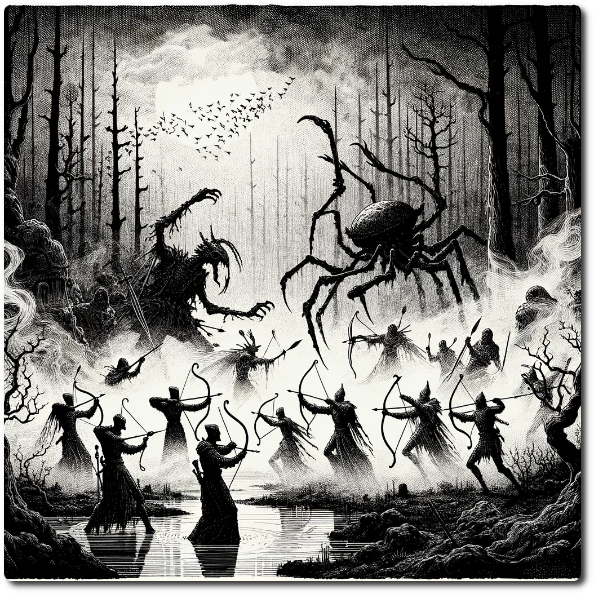

  
  
# 0107 - Swamp - Ruins of Echofall  
  
In this vast swamp, the air is filled with a symphony of life — the chorus of frogs, the buzz of insects, and the distant calls of hidden creatures — all resonating above the subtle, dissonant gurgles and echoes from the decaying waste processing plants. These sounds mingle eerily, creating a haunting acoustic tapestry that tells a story of nature's resilience overshadowed by the remnants of a once-polluting past.  
  
Forage: 8  
Scout: 7  
  
| Roll | Encounter Type | Description |  
| ---- | ---- | ---- |  
| 1 | Quickslime Trap | The party members must spend 1 stamina to avoid or take 2 damage. |  
| 2 | Toxic Fumes | If not chosen by scouting modifier, party members suffers 1 Stamina loss. |  
| 3 | Resources | If chosen by scouting modifier find 4 medical herbs or 1d6 gems |  
| 4 | Combat | Giant Swamp Bugs - Impact: 12 HP: 10 Loot: +1, 25 Gold |  
| 5 | Combat | Rogue Drones - Impact: 14 HP: 12 Loot: +1, 50 Gold  |  
| 6 | Resources | Ancient supply cache, refresh your rations. |  
  
**Special Encounter - Ancient Grudges Never Die**  
  
The event only triggers if the current Calendar is a Full Moon  
  
*In the haunted mists of an age-old swamp, spectral Scouts clash with colossal ancient swamp bugs, their ethereal arrows whistling through the air as they desperately avoid their many-legged foes. This eerie battle, a dance of ghostly figures and monstrous insects, unfolds with a surreal grace, echoing with the sounds of a long-forgotten war and the Scouts' unnerved whispers.*  
  
The party may join in the struggle aiding the Ghostly Scouts who's arrows are having no effect on the bugs.  
  
Ancient Giant Beetles - Impact: 20 HP: 15 Loot: Special  
  
Special Loot  
  
Party Completes the Quest: Neutralize the Phantom Signal  
  
Party also gains 4 corpses, clearly the bodies of long fallen scouts.  
  
One of the corpses is draped over a half functioning transmitter, the party gains 2 Ancient tech.  
  
  
  
  
  
  
  
