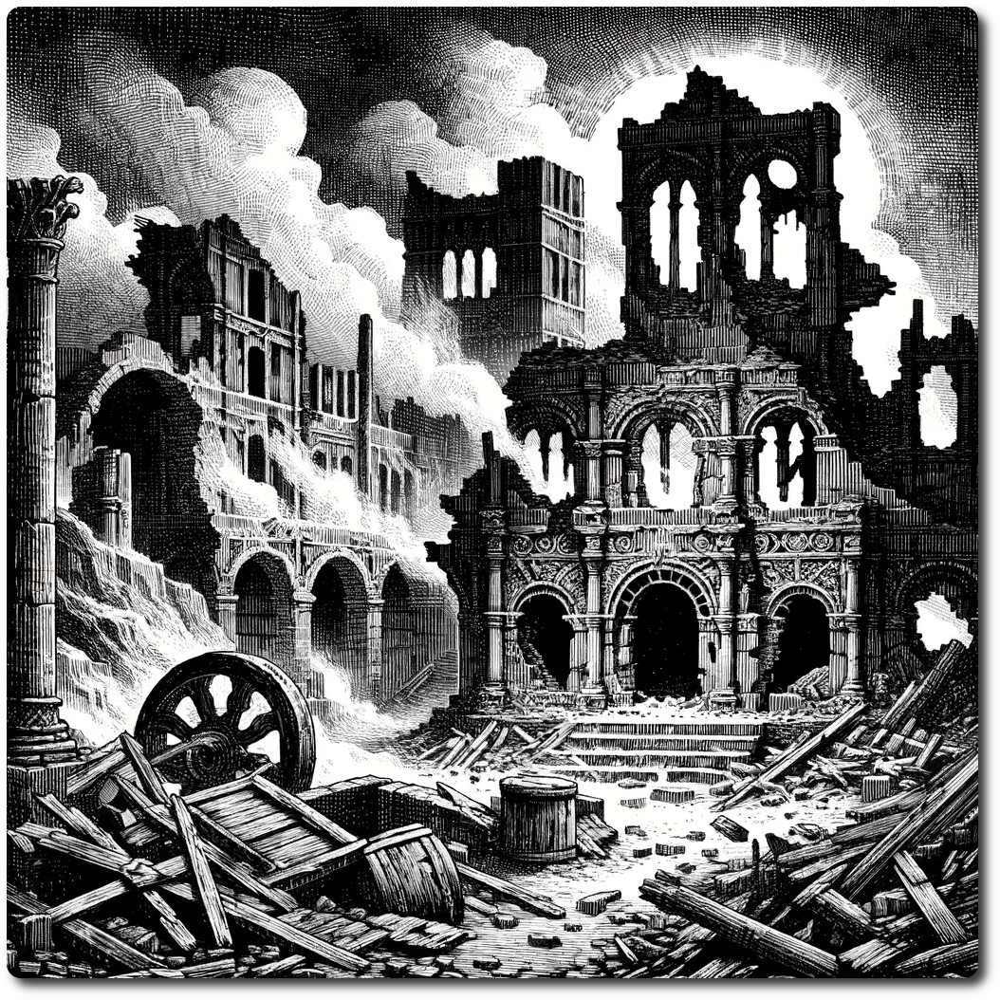

# 0906 - Wilderness - Destroyed Trade Route

*In the Gremion Ruins, history and mystery merge beneath the lands surface, where the famous ruins created a cottage industry out of scavenging. Echoes of a once-bustling trade route are now silenced by the Braying-Leviathan's destruction of the ruins entrance.*

# 1d6 Encounter Table for Gremion Ruins

Forage: 6
Scout: 6

| Roll | Encounter Type | Description |
| ---- | -------------- | ----------- |
| 1    | Combat | **Ruin Reclaimers**: Protective constructs, remnants of the ruins' ancient defenses, now aimlessly guard the shattered relics. **Impact: 15, HP: 18, Loot: +2, 50 Gold** |
| 2    | Social | **Scavenger's Pact**: A band of scavengers, experts in navigating the ruins, propose a risky alliance to delve deeper into the crumbling chambers in search of lost treasures and secrets. |
| 3    | Combat | **Echo Phantoms**: Spirits of traders and inhabitants, disturbed by the Leviathan's destruction, haunt the corridors, their ethereal forms still clinging to the remnants of their past lives. **Impact: 13, HP: 10, Loot: +1, Phantom Shard Worth 30 Gold** |
| 4    | Social | **Historian's Plea**: A desperate historian seeks help to salvage invaluable records and artifacts from the ruins, promising a share of the knowledge and wealth these relics represent. |
| 5    | Combat | **Arcane Stalkers**: Stealthy predators, perfectly camouflaged among the rubble, wait for unwary travelers to wander into their domain. **Ambush Impact: 17, HP: 15, Loot: +3, 150 Gold** |
| 6    | Resources | The party finds a small cache of food. Refresh Rations. |

**Scavenger's Pact**

Social Roll, Difficulty 7. If successful, when exploring beneath Gremion Ruins you may add an additional party member, a Scout with Terrain Knowledge(Gremion Ruins) +3

**Historian's Plea**

Social Roll, Difficulty 8. If successful negotiate a deal, spend 2SP, then gain Information: Map of the Gremion

**Special Encounter - Crisis! or Opportunity?**

If a Trading Post is built at this location parties may move to GR0001 - Gremion Ruins - Entrance.