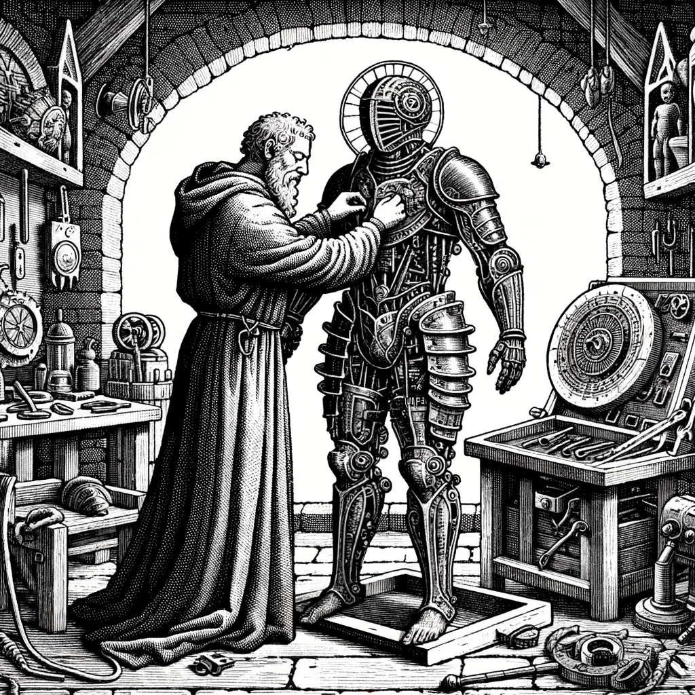

    
    
# Character Creation    
    
In the ever-shifting landscape of the Ancient Future, where the remnants of forgotten civilizations intertwine with the dawn of new epochs, your party begins with the forging of your characters, the vessels for your courage, ingenuity, and the will to prevail. As you select your path and skills, remember that each choice weaves another thread into the rich tapestry of your destiny, shaping the stories that will echo through the annals of time and the digital whispers of the noosphere.    
## Step 1: Choose a Character Type    
    
- Select from [Fighters](./Fighters.md), [Hunters](./Hunters.md), [Priests](./Priests.md), [Scouts](./Scouts.md)    
    
## Step 2: Select Skills    
    
- Choose from a list of skills and abilities specific to the character type.    
- Each skill/ability has a PP cost. More potent skills cost more.    
    
## Stats    
    
Each party member contributes not only different skill, but different stats to the parties total.    
    
1. **Combat Modifier (CM)** - This is how much the character contributes to the combat.    
    
2. **Health Points (HP)** -  Reflects the character's ability to take damage.    
    
3. **Stamina Points (SP)** - Indicates the character’s endurance for physical and strenuous activities.    
    
4. **Willpower Points (WP)** - The measure of mental fortitude and resilience.    
    
5. **Luck Points (LP)** - Represents the character’s chance of turning disaster into a great story.    
    
6. **Resourcefulness Points (RP)** - A measure of the characters ability to solve difficult problems.    
    
### Special Rule: Better Lucky, Than Dead    
    
- The Party may roll spend 1 LP to re-roll any single dice roll of a one. If that roll is a one it may be re-rolled for 1 LP, and so on until you run out of luck.    
    
[Party Creation](./Party-Creation.md)    
    
[Table of Contents](./Table-of-Contents.md)