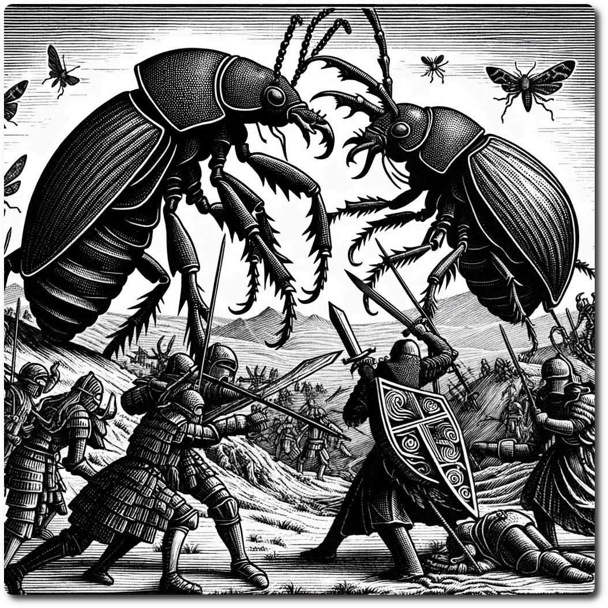

    
    
# Combat System    
    
The combat revolves around a 2d6 roll, influenced by each party member's combat modifier, the enemy's strength, and is further modified by the 'Edge' rule in specific scenarios. For an example of combat take a look at the [Sample Combat Play-by-Play](./Sample-Combat-Play-by-Play.html)    
## Step 1: Calculate Party Impact    
    
- **Party Impact:** Sum the combat modifiers of each character. This sum is the Party Impact.    
    
## Step 2: Calculate Combat Modifier    
    
- Subtract the encounter's Enemy Impact from the Party Impact. The result is the Combat Modifier.    
    
## Step 3: Edge Factor    
    
- **Scouting Advantage:** If the party has successfully scouted, add an extra 1d6 to the combat roll (resulting in a 3d6 roll).    
- **Surprise Disadvantage:** If ambushed, subtract 1d6 from the combat roll (resulting in a 1d6 roll).    
   - Note: If both conditions apply, they cancel each other out, resulting in a standard 2d6 roll.    
    
## Step 4: Time to Tussle    
    
- Roll 2d6, apply the Edge Factor, and add the Combat Modifier.    
- **Results:**     
   - A positive total inflicts damage on the enemies, reducing their hit points. When enemy hit points reach zero, the party wins and may roll on the loot table.    
   - A negative total signifies damage to the party, lose that much HP    
    
## Step 5: Continuing Combat or Retreating    
    
- **Fight On:** The party may choose to continue combat, spend one SP, then repeat Step 4. If the party has reached zero hit points, the party must retreat.    
- **Retreat:** The party may retreat to avoid further combat. In this case, they forfeit any chance to earn loot.    
    
## Step 6: Loot Collection    
    
If an encounter provides a Loot number, then the party can get some loot.    
    
- Loot Roll: Roll 1d6 - 4 + Loot Bonus    
- This is the number of Loot Dice the Party Receives    
    
### Special Rule: Strip It Bare    
    
Nothing goes to waste in the wastes, or so the saying goes. Resourceful adventurers can get some value out of anything.     
    
- If your Loot Roll is 0 or less, spend 1 RP and you get one Loot Dice.    
    
Players may group these rolls as they wish. For example, if the party has 4 Loot Dice, the player may roll each individually, combine two dice into one roll twice, or even use all four for a chance at obtaining superior loot!    
    
### Loot Table    
    
| Roll | Item | Description |    
| ---- | ---- | ---- |    
| 1 | Recycle Goods | 2d6 Plastic |    
| 2 | Ale | 2d6 Ale |    
| 3 | Glass Vials | 2d6 units of Glass, |    
| 4 | Medicinal Herbs | 1d6 Medicinal Herbs |    
| 5 | Grain | 2d6 Grain |    
| 6 | Chest | 100 Gold |    
| 7 | Iron Ore | 3d6 Iron Ore |    
| 8 | Silks | 3d6 Silk |    
| 9 | Salt | 3d6 Salt |    
| 10 | Circuitry Kit | Circuitry 4d6 |    
| 11 | Gems | 1d6 Gems |    
| 12 | Big Chest | 200 Gold |    
| 13 | Ancient Tech | Can be traded to a Techstitcher for 2 PP |    
| 14 | Third Arm | Grants a fighter an additional Free Hand |    
| 15 | Precious Gems | 2d6 Gems |    
| 16 | Reagents Box | Reagents 4d6 |    
| 17 | Shift Shield | Can be used to ignore all damage assigned to the party Single use. |    
| 18 | Drone | Scout can re-roll Scouting Roll at the cost of 1 liter of Flamequick. Comes with 2 liters. |    
| 19 | Skinning Knife | When foraging add 1 to your forage roll.  |    
| 20 | Holographic Locket | Spend one Access Token to ignore half the damage from an attack.  |    
| 21 | Elemental Core Processor | Turns 3 Iron Ore into Ancient Tech. After use roll 1d6 on a 1 it breaks. |    
| 22 | Keg of Flamequick | This keg contains 5 liters of Flamequick. This can be used to power some vehicles, or deal 5 additional damage in combat.  |    
| 23 | MagiTech | Can be traded to a Techstitcher for 4 PP |    
| 24 | Plasma Grenade | Use during combat to deal 10 damage to enemy. Single use. |    
| 25 | Folding Boat | Vehicle: Boat - Allows 2 free moves across water. Unlike other boats it can be carried. |    
| 26 | Spellware Interface | A device that enables the wearer to cast and store spells electronically. Spells not included. |    
| 27 | Plastic Synthesizer | Can convert 3 grain into 2 plastic |    
| 28 | Dimensional Gateway Amulet | An amulet allowing limited travel across different dimensions. During Planning phase return to NeoArcadia  |    
| 29 | Source Code | Trade to a Techstitcher for 8 PP |    
| 30 | Reality Modulator Staff | A powerful staff capable of altering local reality within constrained parameters. Change Hex to different Terrain Type. Single use. |    
    
Back to [Encounter Phase](./Encounter-Phase.html)    
    
[Table of Contents](./Table-of-Contents.html)    
