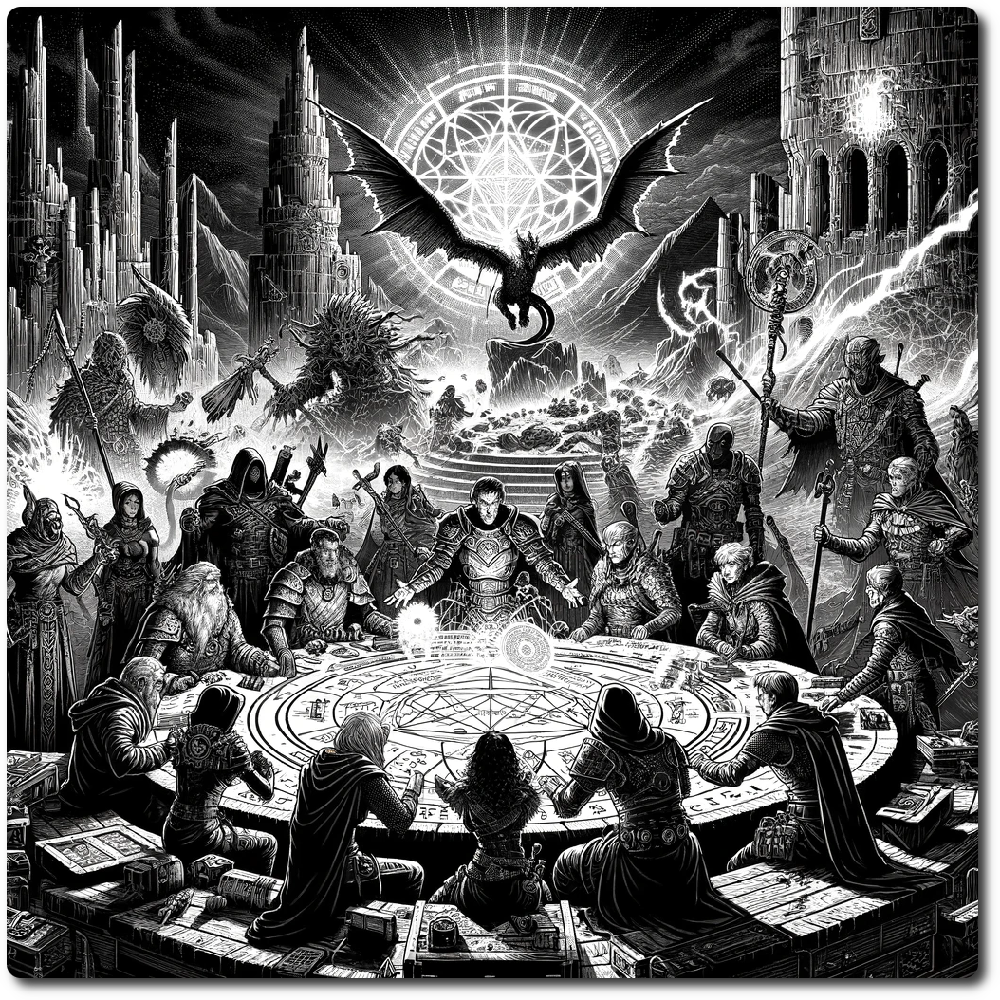

  
# Crisis! Party Dynamics  
  
In the tumultuous world of NeoArcadia, crises demand unprecedented cooperation and flexibility among adventurers. The Crisis! System introduces dynamic party mechanics, allowing for the amalgamation of forces and strategic character exchanges to combat looming threats effectively. These rules are designed to maintain the continuity of the gameplay experience while offering adaptability to accommodate players' varying schedules.  
  
## Combining Forces: United We Stand  
  
During a Crisis! event, players can combine their parties to form a unified front against the formidable challenges ahead. This alliance is a testament to the collaborative spirit required to confront the Crisis! and is governed by the following rules:  
  
1. **Formation of Alliances:** Players can form alliances by combining two or more parties during the Planning Phase.  The combined party temporarily pools their resources, stats, and skills.  
2. **Leadership:** The allied party nominates a leader to make crucial decisions during the Crisis! event. The leader is chosen through a majority vote or any other agreed-upon method among the players.  
3. **Resource Sharing:** All resources, including Gold, Ale, and rations, are pooled together. Resource management decisions are made collectively or delegated to the nominated leader.  
  
## Swapping Characters: Tactical Maneuvers  
  
Flexibility is key in responding to a Crisis! Players can swap characters between parties to optimize their strategy, ensuring that each party is equipped with the necessary skills and abilities to face the challenges ahead.  
  
1. **Swapping Window:** Characters can be swapped between parties only during embark phases where two parties are on the same hex, such as the beginning of a Crisis! This is done at the very beginning of the Embark Phase, before step one.  
2. **Swap Rules:** Each party can swap a maximum of one character per Swap Phase. The decision must be unanimous among the players involved in the swap.  
3. **Recalculate the Parties:** When swapping characters, the parties must recalculate their composition. Since party stats are a based on the members, this will change when the swap occurs  
  
## Reset and Resume: Continuity in Adversity  
  
The Crisis! System acknowledges the unpredictability of players' schedules and ensures that no one is locked into continuous play without flexibility.  
  
1. **Pause and Reset:** Players who need to pause their participation during a Crisis! event can reset their party to its pre-crisis state, retaining all resources and character stats as they were before the alliance.  
2. **Resuming Play:** Upon resuming play, players can re-enter the ongoing Crisis! event during their next turn or wait until the conclusion of the current event to join the next one.  
3. **Record-Keeping:** It's crucial to maintain accurate records of party stats, resources, and character details before forming alliances or engaging in swaps. This ensures transparency and ease in reverting to the original party structure when needed.  
  
These rules are designed to enhance the collaborative spirit of the Crisis! System while respecting the individual commitments and schedules of players. By enabling strategic alliances, character swaps, and flexible participation, adventurers in NeoArcadia can face the direst crises together, forging bonds and stories that resonate through the Ancient Future.  
  
[Table of Contents](./Table-of-Contents.html) 