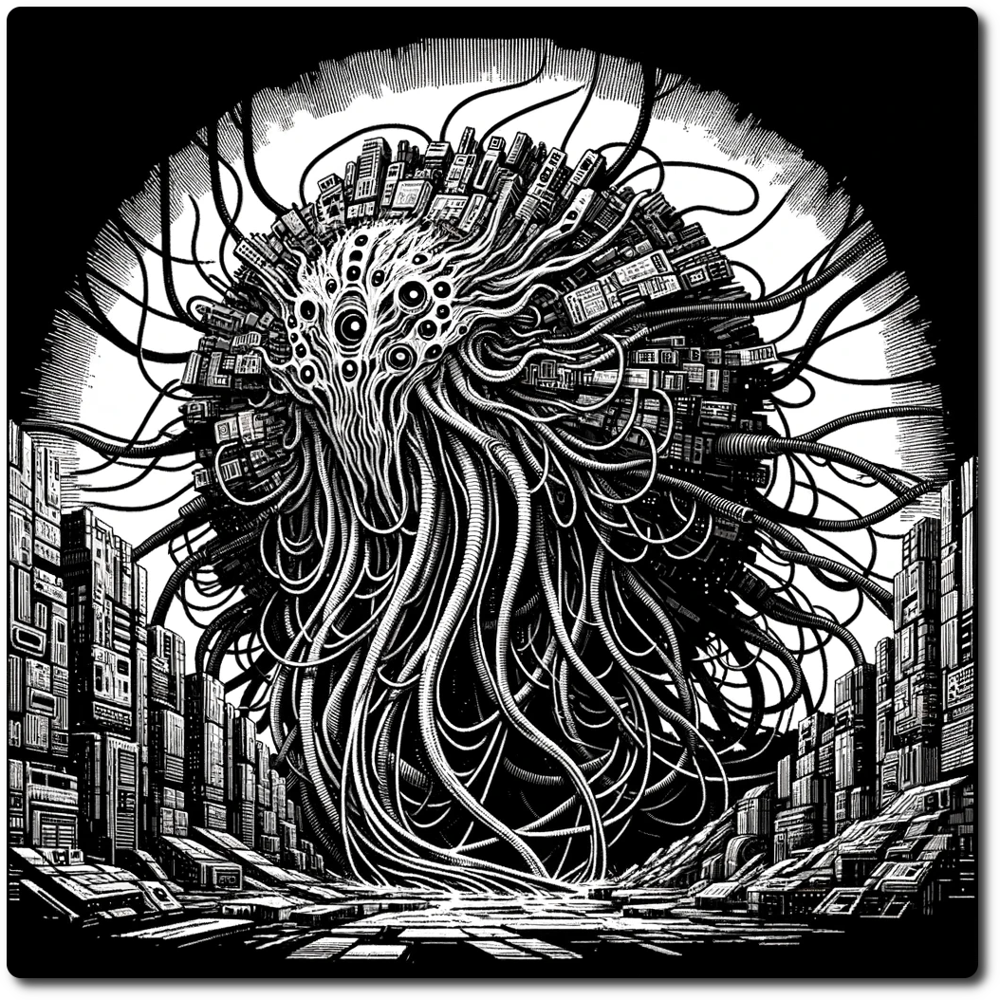

  
*"Run, turn off your hero protocol and run." - Priest Wlem describing the scene to Cav-Marshal Dieker*  
# Crisis! System  
  
Welcome, brave adventurers, to an electrifying new chapter in your NeoArcadia odyssey – the Crisis! System. Beyond the treacherous hexes and the crumbling ruins of the Ancient Future lies a call to unity, a beckon for camaraderie, a test of your collective mettle, a Brutal Reality.
  
### The Essence of Crisis!: A Unifying Force Amidst Chaos  
  
In the heart of the Ancient Future, where the lines between ancient sorcery and futuristic technology blur, life is an everyday battle against the odds. You've navigated through the tumultuous landscapes, outsmarted techno-bandits, and sheltered from the corrosive acid rains. But now, a new kind of challenge emerges – a Crisis!  
  
A Crisis! in the Ancient Future isn't just another skirmish or a passing storm. It's a cataclysmic event that shakes the very foundation of existence, turning the everyday struggle into an epic saga of survival, strategy, and solidarity.  
  
### Your Role in the Tapestry of Turmoil  
  
Imagine this: The skies over NeoArcadia darken as a Skycaptain's urgent message crackles through the airwaves. A massive Leviathan, a remnant from a bygone era, has awakened from its ancient slumber. Its mechanical might, fused with arcane energies, threatens to obliterate everything in its path.  
  
This is not a battle for the lone wolf, the solitary mage, or even a single hardened party. The Crisis! System calls upon you and your fellow parties of adventurers to band together, pooling your skills, resources, and courage to confront a threat of unprecedented scale.   
  
### The Gameplay: A Symphony of Strategy and Bravery  
  
During a Crisis! event, your party joins forces with others, transforming individual quests into a collective crusade. You will:  
  
- **Strategize and Cooperate:** Plan with other players, align your objectives, and execute coordinated assaults or defense strategies against formidable foes.  
- **Embark on Special Missions:** Tackle unique quests that contribute to the overall effort – sabotage enemy supply lines, decode ancient texts for critical intelligence, or brave through hazardous environments to rescue stranded allies.  
- **Witness the Impact of Your Actions:** Your success or failure isn't just personal; it shapes the narrative for the entire player base, creating a dynamic storyline where every player is a key protagonist.  
  
### Forge Memories, Build Legacies  
  
As you stand shoulder to shoulder with your comrades-in-arms, facing the abyss of a Crisis!, remember – you're not just fighting for survival. You're crafting legends, forging bonds that transcend the digital realm, and etching your names in the annals of NeoArcadia.  
Embrace the Crisis! System, for it's more than a game mechanic – it's a call to become part of something greater, a saga where your actions resonate through the Ancient Future. Are you ready to answer the call?  
  
## [The Crisis!](The-Crisis.html)   
  
Rules for playing a Crisis!  
## [Crisis! Party Dynamics](./Crisis-Party-Dynamics.html)  
  
Suggestions for how to run a Crisis!  
## [Leviathan-Awakes](Leviathan-Awakes.html)  
  
A sample Crisis! for at least 3 parties.  
  
[Table of Contents](./Table-of-Contents.html)    
