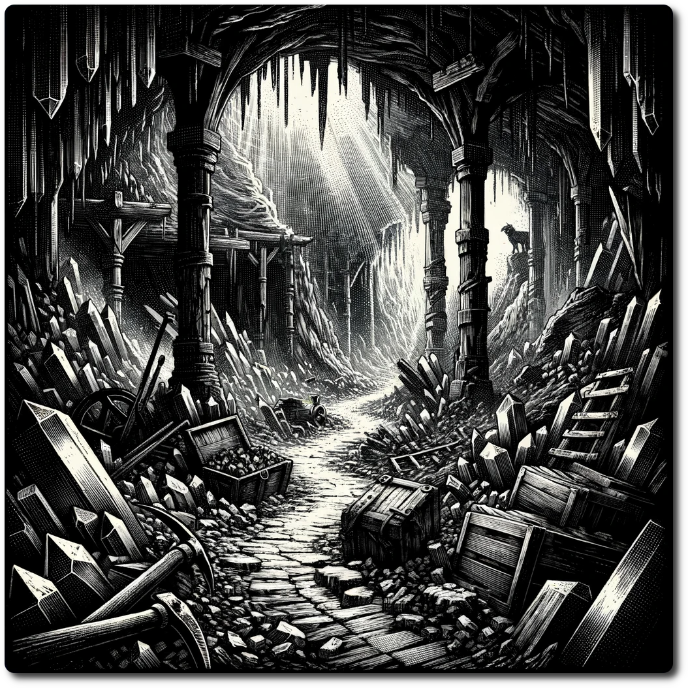

  
# 0303 - Special - Crystal Caverns  
  
*The Crystal Caverns, once a glittering maze of natural splendor, now echo with a haunting silence, as miners' tools lie abandoned and eerie shadows stretch through the crumbling tunnels. Whispers of a monstrous presence twist through the air, its braying call turning the once-pristine crystals into mere whispers of dust.*  
  
Forage: 10  
Scout: 8  
  
| Roll | Encounter Type | Description |  
| ---- | -------------- | ----------- |  
| 1    | Combat | **Crystal Wraiths**: Phantoms of fallen miners, bound to the crystals they once coveted, now guard the caverns with spectral ferocity. **Impact: 16, HP: 12, Loot: +2, Crystal Shard Worth 50 Gold** |  
| 2    | Social | **Echoes of the Past**: Faint whispers guide adventurers to a secluded chamber, where the spirits of miners offer cryptic warnings or valuable insights in exchange for releasing them from their earthly tether. Difficulty 8, success gets 200 Gold |  
| 3    | Combat | **Tunnel Creepers**: Stealthy creatures, born from the cavern's darkness, stalk the unwary, their presence only revealed by the soft clatter of crystal fragments under their feet. ** AmbushImpact: 14, HP: 10, Loot: +1, Precious Gems Worth 80 Gold** |  
| 4    | Social | **Desperate Prospector**: A lone, crazed prospector, obsessed with finding a legendary crystal vein, offers a share of the riches in exchange for help navigating the treacherous, shifting tunnels. Difficulty 9 |  
| 5    | Combat | **Shard Beasts**: Monstrous entities, their bodies composed of jagged crystal shards, emerge from the walls, their every movement a symphony of ear-piercing screeches. **Impact: 15, HP: 20, Loot: +3, Rare Crystal Worth 150 Gold** |  
| 6    | Social/Combat | **Harmonic Convergence**: A mysterious, pulsating crystal at the heart of the caverns resonates with an otherworldly energy. Approach with caution; its allure is as dangerous as it is mesmerizing, with potential for either a transcendent encounter or a devastating showdown. **Impact (if combat): 18, HP: 25, Loot: Special Crystal Artifact** |  
  
**Desperate Prospector  
  
If you fail, the party follows a mad man into the dark. Lucky for you he only wastes your time. Move the party to a random adjacent hex, and they are Lost. You get +1 to the social roll if you meet the Prospector again.  
  
**Harmonic Convergence**  
  
Make a social roll Difficulty 8. If successful the crystal imparts knowledge to you about the nature of the Braying-Leviathan. Your party gets the Special Crystal Artifact that gives +2 to all rolls in the Final Confrontation against the beast. If you fail, driven mad by the brays the crystals attack. Defeating them will also gain the crystal.  
  
**Special Encounter - The Nest**  
  
Nestled deep within the Crystal Caverns, the nest of the Braying-Leviathan contrasts starkly with its surroundings, resembling an ancient laboratory rather than a natural lair. Amidst a clutter of bizarre apparatus and pulsating energy fields, clusters of biomechanical eggs rest, bathed in a strange luminescence.  
  
 A single ancient terminal still remains powered. On the screen is a simple counter, which increments intermediately. The party sudden realize, the Leviathan is but one of a growing hoard. Lose 1 WP. Gain 3 Ancient Technology.  
  
- Make a Choice - Break the Eggs, Take the Eggs. Record this choice on the party sheet.  
  
[Crisis Table of Contents](../Table-of-Contents.md)  
  
Back to Game: [Table of Contents](../../../Table-of-Contents.md)