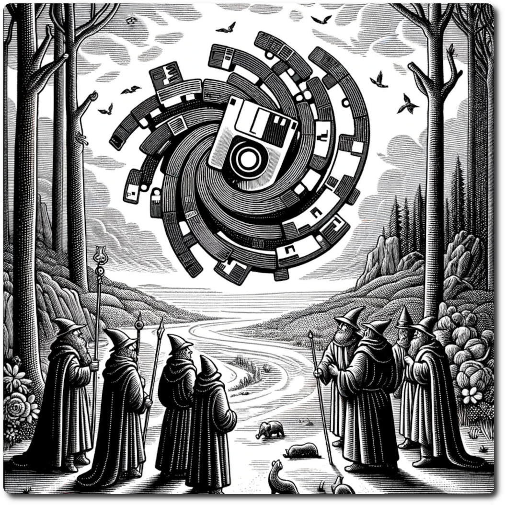

    
    
# Encounter Phase    
Previous: [Embark Phase](./Embark-Phase.html)    
    
## Step 1: Regular Encounters    
    
- Roll 1d6 You may add or subtract your Scouting Bonus after rolling giving you a choice in encounters. If the result is not available on the table, use the closes value.

**Example** 

The  party has a scouting bonus of two. They roll a 5 on the encounter table. They can now chose 3, 5, or 6 (closes number to 7) and improve their odds of survival.
    
## Step 2: Resolve Encounter    
    
Encounters challenge the party and tax their resources. Sometimes it is better to avoid danger, but nothing risked nothing gained.     
    
Combat is common as the Ancient Future is a dangerous place. Use the [Combat System](./Combat-System.html) to slay your foes!    
    
## Step 3: Special Encounters    
    
Some hexes have Special Encounters, these are encounters unique to the hex and have their own rules for resolution as recorded on the Hex Sheet. This means on these hexes the party could have two encounter, a regular one, and a special one.
    
Next: [Recover Phase](./Recover-Phase.html)    
    
[Table of Contents](./Table-of-Contents.html)