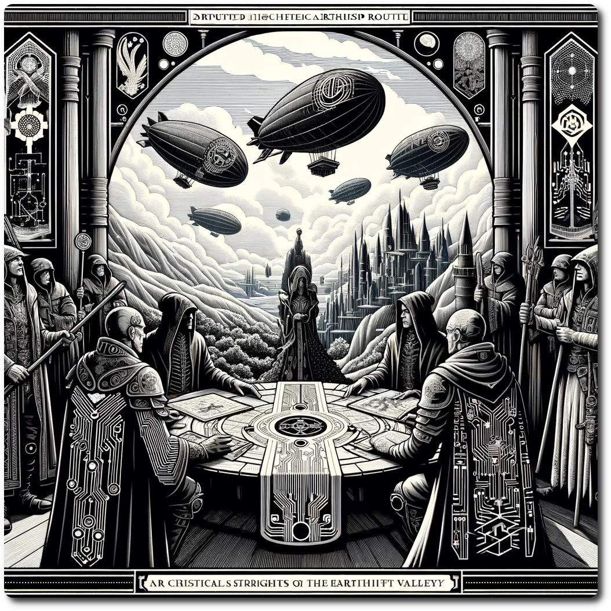

# Example Arbitration

Here is an example of the hex that requires Arbitration and how it is resolved.

# 1204 - Special - The Cloudrift Valley

Forage: 6
Scout: 7

*The Cloudrift Valley, known for its majestic views and treacherous air currents, hosts a vital airship route contested by two prominent factions: the Priests of Linus and the Heretics of Linus. The Priests claim ancestral rights to patrol and maintain the route, ensuring its safety for all. Meanwhile, the Heretics demand access for trade, citing recent agreements that the Priests allegedly obstruct.*

#### Arbitration Encounter: The Priest-Heretic Dispute

**Information**:

1. **Priest Claims**: Historical patrol logs and maintenance records of the airship route by the Priests. 
2. **Heretic Demands**: A copy of the recent trade agreement granting the Heretics access to the route, which they claim has been violated.

#### Difficulty

- **Priest Validation Difficulty**: 8
- **Heretic Validation Difficulty**: 10

#### Outcomes

- **Mutual Understanding**: The factions agree to a shared patrol and trade schedule, improving the route's safety and efficiency. The party gains favor with both factions, increase the Party Reputation by 1. Party Gains 500 gold, and 1 Ticket to Ride.
- **Impasse**: The factions agree to pause hostilities but reach no concrete resolution. Party gains 1 Ticket to Ride for their time.
- **Schism**: Relations between the factions deteriorate, leading to increased hostilities. The party's reputation is reduced by one, void all Tickets to Ride. 

# Resolving the Encounter

### Step 1: Gather Information

The party learns of the dispute upon arriving in the hex containing the disputed airship route. The Information critical to the arbitration includes:

1. **Priests of Linus Claims**: Evidence that the Priests have historically patrolled and maintained the airship route, ensuring its safety.
2. **Heretics Demands**: Records of a recent agreement where the Heretics were granted access to the route for trade purposes, which they claim the Priest have obstructed.

The party lacks this Information initially and decides to halt the Arbitration to gather the necessary evidence. They explore nearby hexes, encountering allies and archives that provide them with the needed claims and demands.

### Step 2: Validation Phase

Upon returning with the Information, the party begins the Validation Phase.

- **Engaging the Priests**: The difficulty to convince the Priests of the Heretics' demands is moderate. The party rolls 2d6. They score a total of 11 against a difficulty of 8, achieving a degree of success of 3, adding one die to the Arbitration Dice Pool.

- **Engaging the Heretics**: The Heretics are more skeptical, presenting a higher difficulty. The party rolls 2d6 scores a total of 12 against a difficulty of 10, also achieving a degree of success of 2, adding one more die to the Arbitration Dice Pool.

#### Special Rule: Stake Your Reputation

The party, having a Reputation of 2, decides to spend 1 LP to add +1 to all Arbitration rolls this turn, enhancing their chances of a favorable outcome.

### Step 3: Arbitration

With the Validation Dice Pool increased by 2 (one from each successful validation), the party rolls for Arbitration:

- They roll 2d6 for the base Arbitration roll and add the 2 additional dice from the Validation Phase. Including their decision to Stake Their Reputation, they roll a total that adds up to 16.

- The outcome is Mutual Understanding: The party successfully mediates the dispute, leading to an agreement where the Priests continue to maintain the route but grant scheduled access to the Heretics, ensuring both parties benefit.

### Step 4: Fallout

The resolution of Mutual Understanding leads to the following outcomes:

- The Priests and Heretics form a joint patrol for the airship route, combining resources to enhance its safety and efficiency.
- Party gains the rewards
