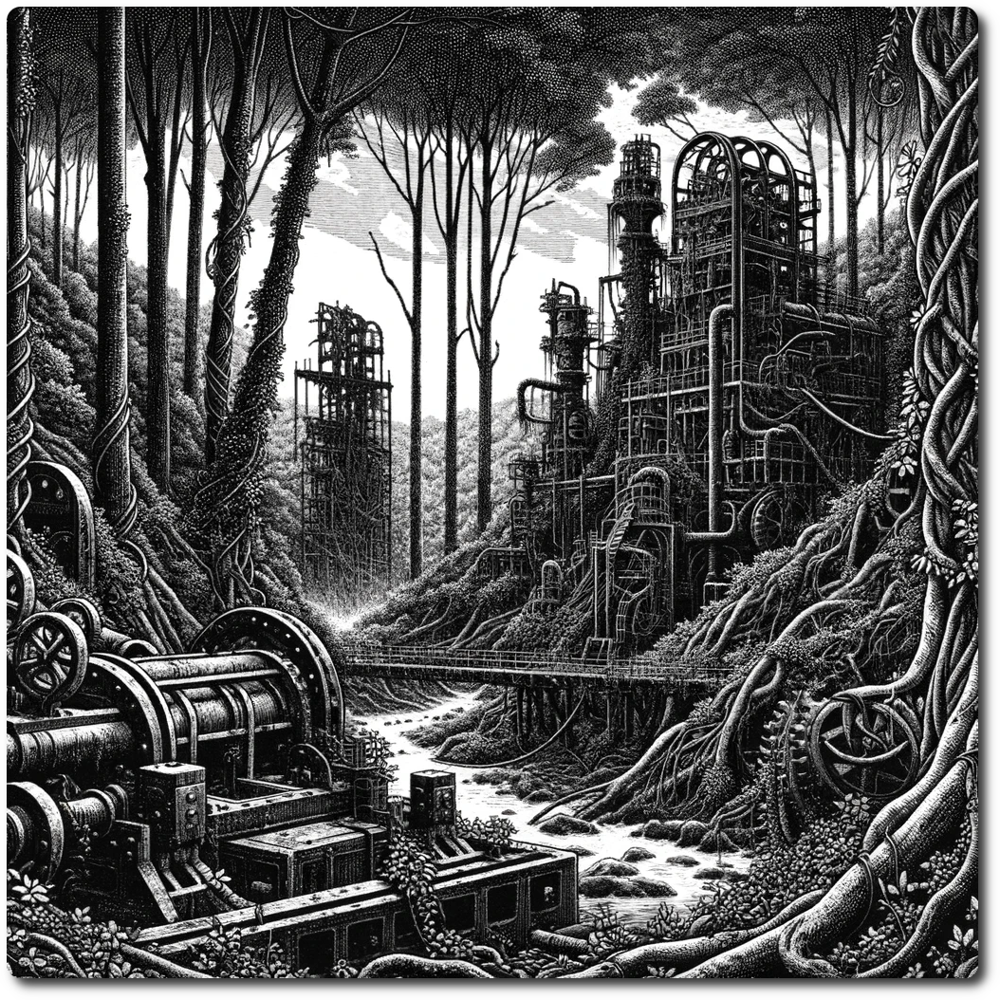

    
    
*In this remote forest, nature has triumphantly reclaimed the remnants of ancient production facilities, entwining the rusted machinery and decaying tech with lush greenery. This surreal and haunting landscape, where the wild merges seamlessly with the remnants of a forgotten technological era, whispers secrets of the past to those brave enough to explore its depths.*    
    
# Forest    
    
Forage: 8    
Scout: 9    

| Roll | Encounter Type | Description |    
| ---- | ---- | ---- |    
| 1 | Encounter | **Lost Traveler**: The party encounters a traveler, weary and far from home. In exchange for 1 ration or 2 ale, this wayward soul offers insights that grant a +2 bonus on the next scouting roll. |    
| 2 | Hazard | **Poison Plant Pollen**: A cloud of toxic pollen from hidden plants ambushes the party. If not chosen by scouting modifier, party takes 1 damage. |    
| 3 | Resources | **Fortunate Find**: If chosen by scouting modifier, the party uncovers a cache containing 1 gem, 6 ale, and 2 Medicinal Herbs.  |    
| 4 | Combat | **Cyber Monkey Ambush**: Suddenly, cybernetically enhanced monkeys launch an attack. **Impact: 15, HP: 1, Loot: +1, 25 Gold** |    
| 5 | Combat | **Bandits Ambush**: The journey is once again fraught with danger as bandits lie in wait. **Impact: 10, HP: 15, Loot: +2, 50 Gold** |    
| 6 | Phenomenon | **Eerie Silence**: An unsettling calm descends, party loses 1 WP. This phenomenon challenges their mental resilience, forcing them to confront the psychological effects of their environment's oppressive silence. |

[Terrain Types](./Terrain-Types.html)    

[Table of Contents](./Table-of-Contents.html)