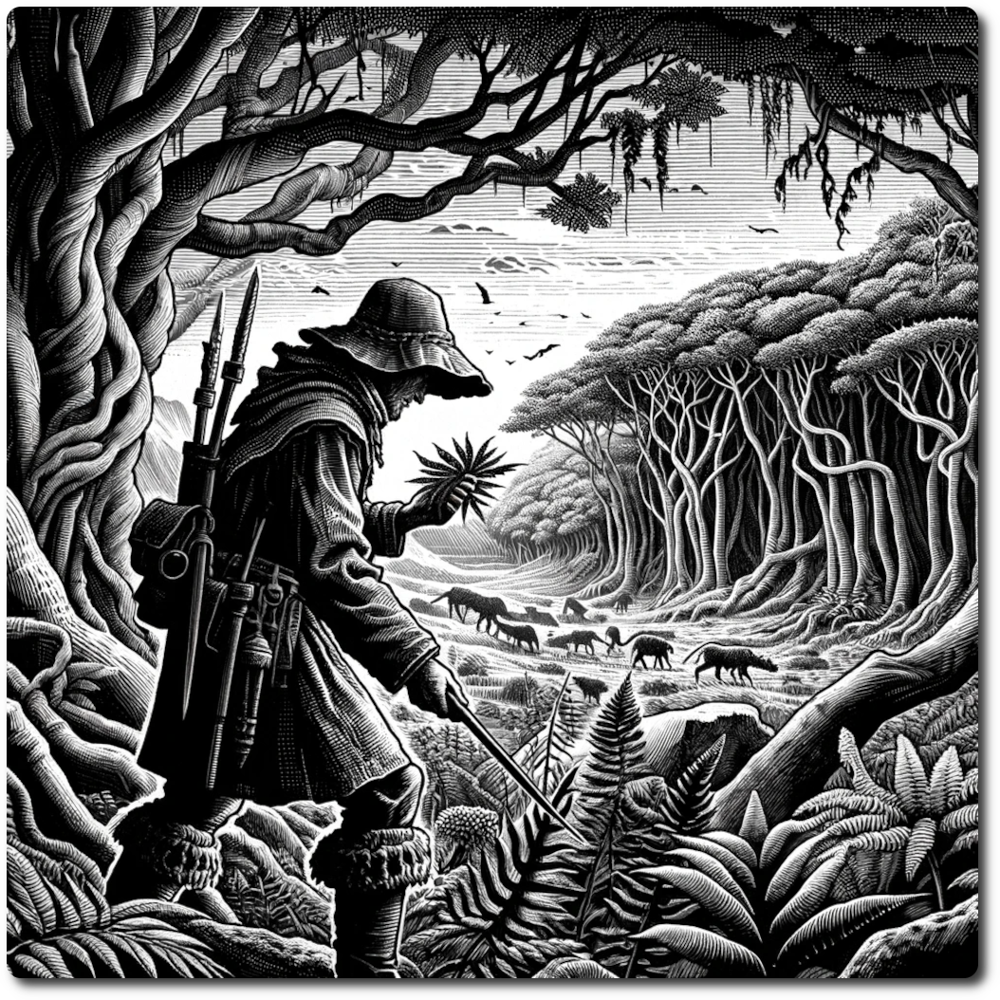

    
    
# Hunters    
    
In the Ancient Future's untamed wilds, the Hunter class stands as a paragon of survival, mastery, and knowledge. These rugged individuals are not only adept at tracking and hunting; they are also scholars of the land, possessing an in-depth understanding of geology and biology.     
    
Their expertise allows them to read the secrets of the terrain, from the subtlest shifts in the earth's crust to the intricate patterns of local flora and fauna. Equipped with this knowledge, they navigate the savage wilderness with an almost supernatural ease, making them invaluable guides and allies in a world where the remnants of advanced civilizations meld with the primal forces of nature.     
    
Their skills are a blend of ancient wisdom and a keen understanding of the remnants of the past, enabling them to thrive where others might falter in the face of the wild's untamed beauty and hidden dangers.    
    
    
| Stat | Base |    
| ---- | ---- |    
| CM | 0 |    
| HP | 2 |    
| SP | 1 |    
| WP | 1 |    
| LP | 1 |    
| RP | 2 |    
    
# Skills    
    
### Survival - PP Cost 2    
    
Tap into the noosphere fields between hunter and habitat, granting the ability to intuitively sense the most fruitful paths, ensuring sustenance amidst the overgrown relics of the Ancient Future.    
    
- You can spend 1 R to add +1 to Foraging Rolls, this may be done after the roll is made.    
- You may take this skill up to 3 times    
    
### Harvest the Land - PP Cost 4    
    
Embrace the land's bounteous essence, allowing your keen instincts and intimate knowledge of the terrain to extract additional sustenance    
    
- When your degree of success is 2+  on a Forage Roll gain one ration, max 6    
    
### Killer - PP Cost X (Max 2)    
    
Hone your predatory instincts to a razor's edge, amplifying your combat prowess to become a formidable force against the mutated creatures and rogue machines that haunt the Ancient Future's landscape.    
    
- Increase your Combat Modifier by X    
    
### Don't Ask - PP Cost 3    
    
Employ a discreet, survivalist tactic that procures rations under dire circumstances, a necessary but unspoken pact between the hunter's need to survive and the brutal realities of wastes. You can eat it, just don't ask what it was . . .    
    
- If the party has ran out of rations you may spend 2 RP to gain a ration.    
    
### Rain or Shine  - PP Cost 1    
    
Draw upon ancient knowledge and natural adaptability to shield your party from the capricious moods of the Ancient Future's skies, ensuring that neither storm nor sun impedes your pursuit.    
    
- Spend 1 RP during Planning phase to ignore weather effects this turn.    
    
### Gatherer - PP Cost 5    
    
Utilize a keen eye and an intuitive understanding of the land to uncover and retrieve valuable resources, ensuring that no treasure, whether hidden in data vaults or beneath the soil, escapes your vigilant gaze.    
    
- Spend 2 RP when making a loot role, the add one to the result. This may only be done before making the roll.    
    
### Resourceful - PP Cost 2X    
    
Drawing from the vast well of survival instincts and the ingenious knack for adaptability, this skill embodies the hunter's ability to thrive in the unpredictable realms of the Ancient Future.    
    
- Increase Resourcefulness by X    
    
    
[Character Creation](./Character-Creation.md)    
    
[Table of Contents](./Table-of-Contents.md)    
