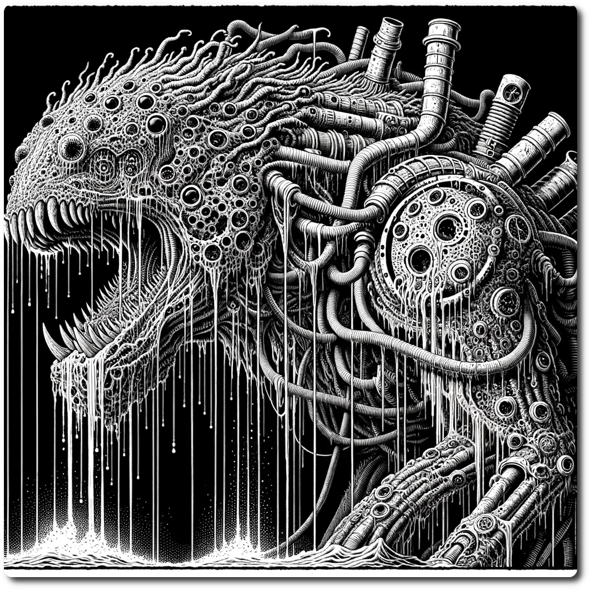

  
# Crisis! Leviathan Awakes  
  
In the depths of NeoArcadia, a tremor passes through the land – a sign that the ancient Braying-Leviathan, a creature of myth and terror, has awakened from its ageless slumber. Its haunting bray resonates across the land, sowing fear and weakening the will of the bravest adventurers. "Leviathan Awakes" is a Crisis! event that tests the mettle and strategy of all who dare to confront this colossal beast.  
  
## Overview of the Crisis! Event: Leviathan Awakes  
  
- **The Wager:** The awakening of the Leviathan comes with the destruction of one Trading Post, a valuable resource hub for adventurers. Parties wager the outpost against the potential rewards of subduing the Braying-Leviathan. Choose a hex with an outpost and remove the outpost and place the Braying-Leviathan and reveal the Special Encounter sheet for it.  
  
- **Rumors abound:** Shuffle the rumors for this crisis and draw one per player. Then shuffle the remaining rumors into the Rumor Deck.  
  
- **Update Hex Sheets**: Add the hex sheets to the binder. Add to the General Goods at NeoArcadia quickfire. It sells for 50 gold per liter.  
  
- **Initial Threat:** The Braying-Leviathan's awakening is marked by a powerful bray that echoes through the surrounding hexes, parties within two hexes of the Leviathan at the beginning of the crisis lose 1 WP. Parties that are with in one hex of the Leviathan at the beginning of the Environment turn lose 1 WP.  
  
- **Leviathan's Presence:** The Braying-Leviathan manifests at the location of the destroyed trading post, becoming a formidable presence on the map that demands immediate attention.  
  
## Rules for the Leviathan  
  
### Special Rule: Mobile Threat  
  
The Braying-Leviathan moves across the hex map of NeoArcadia during the environment phase, following a set of specific rules that dictate its behavior:  
  
1. **Lure Success:** If a party successfully executes a Lure action, the Leviathan moves one hex toward the party. This strategic maneuver allows parties to guide the beast's movements, potentially steering it away from critical areas or setting up an ambush.  
     
2. **Attraction to Structures:** In the absence of a successful Lure, the Leviathan instinctively moves toward the nearest building within three hexes. This behavior reflects its destructive nature, targeting the remnants of civilization and resources crucial to the adventurers. If it end's the environment turn on a hex with a building, that building is destroyed.  
     
3. **Random Movements:** If there are no buildings within three hexes and no successful Lure has been executed, the Leviathan moves randomly. This unpredictability adds an element of chaos and urgency to the Crisis! event, requiring parties to be adaptable and vigilant.  
  
### Special Rule: Lure the Beast!  
  
The Braying-Leviathan can be lured to the party with the expenditure of some resources. Seemingly attracted to destruction, the burning of a liter of quickfire has a chance to attract the creature.  
  
 1. Make a Scout Roll against the current hex and spend one liter of quick fire. You may spend additional liters to add plus one to the role. Subtract one for each hex between the party and the Leviathan.  
   
 2. If successful the party has Lured the Leviathan.  
  
## Responding to the Crisis! Leviathan Awakes  
  
Adventurers in NeoArcadia must rise to the challenge, using strategy, strength, and cooperation to confront the Braying-Leviathan. The Crisis! event unfolds in the following phases:  
  
1. **Mobilization:** Parties converge at the Rally Point, pooling their resources and strategizing their approach to subdue the Leviathan. This phase involves careful planning, resource allocation, and possibly forming alliances to strengthen the collective response.  
     
2. **Confrontation:** To begin the final confrontation the following events must have occurred.  
  
- A party collected the Information: First Hand Account.  
- A party must Lure the Leviathan at least three times.  
- A party must uncover the Origin of the Braying-Leviathan.  
  
In addition one of the following must have occurred.  
  
- Ally with the Techno Bandits?  
- Discover the Ancient Data Slates  
- Receive the Blessing of Linus  
  
Finally, the parties must overcome 4 of the encounters on the Presence of the Leviathan table.  
     
3. **Resolution:** The climax of the Crisis! event is the final confrontation with the Braying-Leviathan. Parties must use all their resources, skills, and strategic insight to subdue the beast. The outcome of this confrontation determines the resolution of the crisis, with significant implications for the future of NeoArcadia.  
- Remove the Leviathan from play, remove the Crisis! Rumors from the rumor deck.  
  
5. **Reward:** These rewards are harvested from the Origin of the Leviathan or harvested from the beasts mechanical body.  
-  40 Timber: For the structure's basic framework, offering a rustic charm.    
- 10 Cloth: To provide cover and warmth, creating a welcoming atmosphere for traders.    
- 24 Plastic: Utilized in crafting durable storage units and counters.    
- 18 Spices: A symbol of the variety and richness of goods offered, attracting traders from far and wide.    
  - 2 Ancient Tech per Surviving Character  
  - Complete Quest: Nap Time for the Big Boi +2 Reputation  
- 2000 Gold from the Skycaptain + 500 per Character lost.  
  
[Crisis Table of Contents](./Table-of-Contents.html)  
  
Back to Game: [Table of Contents](../../Table-of-Contents.html)  
