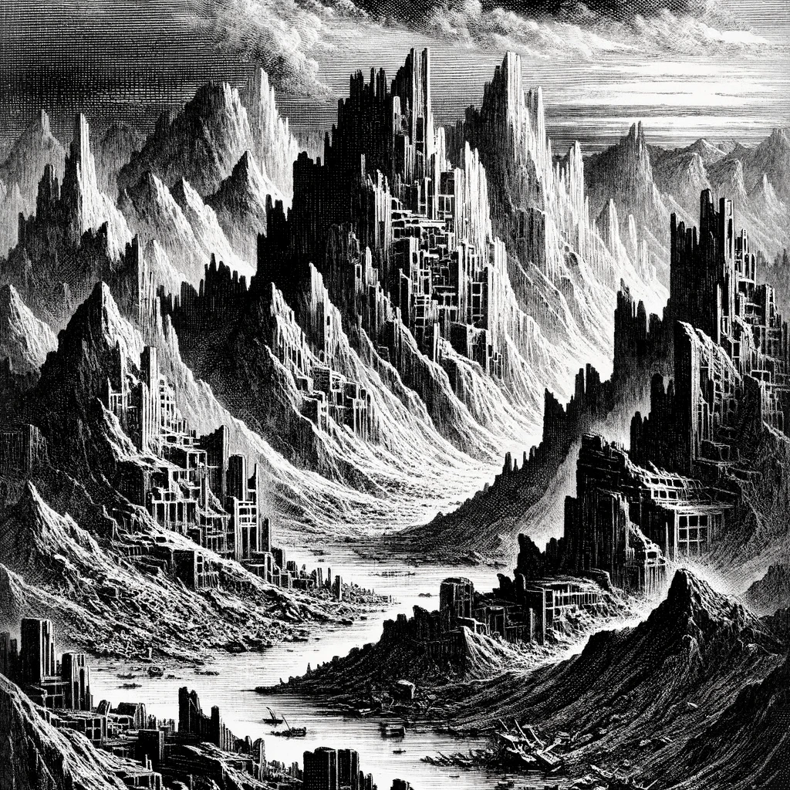

---  
share: "true"  
---  
  
  
  
  
*High in the mountains of rubble, remnants of the colossal hive cities' collapse, the air carries a distinct, pungent mix of rust and decay, a testament to the long-forgotten urban sprawls. It's tinged with a sharp, metallic scent, mingling with the faint, earthy aroma of ancient concrete and steel slowly surrendering to nature's embrace.*  
  
# Mountain  
  
Forage: 10  
Scout: 8  
  
| Roll | Encounter Type | Description |  
| ---- | ---- | ---- |  
| 1 | Rubble Slide | Distribute party members take 3 damage and lose 1 stamina |  
| 2 | Altitude Sickness | If not chosen by scouting modifier, each party member loses 1 stamina to Altitude Sickness |  
| 3 | Resources | If chosen by scouting modifier find 2 gems, 2 medicinal herb |  
| 4 | Combat | Predator Birds - Impact: 7 HP: 15 Loot +1, 1 gem |  
| 5 | Combat | Bandits Ambush - Impact: 10 HP: 15 Loot: +2, 50 Gold |  
| 6 | Natural Cave | No need to set a watch |  
  
[Terrain Types](./Terrain%20Types.html)  
  
[Table of Contents](./Table%20of%20Contents.html)  
