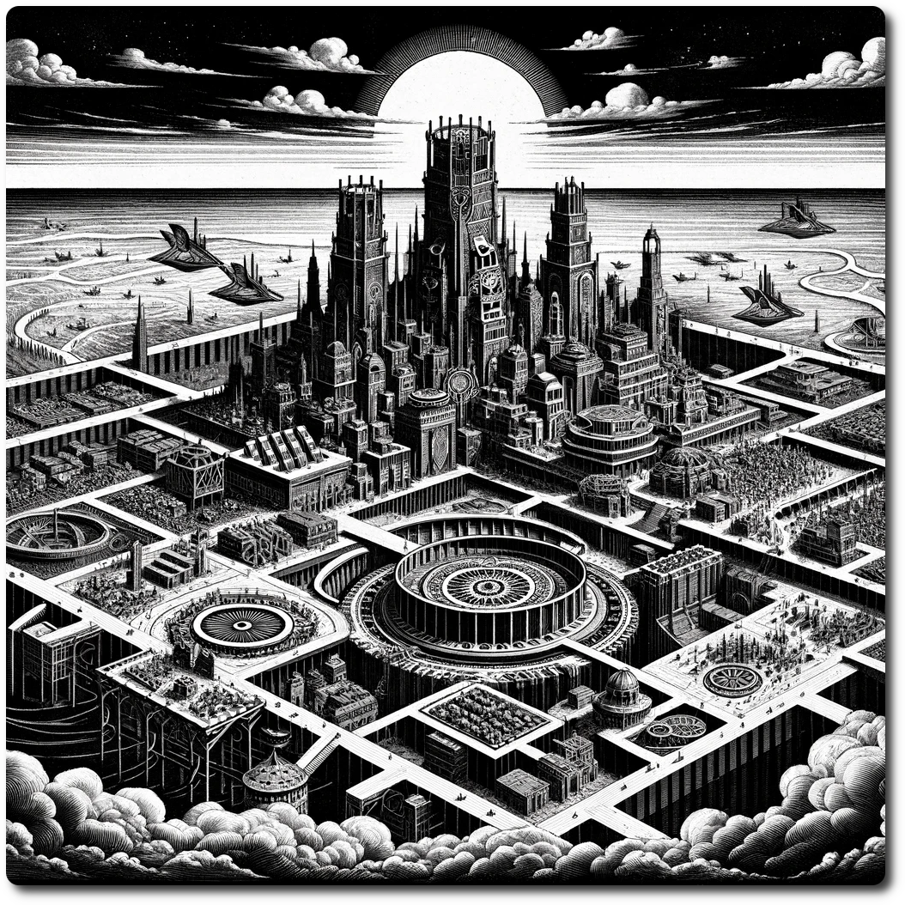

    
    
# XXXX- Special - NeoArcadia the Fallen Sky City    
    
NeoArcadia, the Fallen Sky City, stands as a beacon of resilience and innovation in the world of the Ancient Future. Once a marvel even among the other cities of the clouds, its history is marked by a catastrophic descent that transformed it from a floating utopia to a grounded haven amidst ruins.     
    
Yet, even in its fall, NeoArcadia emerged as a bustling metropolis, ingeniously built upon the remnants of its former glory. The city is a tapestry of the old and the new, where technological wonders from the Era of Flight miraculously survived the Crash, integrating seamlessly with the improvised ingenuity of the present.     
    
At its heart is the unbroken lineage of Sky Captains, who, according to legend, have ruled since the city's days in the heavens. Their leadership is a testament to the unyielding spirit of Neo Arcadia's inhabitants, who turned a tale of disaster into one of triumph.     
    
Today, NeoArcadia shines as a vibrant hub, a testament to the enduring human spirit and a living museum of technological marvels, attracting adventurers, scholars, and dreamers drawn to its unique blend of history and progress.    
    
**Forage:** 3    
**Scout:** -    
    
Markets:    
[Trade Goods Market](./Trade-Goods-Market.html)    
[Flea Market](./Flea-Market.html)    
[General Goods](./General-Goods.html)    
    
**Special Encounter - Welcome Home**    
    
- Parties returning to this Hex restore all stats except Luck    
    
**Special Encounter - Hit the Town**    
    
Characters may choose 2 of these options    
- Get Lucky - Spend 2 Ale to roll 1d6, on six regain one luck. You may do this any number of times, each time doubling the amount of Ale consumed.    
- Visit the [Techstitcher](./Techstitcher.html) - Trade Ancient Tech for PP    
- Gamble - Spend 1 Luck roll 1d6 and consult the table    
    
| Roll | Result |    
| ---- | ---- |    
| 1 | You get nothing. |    
| 2 | You get nothing |    
| 3 | You get nothing |    
| 4 | Regain 1 Luck |    
| 5 | Win 50g |    
| 6 | Gain 1 PP |    
    
[Table of Contents](./Table-of-Contents.html)