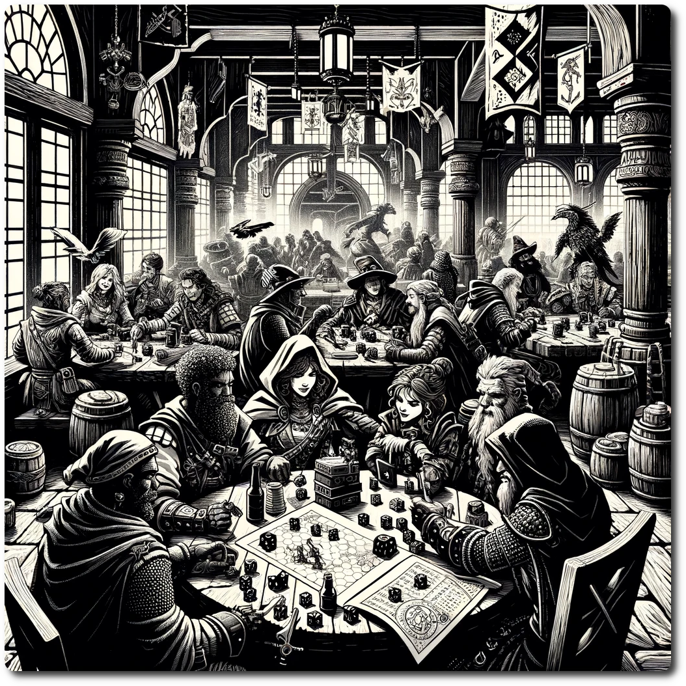

---  
share: "true"  
---  
  
    
    
# Play the Game    
    
NeoArcadia is a game designed for long-term play, offering a Continuous Play Experience. Envision a game evolving over not just hours, but weeks and months, continuously welcoming new players into its ever-changing world. This approach marries the charm of classic play-by-post war games with the dynamic interactivity of modern tabletop gaming.    
    
**How It Works:**    
    
- **Asynchronous Play:** The game's Continuous Play Experience allows for flexible participation. Players can join and contribute at their own pace, ensuring the game remains active and evolving, even in their absence.    
- **Open-Ended Narrative:** The storyline unfolds over an extended period, shaped by the actions and decisions of both current and new players. This creates a collaborative and evolving narrative.    
- **Dynamic Integration of New Players:** Newcomers can easily join the game without disrupting its flow. The design facilitates the seamless introduction of new characters and perspectives.    
    
## Game Pieces    
    
- **Map:** A visual representation of the play area.    
- **Rumor Deck:** A stack of [Rumors](Rumors.html) about the individual [Hexes](Hexes.html) on the map.    
- **Party Markers:** Objects to mark the locations of parties in the play area.    
- **Hex Sheets:** Detailing each hex on the board, including special rules and [Encounters](Encounters.html). These sheets, numbered on the back, are revealed when a party enters the corresponding hex.    
- **Party Sheets:** Used for keeping records of each party.    
- **Calendar Card:** Tracks game time progression, the current Season, and Weather Effects.    
- **d6s:** Dice used for various rolls.    
- **History Log (Optional):** A record of important and fun events, plot developments, and a way to share tales of adventures with others.    
- **Adventure Packs (Optional):** Additional maps, quests, rumors, and hex sheets. You can get [The Techno Bandits of Turing Woods](./adventures/Techno%20Bandits%20of%20Turing%20Wood/The%20Techno%20Bandits%20of%20Turing%20Wood.html) for free!  
    
## Setup    
    
1. Lay out the Map.    
2. Shuffle the Rumor Deck.    
3. Place Party Markers on [NeoArcadia](./NeoArcadia.html)    
4. Arrange the Hex Sheets in numerical order.    
5. Set up the [Environment System](Environment%20System.html).    
    
## Rolling Dice    
    
Most dice rolls in NeoArcadia work off of the following formula.    
    
Xd6 + Good Stuff - Bad Stuff = Degree of Success    
    
### Example    
    
Let's say you were scouting a new hex with a Scouting Difficulty of eight. You roll 2d6, resulting in a a 2 and a 6 for a total of eight. If you had a scout with Terrain Knowledge you would add one. Then you would subtract the Scouting Difficulty of the Terrain with the result being 1.    
    
8 + 1 - 8 = 1    
    
That would give you a scouting bonus (the degree of success) equal to 1.    
    
Some rolls like combat have bad effects if the number is negative, like the party taking that much damage.    
    
## Turn Order    
    
1. [Environment Turn](Environment%20Turn.html)    
2. Existing Players' Turns    
3. New Players' Turns    
    
## Player's Turn    
    
Players proceed through their turn in the following phases:    
    
1. [Prepare Phase](Prepare%20Phase.html)    
2. [Embark Phase](Embark%20Phase.html)    
3. [Encounter Phase](Encounter%20Phase.html)    
4. [Recover Phase](Recover%20Phase.html)    
    
## More Adventure, More Fun!    
    
Played through the base Adventure and conquered the Techno Bandits?    
    
Check out the [Advanced Rules](./Advanced%20Rules.html)    
    
[Table of Contents](./Table%20of%20Contents.html)    
