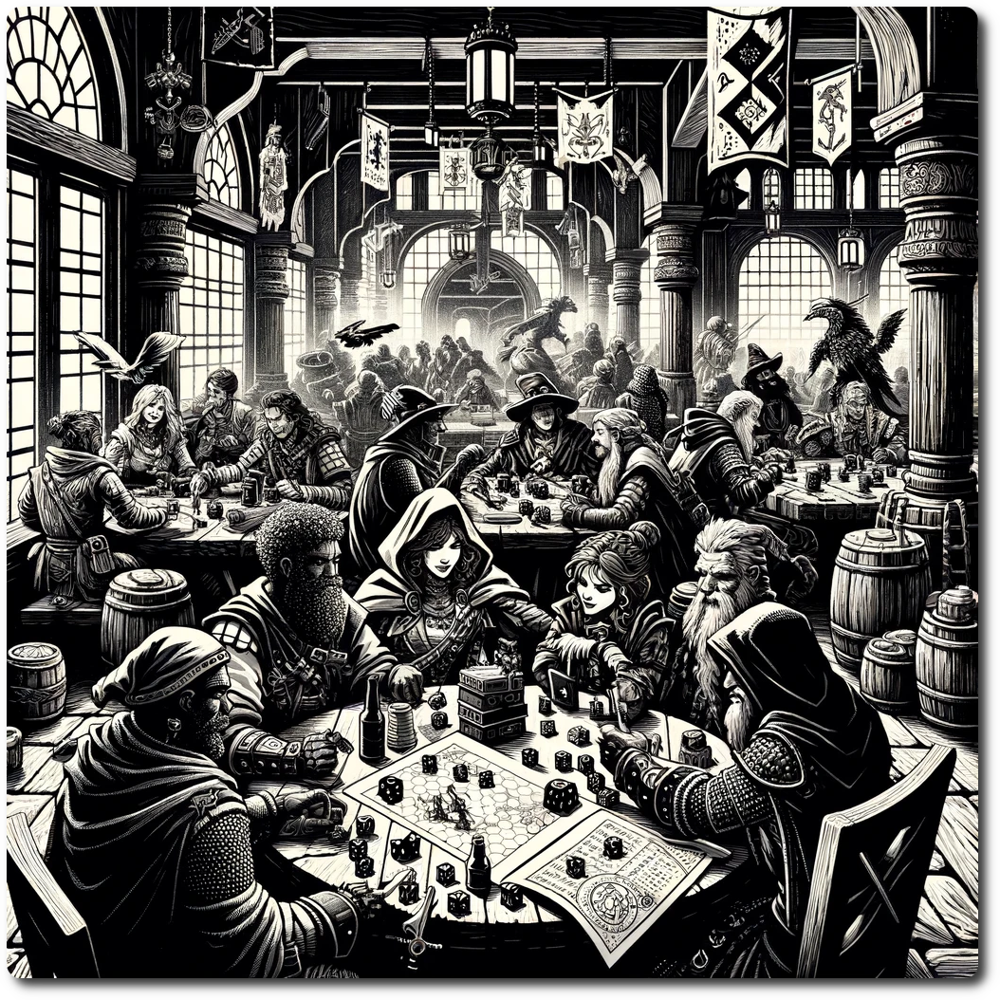

    
   
# Play the Game    
   
NeoArcadia is a game designed for long-term play, offering a Continuous Play Experience. Envision a game evolving over not just hours, but weeks and months, continuously welcoming new players into its ever-changing world. This approach marries the charm of classic play-by-post war games with the dynamic interactivity of modern tabletop gaming.    
   
**How It Works:**    
   
- **Asynchronous Play:** The game's Continuous Play Experience allows for flexible participation. Players can join and contribute at their own pace, ensuring the game remains active and evolving, even in their absence.    
- **Open-Ended Narrative:** The storyline unfolds over an extended period, shaped by the actions and decisions of both current and new players. This creates a collaborative and evolving narrative.    
- **Dynamic Integration of New Players:** Newcomers can easily join the game without disrupting its flow. The design facilitates the seamless introduction of new characters and perspectives.    
   
## Game Pieces    
   
- **Map:** A visual representation of the play area.    
- **Rumor Deck:** A stack of Rumor Cards about the individual hexes on the map.    
- **Party Markers:** Objects to mark the locations of parties in the play area.    
- **Hex Sheets:** Detailing each hex on the board, including special rules and encounters. These sheets are folded in half and numbered on the back.
- **Party Sheets:** A record of your party's stats and skills. 
- **Environment Log:** Tracks the games calendar, the current Season, and Weather Effects. 
- **d6s:** Dice used for various rolls.
- **History Log (Optional):** A record of important and fun events, plot developments, and a way to share tales of adventures with others.    
- **Adventure Packs (Optional):** Additional maps, quests, rumors, and hex sheets. You can try [The Techno Bandits of Turing Woods](./adventures/Techno-Bandits-of-Turing-Wood/The-Techno-Bandits-of-Turing-Wood.html) for an example.
- **Crisis! Expansions:** Unique scenarios to challenge groups of players such as [ Leviathan Awakes](./crisis/Leviathan-Awakes/Leviathan-Awakes.md)
  
## Setup    
   
1. Lay out the Map.    
2. Shuffle the Rumor Deck.    
3. Place Party Markers on [NeoArcadia](./NeoArcadia.html)    
4. Arrange the Hex Sheets in numerical order.    
5. Set up the [Environment System](Environment-System.html).

## Drawing from the Rumor Deck

When you draw from the rumor deck you may record any information you wish, then shuffle the rumors back into the deck for other parties to hear. You may instead choose to spread the rumor by placing it face up in the play area.

## Rolling Dice    
   
Most dice rolls in NeoArcadia use the following formula.    
   
Xd6 + Good Stuff - Bad Stuff = Degree of Success    
   
### Example    
   
Let's say you were scouting a new hex with a Scouting Difficulty of eight. You roll 2d6, resulting in a a 2 and a 6 for a total of eight. If you had a scout with Terrain Knowledge you would add one. Then you would subtract the Scouting Difficulty of the Terrain with the result being 1.    
   
8 + 1 - 8 = 1    
   
That would give you a scouting bonus (the degree of success) equal to 1.    
   
Some rolls like combat have bad effects if the number is negative, like the party taking that much damage.    
   
## Turn Order    
   
1. [Environment Turn](Environment-Turn.html)    
2. Existing Players' Turns    
3. New Players' Turns    
   
## Player's Turn    
   
Players proceed through their turn in the following phases:    
   
1. [Prepare Phase](Prepare-Phase.html)    
2. [Embark Phase](Embark-Phase.html)    
3. [Encounter Phase](Encounter-Phase.html)    
4. [Recover Phase](Recover-Phase.html)    
   
## More Adventure, More Fun!    

Defeated the Techno Bandits? Survived the Braying-Leviathan?
   
Check out the [Advanced Rules](./Advanced-Rules.html) to create more excitement for your game.
   
[Table of Contents](./Table-of-Contents.html)    
