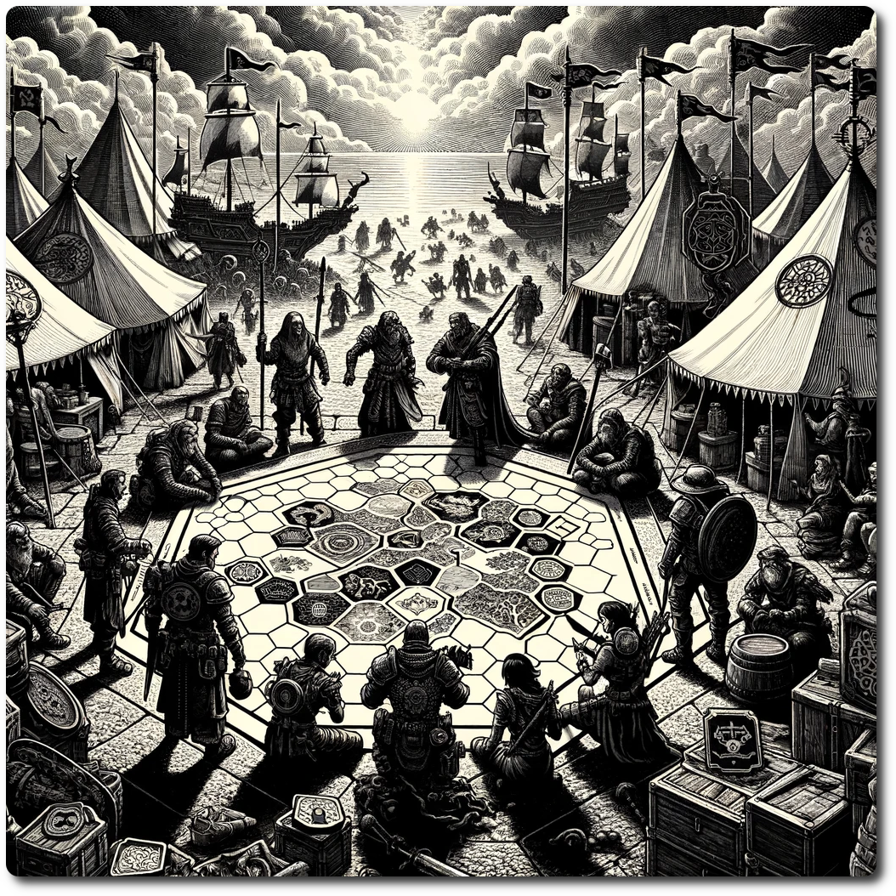

    
    
# Prepare Phase    
    
## Step 1. **Play or Pass**    
    
Players who do not wish to participate in the current or upcoming rounds can opt to skip their turn. This flexibility accommodates situations like phone calls, snack breaks, or weekend trips, allowing the game to progress despite real-life interruptions.    
    
### Special Rule: Skip 'em    
    
If a player is not present, the group can choose to skip ahead to the next present player.    
    
## Step 2. Select or Build a Party    
    
Players without a party should use the [Party Creation](./Party-Creation.html) rules to form one. This applies when starting the game or after losing all previous parties. This action constitutes the entirety of the player's turn.    
    
Players with existing parties select one to activate for the turn.    
    
Players owning a Guildhall may recruit a new party to their guild for a fee 1000 Gold. Follow the [Party Creations](./Party-Creation.html) rules.    
    
## Step 3. Planning    
    
Players choose a destination hex for their active party from adjacent hexes. The party remains in its current location and does not move yet.    
    
### Special Rule: Lost    
    
A [Lost](Lost.html) party does not select its next hex but rolls 1d6 to move to a random adjacent hex. The party is no longer lost after this turn.    
    
## Step 4. Provisioning    
    
Parties can trade at any [Market](./Market.html) available in their current hex. Each market has a unique table of goods and their trade values. Parties can engage in unlimited trades.    
    
### Special Rule: Ale is Always a Good Investment    
    
Parties can always purchase or sell Ale at a market.    
- Buy Price: 2 gold for 6 Ale    
- Sell Price: 5 Ale for 2 gold (as one is typically consumed)    
    
### Special Rule: Market Collapse    
    
If a player exploits a trade loop yielding more resources than initially held, resulting in infinite goods, that market collapses. The player then receives 10 PP to distribute among their characters. The market closes, leaving the economy in ruins. Thanks, Capitalism.    
    
## Step 5. Character Abilities and Spreading Rumors    
    
Characters with abilities applicable in the Prepare Phase may use them now, in any order the player chooses.    
        
## Step 6: Forage    
    
The party can gather food and water from their current location before traveling to the next hex. If not they will have to dip into their limited and ever dwindling supplies.    
    
- **Forage Roll** 2d6 - Forage Difficulty.    
- If the party is successful, the party finds enough resources.    
- Otherwise the party must consume one ration or lose 2 stamina.    
    
Next: [Embark Phase](./Embark-Phase.html)    
    
[Table of Contents](./Table-of-Contents.html)