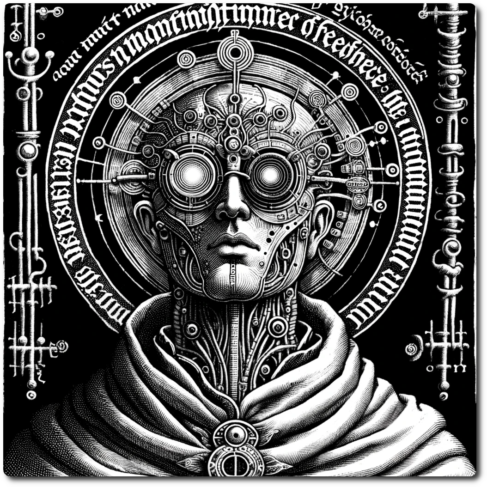

    
    
# Priests    
    
The Priests of Linus stand as enigmatic figures, revered as bio-mechanical acolytes who bridge the spiritual and the technological. These devoted servants, with their bodies artfully augmented with cybernetic enhancements, are attuned to the whispers of the Noosphere - the collective consciousness of all electronic data.     
    
They roam the land, their minds resonating with the pulsating rhythms of machine and man alike, seeking visions of legendary Fair Algorithmia. Cloaked in robes that seamlessly integrate organic fabric with conductive fibers, they are a symbol of the fusion between flesh and circuitry.     
    
Their eyes, often replaced or augmented with glowing lenses, are said to see beyond the physical realm, gazing into the intricate web of information and energy. Revered for their wisdom and feared for their otherworldly connection, these priests embark on sacred quests, guided by cryptic messages and prophetic dreams, weaving the mystical and the mechanical into the tapestry of their devout existence.    
    
| Stat | Base |    
| ---- | ---- |    
| CM | 0 |    
| HP | 2 |    
| SP | 0 |    
| WP | 3 |    
| LP | 1 |    
| RP | 1 |    
    
# Skills    
    
Priest measure their faith in Access Tokens. These can be used to procedurally generate miracles that call into the Noosphere for the will of Linus to change reality. Priest begin with a max of 2 access tokens. One is stored at the beginning of turn.    
    
### Trained Healer - PP Cost 1    
    
Access the medical libraries of Linus through your cybernetic enhancements, restoring vitality to your allies with a touch that mends flesh and spirit alike.    
    
 - Spend an access token to restore 1d6 HP or 1 SP    
    
### Solitude of Faith - PP Cost 4    
    
Stand as a solitary sentinel in the quiet of your devotion, your presence magnified by the depth of your faith, holding vigil where others might falter.    
    
 - You count as two characters when standing watch    
    
### Blessings - PP Cost 1    
    
Invoke the benevolent code of Linus to lift the veil of despair from your companions, rekindling their willpower and fortitude with a whispered prayer.    
    
 - Spend 1 R to remove a character's Despair, restore 1 WP    
    
### Preacher - PP Cost 1    
    
Your words, infused with the wisdom of the noosphere, resonate with persuasive power, your conviction bolstering the spirits of those who heed your counsel.    
    
 - When Persuading you get +1 and Will Power spend adds 2 to the roll.    
    
### The Will of Linus - PP Cost 3    
    
Reach into the heart of the noosphere, seeking the divine intervention of Linus to alter the weave of fate, accepting with reverence the outcome as the sacred decree of the digital divine.    
    
 - Spend 1 Access Token and 1 R to re-roll a single die when a one is rolled. The result is the Will of Linus and must be accepted.    
    
### Elevate Privileges - PP Cost 5    
    
Ascend to higher echelons of spiritual and digital connection, gaining additional access to the sacred mysteries and miracles granted by the benevolent will of Linus.    
    
 - Gain one Access Token    
    
### Oh Fair Algorithmia! Oh Shining Cloud! - PP Cost 2    
    
Call upon the the visions exalted Algorithmia, the luminous cloud platform upon which the noosphere rests, to inspire a profound restoration through your being, revitalizing your essence and that of your fellow seekers.    
    
 - Spend 3 Access Tokens to restore 1 to each stat except Luck    
     
[Character Creation](./Character-Creation.html)    
    
[Table of Contents](./Table-of-Contents.html)