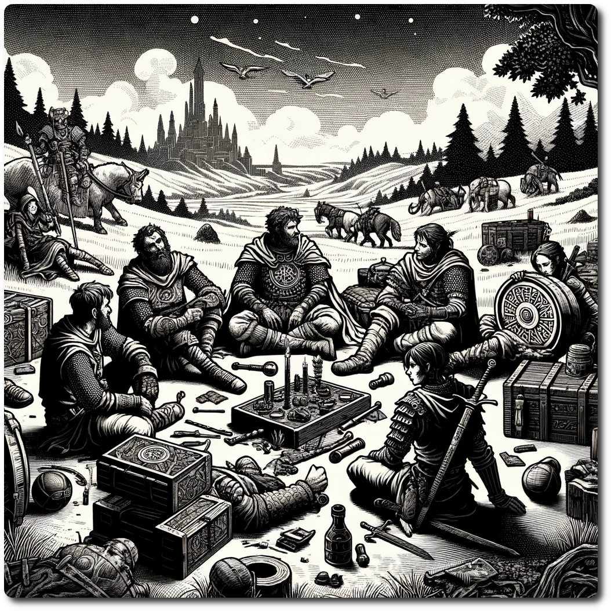

    
    
# Recovery Phase    
Previous: [Encounter Phase](./Encounter-Phase.html)    
    
## Step 1: Death    
    
- If the party is at 0 HP roll 1d6 if the roll is 4+ nothing happens, otherwise chose a character to become a corpse.    
- **Exhaustion Check:** If the party is at 0 stamina roll 2d6; on an 4+ nothing happens, otherwise choose a character to become a corpse.    
- Corpses are no longer considered characters and do not contribute to the party. Not even Linus can break the cycle of death. Pour out an ale for your fallen friend.    

#### Special Rule - Party Death

Sometimes a run of bad luck results in a dead party, the Brutal Reality of the Ancient Future can not be understated. 
- Record on the Hex Sheet the parties gear. 
- When a party arrives on the hex, they may loot the bodies at the end of the Embark Phase.
- 
## Step 2: Despair    
    
- If the Party is at 0 WP, choose a character to despair.    
- The character can not use skills until WP is increased to at least 1.    
    
## Step 3: Recover Hit Points    
    
The party recovers 2 HP    
    
## Step 4: Recover Stamina    
    
- Two characters must be selected for standing watch. The dangers of the Ancient Future do not rest. If the watch can not be filled, the party is slain in the night (Probably by wolves).
- The party recovers one stamina.    

#### Special Rule - Medicinal Herb

- The party may consume one Medicinal Herb to repeat a previous step, allowing for extra recovery. 
- The party may instead consume 2 Medicinal Herbs to restore one WP.

## Step 5: Recover Resourcefulness    
    
- Recover 1 RP    
- The party may then convert Luck Points into Resourcefulness.    
- Luck Points, once spent, are not recovered, unless a stroke of luck occurs...    
    
Back to: [Prepare Phase](./Prepare-Phase.html)    
    
[Table of Contents](./Table-of-Contents.html)