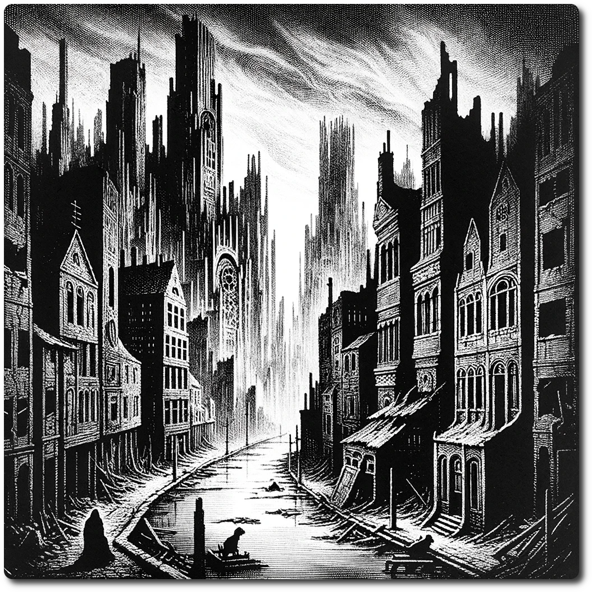

    
    
*In the heart of the desolate cityscape, towering buildings and crumbling structures stand as silent sentinels over streets eerily devoid of both human and mutant life. The pervasive stillness is unsettling, a haunting testament to a sudden, mysterious exodus that left the city frozen in time, a ghostly urban maze untouched by the living.*    
    
# Ruined Cityscape    
    
Forage: 8    
Scout: 14    

| Roll | Encounter Type | Description |    
| ---- | ---- | ---- |    
| 1 | Hazard | **Collapsed Building Challenge**: The party must carefully navigate through the dangerous terrain of a collapsed building. The treacherous journey results the party taking 3 damage, but also presents an opportunity to make 2 Loot Rolls. |    
| 2 | Supernatural | **Ghostly Apparitions Encounter**: Unseen forces test the party's resolve as ghostly apparitions emerge. If not chosen by scouting modifier, party loses 1 WP. |    
| 3 | Resources | **Ancient Tech Discovery**: If chosen by scouting modifier, discover of 1 piece of Ancient Tech. This rare and valuable find promises to enhance the party's capabilities. |    
| 4 | Combat | **Rogue Security Bots**: The remnants of a forgotten defense system become a lethal threat as Rogue Security Bots engage the party. **Impact: 12 HP: 10 Loot: +3, 50 Gold** |    
| 5 | Combat | **Feral Animal Things Attack**: The wilderness reveals its ferocity with the emergence of Feral Animal Things. **Impact: 15 HP: 15 Loot: +4, 50 Gold** |    
| 6 | Combat | **Rogue AI Ambush**: A highly advanced and unexpected threat emerges as a Rogue AI orchestrates an ambush.  **Impact 25 HP 20 Loot +5** |

[Terrain Types](./Terrain-Types.html)    
    
[Table of Contents](./Table-of-Contents.html)