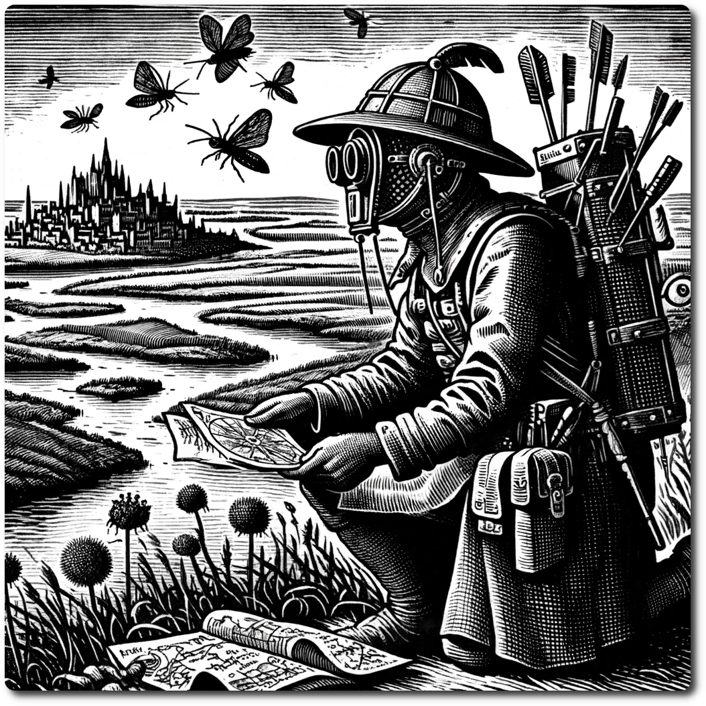

    
    
# Scouts    
    
In the vast expanses of the Ancient Future, Scouts stand out as the quintessential navigators and explorers, many of whom honed their skills in the tumultuous times of the Last War. These born adventurers are driven by an insatiable curiosity, not only to uncover hidden riches but also to unearth distant memories and forgotten tales that lie scattered across the land.     
    
With an innate proficiency in charting unexplored territories and deciphering cryptic maps, Scouts possess a unique blend of practical survival skills and a deep yearning for discovery. They are adept at reading the subtle signs of nature and unraveling the secrets of the most treacherous landscapes.     
    
However, despite their bravery and expertise, Scouts harbor a peculiar and intense hatred for bugs. Some say this is a lasting legacy of the Last War, but most scouts are unwilling to speak of the exact reason. Those who do tell tales that are as unbelievable as they are grisly.    
    
| Stat | Base |    
| ---- | ---- |    
| CM | 0 |    
| HP | 3 |    
| SP | 2 |    
| WP | 0 |    
| LP | 1 |    
| RP | 1 |    
    
# Skills    
    
    
### Never Lost - PP Cost 2    
    
Channel your unparalleled orientation skills to navigate through the enigmatic wilds of the Ancient Future, dispelling confusion and ensuring your path remains true and unerring.    
    
- During Prepare Phase can spend 1 RP to remove the [Lost](Lost.md) condition.    
    
### Covert Maneuver - PP Cost 4    
    
Employ your stealth and cunning to reconnoiter upcoming territories without alerting potential threats, making informed decisions that keep your party one step ahead of danger.    
    
- Before the party moves into a hex, you may spend 1 RP to look at the hex sheet for the destination with out revealing it. You may choose not to move this turn.    
    
### Terrain Knowledge (Type) - PP Cost 1    
    
Draw upon your intimate understanding of specific landscapes to master the art of moving through them, turning every stone and leaf into a guide and ally in your explorations.    
    
- You may take this skill multiple times even for the same Terrain.    
- When scouting a hex of chosen terrain type add one to the scouting roll.    
    
### Opportunist - PP Cost 2    
    
Utilize your keen adaptability to alter the course of your journey, shifting the odds in your favor as you deftly navigate the unpredictable wilderness of the Ancient Future.    
    
- You can spend 1 RP to change your Scouting Modifier by 1 when selecting an encounter. You may not use this if you do not have a Scouting Modifier.    
    
### Army Scout - PP Cost X (Max 4)    
    
Infuse your combat techniques with the precision and efficiency learned from your time in the Last War, ensuring that each strike is as strategic as it is lethal.    
    
- Your Combat Modifier is X/2 rounded down    
    
### The Only Good Bug . . . - PP Cost 1    
    
Embrace your deep-seated aversion to bugs, channeling it into a fierce combat prowess that makes you a relentless force against these skittering foes of the Ancient Future.    
    
- Your Combat Modifier is tripled against bugs. (Min 3)    
    
### Energy Conservation - PP Cost 2X    
    
Cultivate your stamina and endurance through meticulous energy management, allowing you to traverse the vast and treacherous landscapes of the Ancient Future with unwavering resilience.    
    
- Increase Stamina by X    
- You can take this multiple times    
    
[Character Creation](./Character-Creation.md)    
    
[Table of Contents](./Table-of-Contents.md)