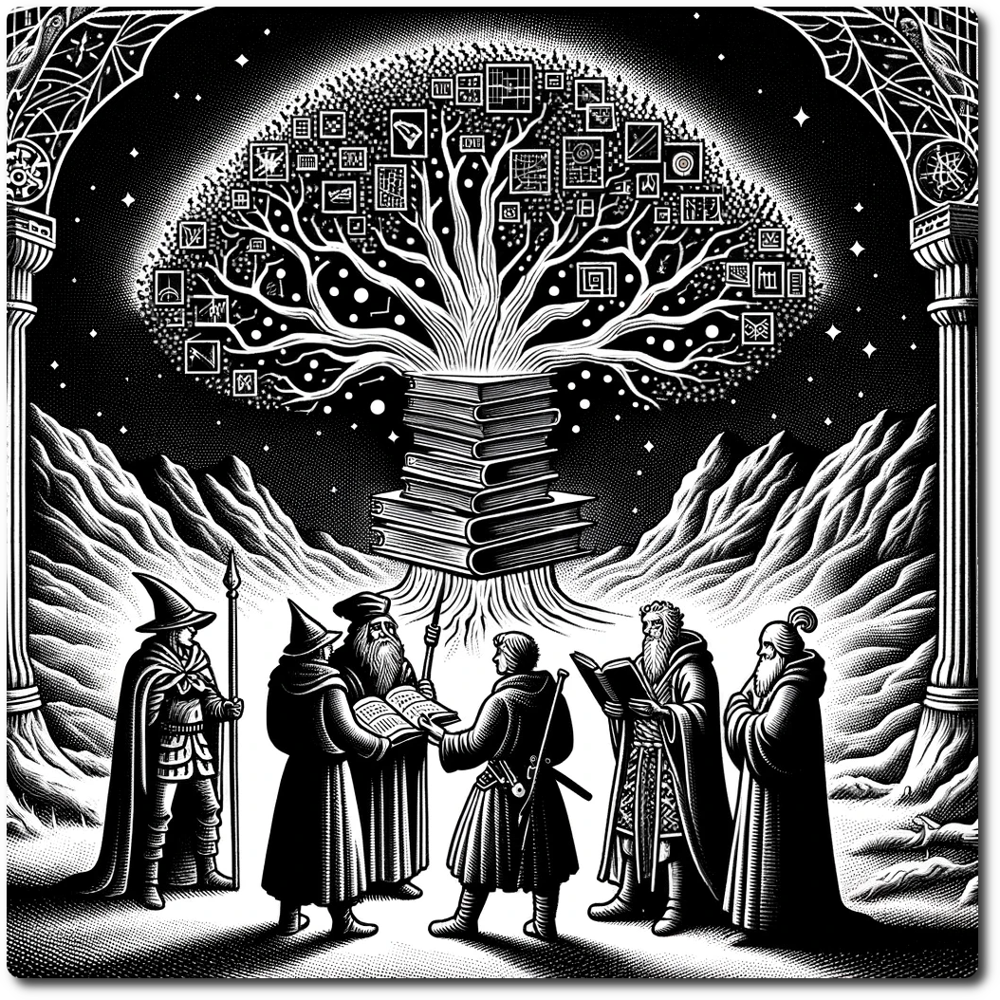

    
    
# Social System    
## Components    
    
1. **Rumors:** Gathering insights about distant hexes.    
2. **Information:** Acquiring specific details to unlock events or secrets.    
3. **Reputation:** Reflects how parties are perceived, influencing their interactions.    
    
## Trade    
    
- Players can exchange items at hexes with markets during the [Prepare Phase](./Prepare-Phase.html).    
- Players can trade items with other parties if they occupy the same hex. This can occur during any phase. For parties belonging to different players, both players must be present at the time of the trade.    
    
## Rumors    
    
- Each rumor is linked to a specific hex. Not every hex has a rumor, but the notable ones typically do.    
- Rumors may not always be accurate and could contain misleading information.    
- Parties have the option to share rumors with others, even in different hexes.    
- Players can choose to "spread" a rumor by placing the corresponding rumor card face up. This action is performed during the [Prepare Phase](./Prepare-Phase.html).    
    
## Information    
    
- Information is typically more reliable and detailed than rumors.    
- It is used to unlock special encounters, find hidden treasures, or solve puzzles.    
- Information cannot be shared like rumors, but it can be traded between parties on the same square or sold at the [Flea Market](./Flea-Market.html)    
    
## Persuasion    
    
- Encounters may require a Persuasion Roll.    
- **Persuasion Roll:** 2d6 + [Party's Reputation](./Party's-Reputation.html) vs Difficulty.    
- Before the roll, you may spend one WP to add +1.    

## Arbitration

Sometimes words are as important as actions, and agreement the only path to surviving the Brutal Reality of the Ancient Future. Forming agreements can be a valuable source of stability.

### Step 1. Gather Information

Arbitration encounters will have a list of information that could sway the out come. This information could come from many sources and could seem trivial, but these are facts of the situation that both sides think matter. 

- If the party encounters an Arbitration encounter they and they do not have the information listed, they can halt the Arbitration until they gather the information.
- The next time a party enters the hex, they must finish the Arbitration.
    
### Step 2. Validation Phase
    
 Now that the Information has been gathered, it needs to be validated by each side. Not they think the party is trying to trick them, but just to insure the party has not been tricked itself.
 
 **Engage Each Faction**: Conduct separate rolls to persuade each side of the Information's validity. Use the listed difficulty and roll 2d6 plus any adjustments. Each side may have different difficulty for a piece of information

#### Special Rule: Stake Your Reputation

The party may spend 1 LP to add one to all Arbitration rolls this turn. They may do this a number of times up to their Reputation.

- Degree of Success  1-4, Add one die to the Arbitration Dice Pool
- Degree of Success  5+, Add two dice to the Arbitration Dice Pool 
   
### Step 3. Arbitration

This is where the disputing parties make a decision about what happens next. This outcome falls into three categories as shown below.

- Roll 2d6 + Validation Dice
	- 15+ Mutual Understanding
	- 8-14 Impasse
	- 7 or less Schism

### Step 4. Fall Out

Resolve the encounter using the outcome. 

[Example Arbitration](./Example-Arbitration.html)

[Table of Contents](./Table-of-Contents.html)