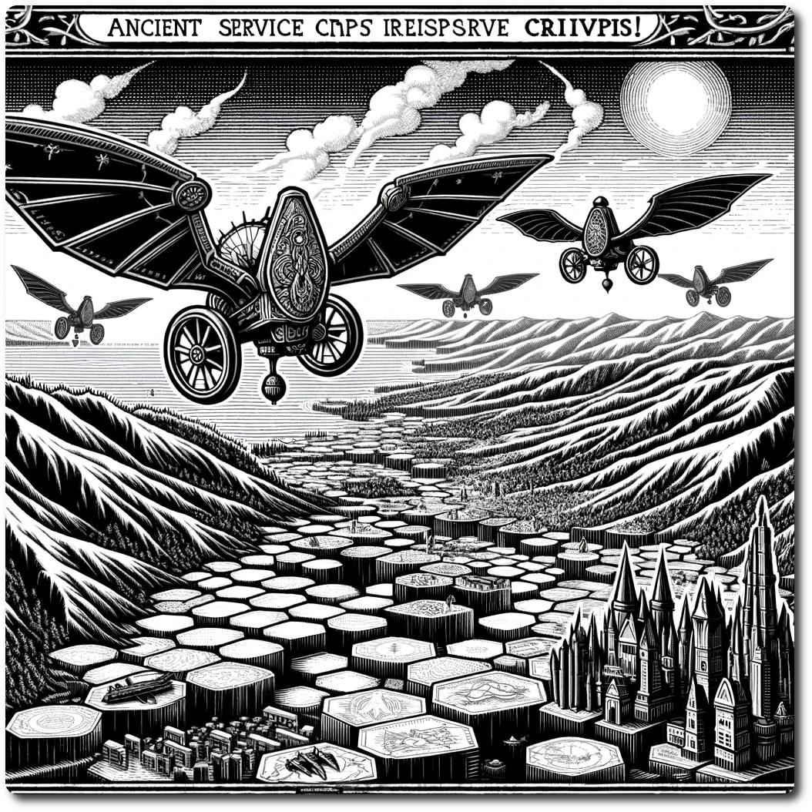

  
# The Crisis!  
  
In the ever-shifting landscape of NeoArcadia, the emergence of a crisis marks a pivotal moment that calls for unity and courage among the scattered adventurers. The Skycaptain, a figure of authority and desperation, initiates the Crisis! event, setting in motion a series of grave challenges and compelling rewards. Here are the mechanics for starting a Crisis! event:  
  
The Crisis! event follows a structured approach to ensure clarity, challenge, and engagement:  
  
1. **The Skycaptain's Call:** The Skycaptain officially declares the onset of the Crisis! event, detailing the nature of the threat, the location of the Rally Point, and the initial consequences (e.g., the destruction of the outpost).  
2. **Resource Assessment:** Parties assess their resources, determining what was lost due to the crisis and what can be pooled together for the impending challenges.  
3. **Strategic Mobilization:** .  
4. **Crisis Resolution:** The event unfolds in phases, with each phase presenting specific challenges, decisions, and opportunities. The parties' actions, resource management, and strategic choices determine the outcome of the Crisis! event.  
5. **Outcome and Rewards:** Upon successfully confronting the crisis, the parties are rewarded commensurate with their sacrifices, risks, and strategic prowess. Failure to overcome the crisis may result in further losses but also offers valuable lessons and the resolve to face future threats.  
  
## 1. The Skycaptain's Call  
  
When the stability of NeoArcadia is at stake, the Skycaptain issues a distress call, an unmistakable sign of dire circumstances. This call is the precursor to a Crisis! event and gathers all the player's parties to a starting location.  
  
### Rallying the Adventurers  
  
- **Dispatching Service Craft:** The Skycaptain dispatches ancient service craft, remnants of a more advanced era, to deliver the call to action to parties across the hex map. These crafts symbolize the urgency and gravity of the situation. This happens during the Environment Turn.  
- **Gathering at the Rally Point:** Parties are instructed to converge at a specific hex, the Rally Point, to facilitate coordination, resource sharing, and strategic planning. The Rally Point is typically near the epicenter of the crisis. Players may do this during their next turn after the Crisis! is declared. This consumes the parties whole turn.  
- **Temporary Safe Passage:** To expedite the gathering, the Skycaptain ensures temporary safe passage through hexes, reducing the usual risks and allowing parties to reach the Rally Point more efficiently. At the end of the Player's turn, move the party to the rally point.  
  
## 2. Resource Assessment: Navigating the Aftermath of a Crisis  
  
As the reality of the Crisis! event sets in, the adventurers of NeoArcadia must quickly come to terms with their current situation and prepare for the daunting challenges ahead. Resource assessment is a critical phase where parties evaluate their assets, strategize resource allocation, and gear up for the collective effort to confront the crisis. Here are the detailed mechanics for the Resource Assessment phase:  
  
### Resource Assessment Phase: A Time for Reflection and Strategy  
  
1. **Initial Loss Assessment:**  
   - As the Crisis! event begins, the initial consequences are felt immediately. The Crisis! will detail the resources lost as the initial event. This is done during the Environment Turn.  
   - A Crisis! May have a scaling option, this allows larger play groups to scale the Crisis! to a level that is both difficult and fun. If you can solve a Crisis! in a turn, it is not really a Crisis! chum.  
  
2. **Inventory Check:**  
   - Player conduct a thorough inventory check, listing all available resources, including Gold, Ale, rations, and any special items or artifacts they are will to contribute to the crisis.  
   - This step ensures that all parties have a clear understanding of their starting point for the crisis, setting the stage for effective resource management. If a player must leave the Crisis before it is resolved, they have an option of rolling back to this point.  
   - This should also be used to make sure nothing is duplicated or lost as players leave.   
  
**Example:** Pat commits his geared up fighter and swaps it with Kriss's Priest. If Pat has to leave and they decide to roll back, Kriss can continue playing with the fighter, and at the end of the Crisis! We know that the fighter was Pat's and don't have to worry about where it ends up, it is safely rolled back into Pat's resources.  
  
3. **Resource Pooling and Allocation:**  
   - Once at the Rally Point, parties have the option to pool their resources, creating a shared inventory that can be strategically allocated based on the needs of the collective group.  
   - Decisions regarding resource allocation should be made collaboratively, with each party's needs and strengths taken into consideration. The nominated leader or a designated quartermaster may facilitate this process.  
  
4. **Strategic Planning:**  
   - With a clear understanding of the available resources, parties engage in strategic planning. This involves determining the most critical needs, anticipating future challenges, and setting priorities for resource usage.  
   - Parties may also plan for resource acquisition, considering potential scavenging missions, trade opportunities, or crafting endeavors to replenish or enhance their inventory.  
  
5. **Recording and Transparency:**  
   - All resource assessments, pooling decisions, and strategic plans should be meticulously recorded. This ensures transparency and allows parties to track resource flow, consumption, and replenishment throughout the Crisis! event.  
   - The use of shared documents or a designated record-keeper can facilitate this process, ensuring that all parties have access to up-to-date information.  
  
6. **Preparation for the Unexpected:**  
   - While parties can plan based on current knowledge and resources, the volatile nature of a Crisis! event means that unexpected challenges can arise.  
   - Parties are encouraged to set aside a contingency reserve, a portion of resources dedicated to addressing unforeseen difficulties or taking advantage of sudden opportunities.  
  
## 3. Crisis Resolution: The Final Stand in NeoArcadia  
  
The Crisis Resolution phase is the climactic conclusion of a Crisis! event, where the combined efforts of all parties are put to the ultimate test. This phase determines the fate of the adventurers and the lands of NeoArcadia, turning the tide towards a triumphant victory or a mournful defeat. Here are the mechanics for the Crisis Resolution.  
  
### Crisis Resolution Phase: Epic Triumphs and Tragic Laments  
  
1. **Final Confrontation:**  
   - The Crisis! event culminates in a final confrontation, a decisive battle or challenge that requires the collective effort and strategic acumen of all allied parties.  
   - This confrontation might involve facing the Braying-Leviathan head-on, neutralizing a catastrophic technological anomaly, or completing a complex ritual to contain the crisis.  
   - The specific conditions for the Final Confrontation will be included in the Crisis! Usually this will include gathering specific information, succeeding at specific special encounters, or gathering certain resources and building special structures.  
  
2. **Coordinated Efforts:**  
   - Success in the final confrontation depends on the effective coordination of resources, skills, and strategies. Each party plays a specific role, contributing to the collective effort based on their strengths and the strategic plans laid out during the Resource Assessment phase.  
   - The outcome of each party's actions is determined through a combination of strategy, skill checks, and the judicious use of resources. If the players hits the Success Threshold they win, otherwise, well if has been an honor chum.  
  
3. **Epic Wins:**  
   - A successful resolution of the Crisis! event is celebrated as an epic win, a testament to the bravery, unity, and strategic prowess of the adventurers.  
   - The parties are rewarded with rich spoils, including rare resources, ancient artifacts, and renown that spreads across the lands of NeoArcadia. These rewards not only reflect the immediate success but also contribute to the long-term development and legacy of the parties.  
   - The tales of victory are chronicled by bards and storytellers, ensuring that the deeds of the heroes are remembered and celebrated for generations. If you are using a History Log, make sure to include this.  
  
4. **Tragic Losses:**  
   - Failure to resolve the crisis results in tragic losses, casting a shadow of sorrow and despair over the affected lands and parties. Death is usually the smallest price paid.  
   - The consequences of failure are significant, including further resource depletion, loss of important characters, and the spread of the crisis's detrimental effects across NeoArcadia.  
   - However, even in defeat, the stories of bravery, sacrifice, and the harsh lessons learned are recounted in laments and tales. These narratives serve as solemn reminders of the challenges faced and the resilience required to persevere in the Ancient Future.  
  
5. **Assessing the Aftermath:**  
   - Following the resolution of the Crisis! event, parties assess the aftermath, taking stock of their losses and gains, and divide back up the resources as agreed upon.  
   - This is done in the Environment Turn following the Final Confrontation. Normal play resumes, until the next Crisis! Strikes.  
  
[Table of Contents](./Table%20of%20Contents.html)  