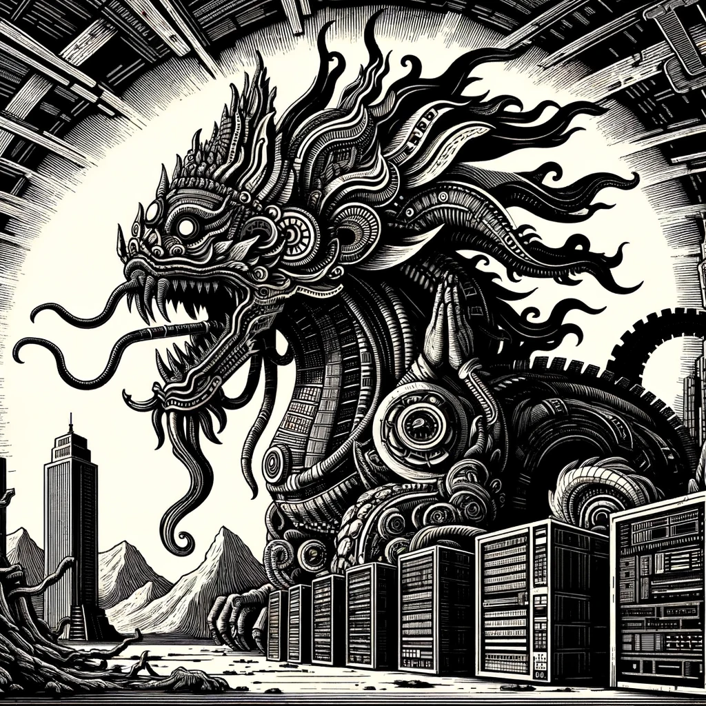
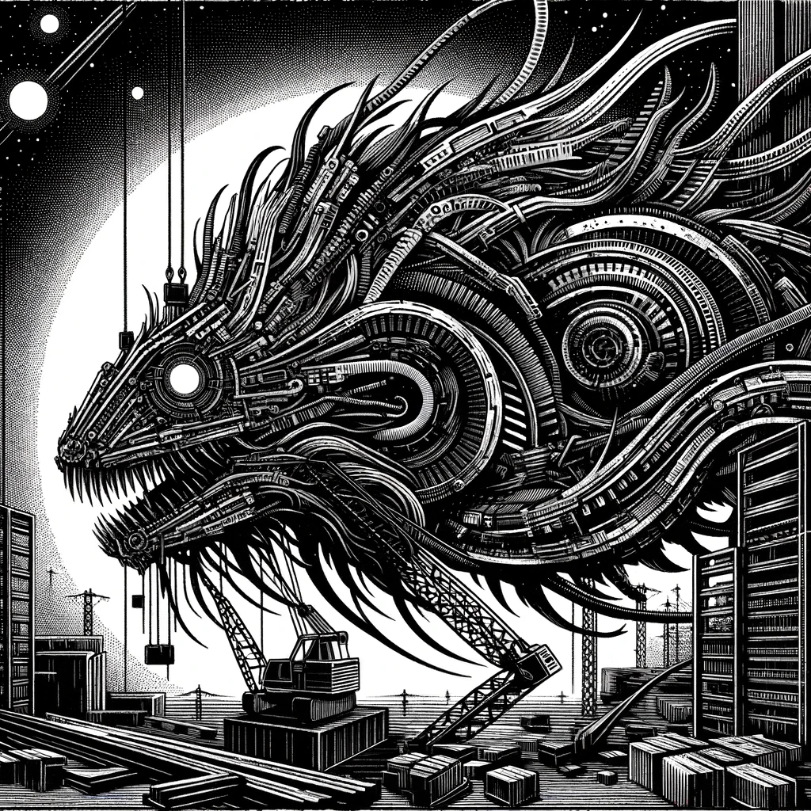
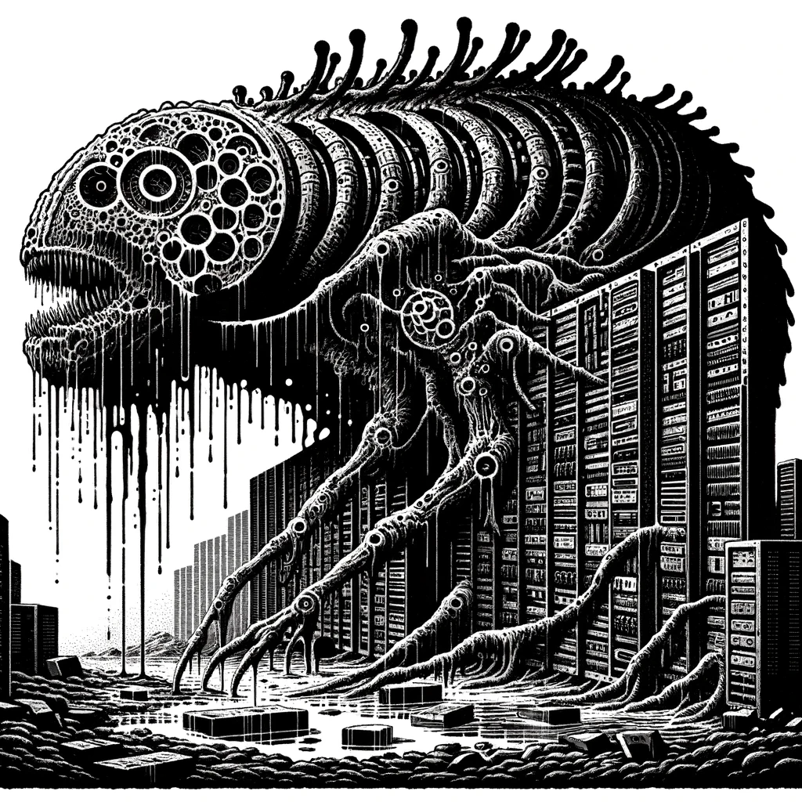
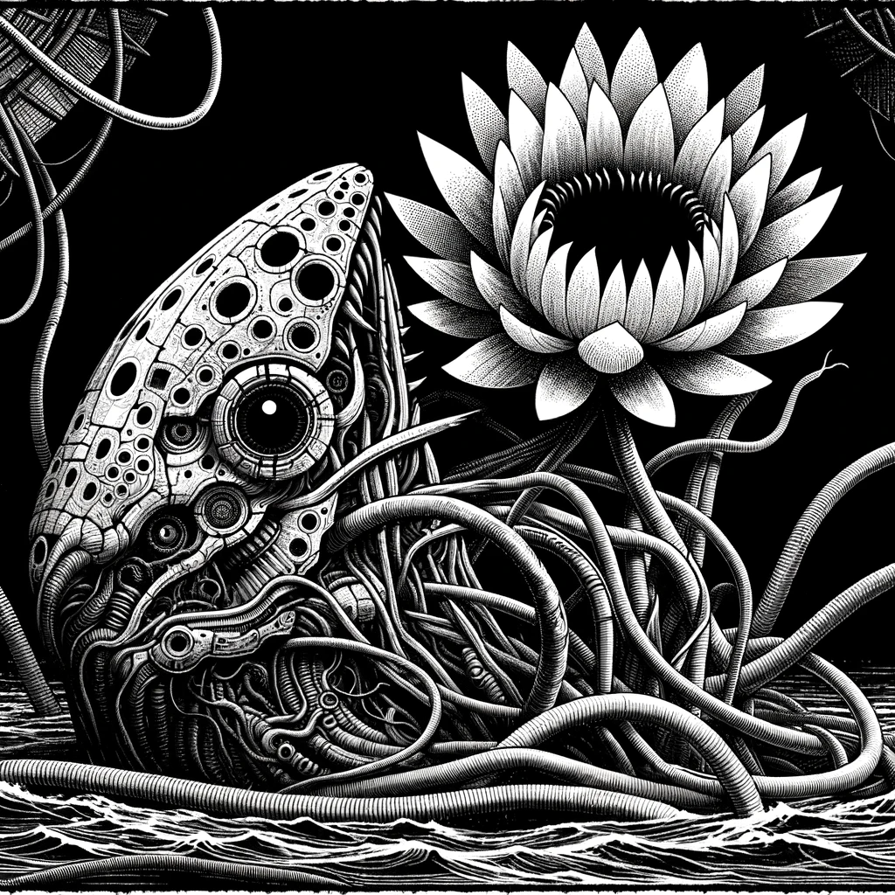
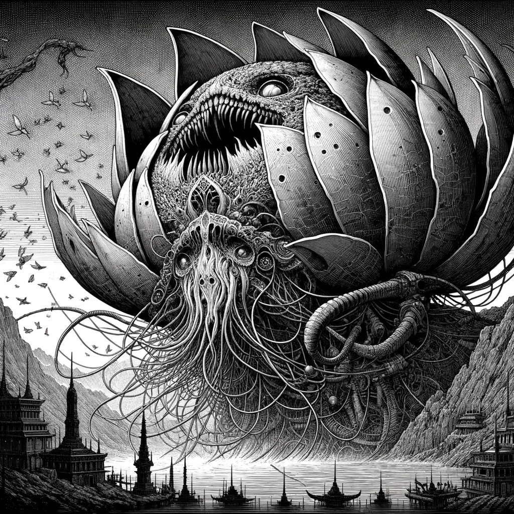
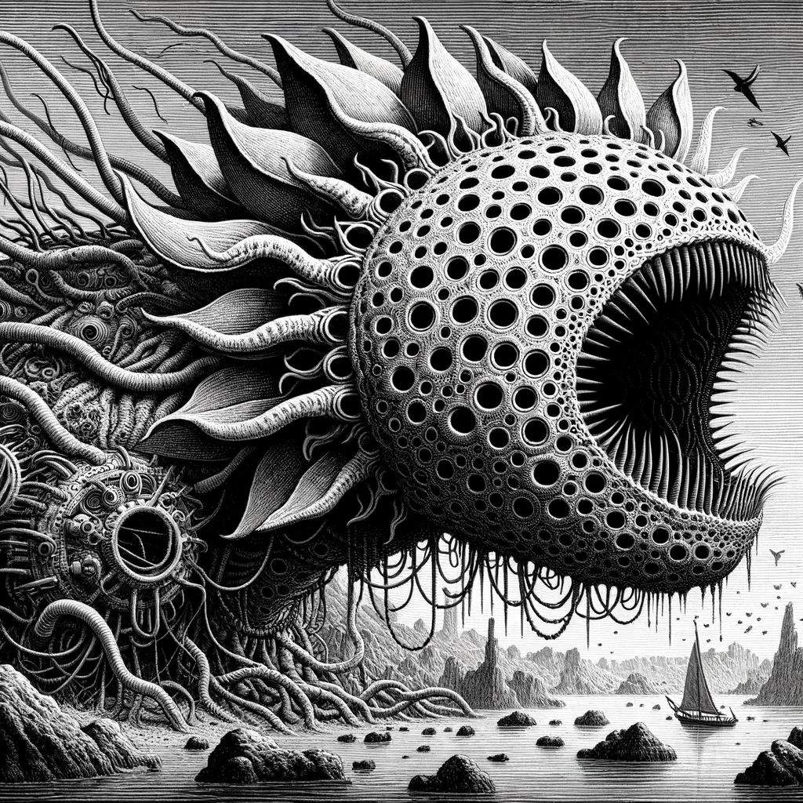
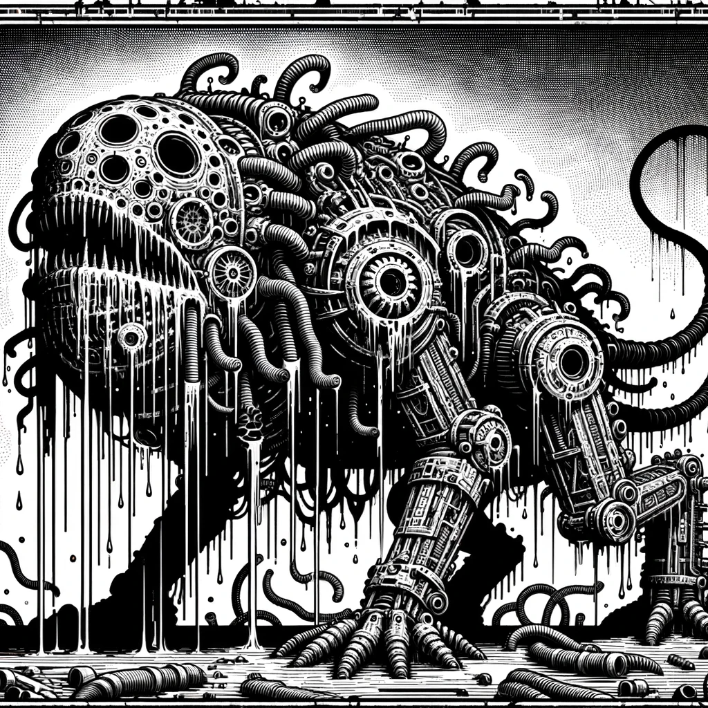
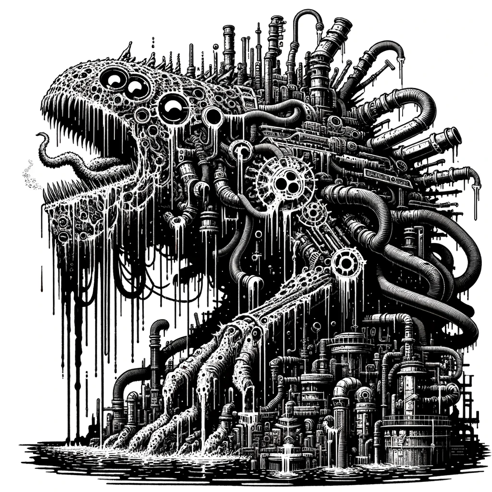
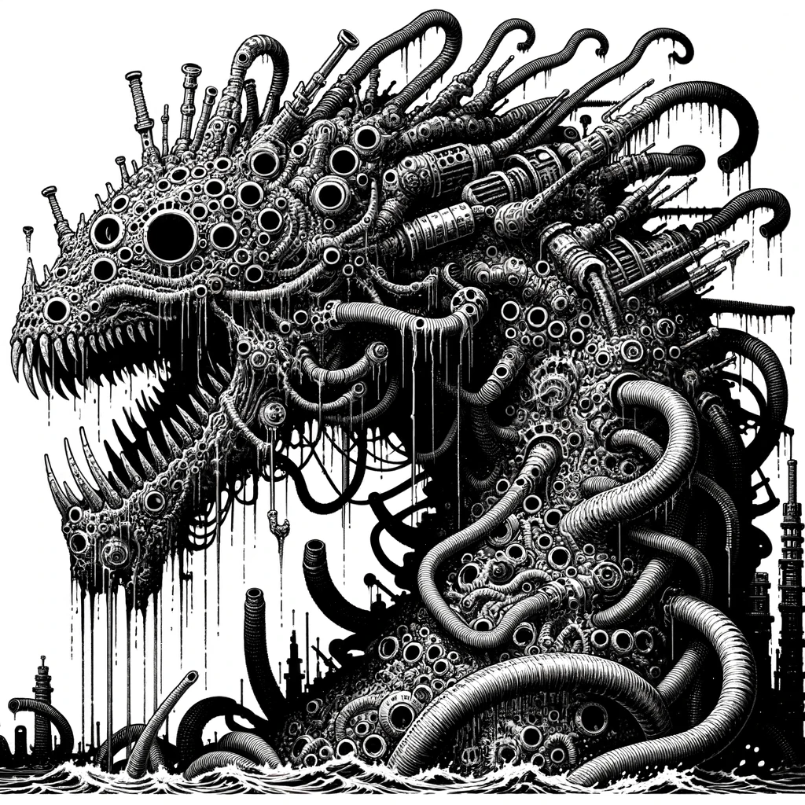

# What Was Not  
  
Welcome to the all the art that was cool, but not exactly what was wanted. . .   
  
## Braying-Leviathan  
  
This was fun to make, the idea of a giant loud force of destruction is awesome! Getting there required some work, as the Leviathan seemed to be closely related to dragons, which as show below is where the images started.  
  
  
  
  
  
  
  
That is the one where it took a turn, the horrible face on this guy was really inspiring. The wall of servers was cool, but not exactly the best thing to clip into. So more prompts were tried, using lotus root in the prompt. The Yikes got stronger.  
  
  
  
  
  
  
  
The last one almost made it, the sail boat for scale was cool, but I just couldn't stop looking at the flower part. Undertale is a good game, but the vibe is a little different in the Brutal Reality of the Ancient Future.  
  
  
  
  
  
  
  
So we did manage to dial it in, as you can see from the last couple it was just a matter of trying a bunch until the ONE is found.  
  
