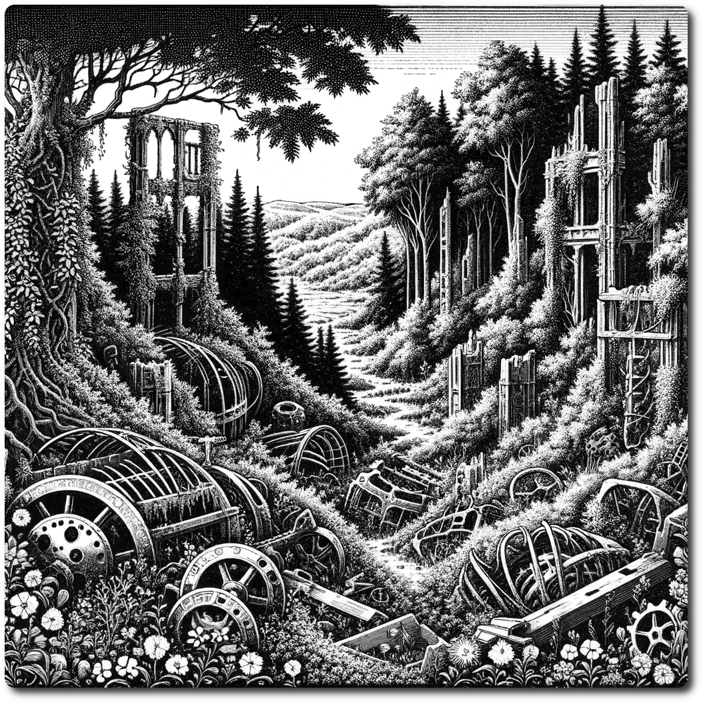

---  
share: "true"  
---  
  
    
    
*In the wilderness of the Ancient Future, nature has reclaimed the relics of a once-advanced civilization, intertwining overgrown forests with the rusted skeletons of forgotten technology. This untamed landscape is a patchwork of dense greenery and eerie, abandoned ruins, where the whispers of the past meet the primal breath of the wild, creating a world both hauntingly beautiful and mysteriously perilous.*    
    
# Wilderness    
    
Forage: 9    
Scout: 8    
    
| Roll | Encounter Type | Description |    
| ---- | ---- | ---- |    
| 1 | Get Lost | Party is Lost unless Scout spends 1 R |    
| 2 | Thorn Brush | If not chosen by scouting modifier, each party member takes 1 damage. |    
| 3 | Night Screams | Howling voices of rogue AI echo through the night, lose 1 Will power |    
| 4 | Combat | Wolves - Impact: 14 HP: 5 Loot: 0 |    
| 5 | Combat | Bandits Ambush - Impact: 15 HP: 15 Loot: +2, 50 Gold |    
| 6 | Phenomenon | Ancient Security Field, no need to set a watch this recovery. |    
    
[Terrain Types](./Terrain-Types.html)    
    
[Table of Contents](./Table-of-Contents.html)