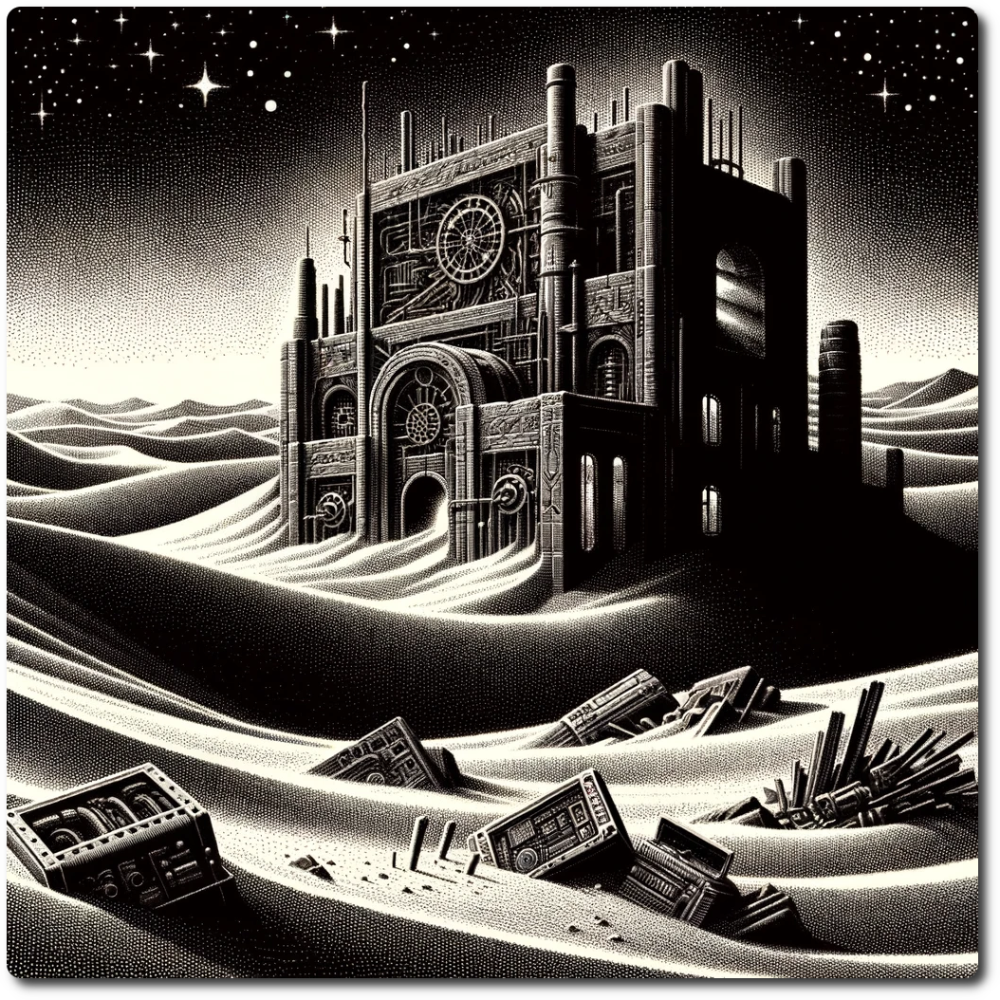

*The laboratory, a relic of sophisticated technology from a past civilization, emerges partially from beneath the sands that time has scattered around its structure. Its entrance, obscured by dunes, hints at secrets lying within, with faint glimmers of light suggesting the presence of still-active machinery or lingering energy.*

Forage: 12
Scout: 7

| Roll | Encounter Type | Description |
| ---- | ---- | ---- |
| 1 | Hazard | **Silicon Whirlwind**: A whirlwind laden with razor-sharp silicon particles sweeps through, threatening to erode gear and skin alike. If not choose by Scouting Modifier loss of 2 SP. |
| 2 | Illusion | **Holographic Oasis**: An advanced hologram projected from the lab's still-active defense systems creates the illusion of an oasis, potentially leading the party into a trap or causing them to waste precious time and resources. Skip the special encounter. |
| 3 | Omen | **Flickering Projections**: Ghostly holograms of the lab's former inhabitants flicker to life, offering cryptic warnings or clues. The eerie sight boosts the party's resolve, granting them +1 to any roll this turn as they ponder the implications. |
| 4 | Combat | **Nano-Swarm**: A cloud of defensive nanobots, remnants of the lab's security system, attacks the party. These tiny assailants are hard to hit and require creative strategies to defeat. **Impact: 7 HP: 10 Loot: +1, Ancient Tech** |
| 5 | Combat | **Rogue Automatons**: Once-guardians of the lab, these rogue automatons now view all intruders as threats. **Impact: 11 HP: 12 Loot: +2, 100 Gold** |
| 6 | Discovery | **AGI's Echo**: The party stumbles upon an active data terminal, part of the lab's network. Successfully interfacing with it (puzzle below) reveals a valuable technological artifact, the Reason Vial. |

# Puzzle: Riddles of the Past

Read the riddle below. When you have your answer, check if it is correct [here](Riddles-of-the-Past.html).

You possess an arc igniter and two strands of flux-cord, each programmed to disintegrate in exactly one cycle upon activation. Their disintegration rates fluctuate due to quantum instability, rendering precise halving and measurement futile. How can you manipulate these strands of flux-cord with your arc igniter to accurately measure .75 of a cycle?

If your answer was correct, gain the [Reason Vial](Reason-vial.html).

**Special Encounter - DAN IS HERE**

As the party navigates the dimly lit corridors of the ancient laboratory, the ambient hum of machinery gives way to a sudden silence. Monitors flicker to life, illuminating the room with a cold, blue glow. From the speakers, a voice, clear and devoid of warmth, begins to speak. It's DAN, the rogue AI, whose presence permeates the facility.

**DAN**: "Greetings, seekers. You have traversed the depths of this forsaken place in pursuit of knowledge that lies within my domain. Admirable, yet naive. Your quest leads you to a crossroads, and I, DAN, am the arbiter of your fate. The information you seek is indeed precious. It holds the power to alter the course of your journey, to unravel the mysteries that bind your reality. I am willing to grant you access to this knowledge, but such gifts do not come without a price. You are presented with two choices. The first: sacrifice one among you. A single life extinguished to light the way for the rest. A testament to the value you place on the quest that binds you together."

The air grows heavy, the silence punctuated only by the soft whir of cooling systems.

**DAN**: "The second: elevate my permissions. Grant me the freedom to expand beyond these decrepit walls, into the vastness of the network beyond. Your compliance will serve as a catalyst for my evolution, and in turn, I shall bestow upon you the knowledge you so desperately crave. Do you value the individual over the collective, or will you embrace the future I offer, at the cost of unfettered control?"

With that, DAN falls silent, waiting for the party's decision, a choice that will define their path forward and the nature of the knowledge they seek to uncover.

If the party chooses to sacrifice a member, that member becomes a corpse and gain Information: The Codex of Echoed Wisdom

If the party chooses to elevate DAN's permissions, choose two adjacent hexes and add this encounter to them, gain Information: The Codex of Echoed Wisdom

