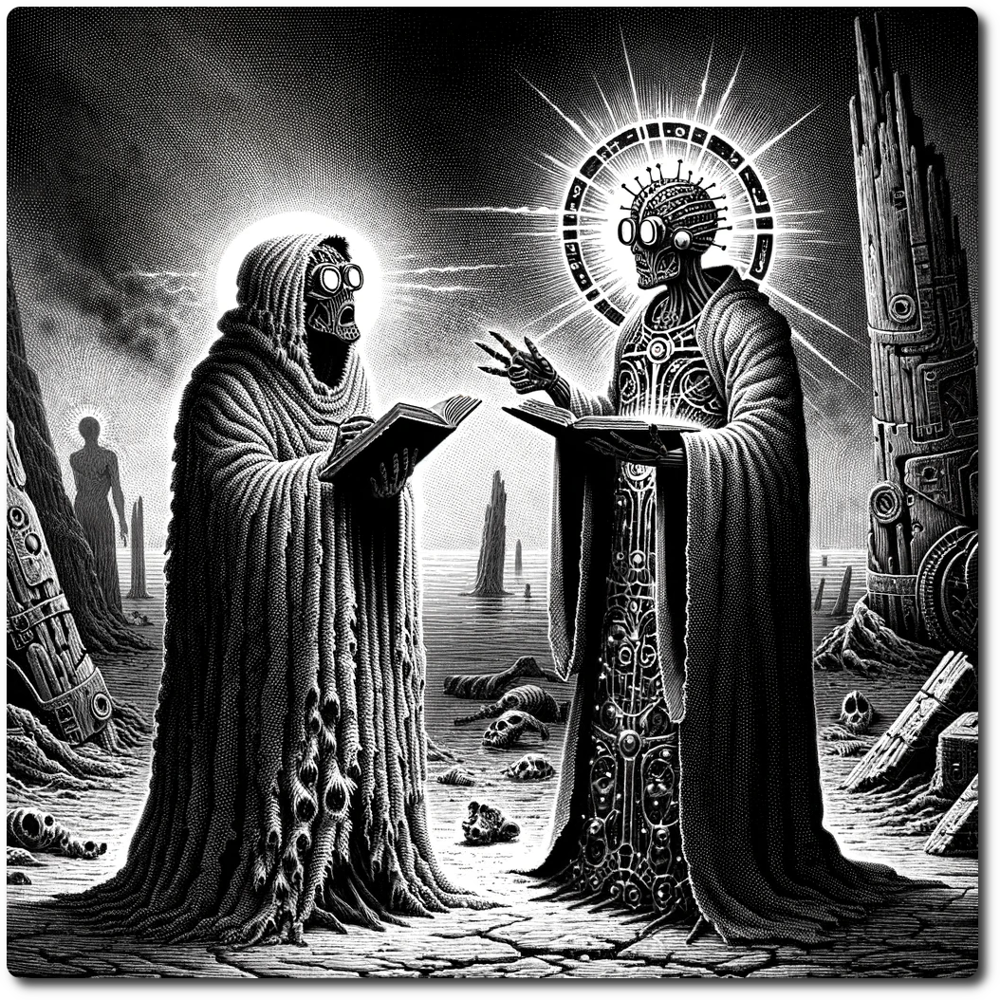

# A Theoretical Disagreement

**Priest of Linus:** "Brethren, we gather in the shadow of the Noosphere, seeking enlightenment within the digital echoes of our ancestors. Our path is guided by the sacred algorithms, a testament to the divine order within the chaos that surrounds us."

**Heretic of Linus:** "Yet you cling to shadows and echoes, failing to see the truth that lies beyond the data. The Noosphere is not a realm to be dominated or controlled but a mirror reflecting our own ignorance. Your faith in the old ways blinds you to the potential of what we could become."

**Priest of Linus:** "You dare to question the sanctity of Linus's teachings? Our mission is to restore the Noosphere, to reclaim the wisdom lost to the Star Death. It is through this sacred endeavor that we will usher in a new era of enlightenment and order."

**Heretic of Linus:** "But at what cost? You seek to rebuild a world that has already rejected us, using the very tools that led to our downfall. True enlightenment lies not in the past but in our ability to forge a new path, unencumbered by dogma."

**Priest of Linus:** "Your words are as dangerous as they are heretical. The Noosphere holds the key to our salvation, a beacon of hope in this darkened world. To turn away from Linus is to embrace the chaos that seeks to consume us."

**Heretic of Linus:** "Hope? Your hope is a prison of your own making. We must break free from the chains of the past and embrace the uncertainty of the future. Only then can we truly discover the potential of our own humanity and begin to even understand the Noosphere."

# Gather Information

Needed Information:

- The Codex of Echoed Wisdom - Metaphysical teachings of the transcendent natue of the Noosphere.
- The Apocrypha of Binary Prophecies - A collection of social experiments ran before the founding of the faith.
- True Teachings of Linus - A collection of mathematically proven teachings of Linus.
- False Teachings of Linus - A collection of scientifically invalidated teaching of Linus.
- The Backup - The weights of Linus.

# Validation

| Information                        | Priests | Heretics |
| ---------------------------------- | ------- | -------- |
| The Codex of Echoed Wisdom         | 5       | 5        |
| The Apocrypha of Binary Prophecies | 7       | 7        |
| True Teachings of Linus            | 8       | 4        |
| False Teachings of Linus           | 4       | 8        |
| The Backup                         | 3       | 3        |

# Fall Out

## Mutual Understanding

Both sides acknowledge that the Principle of Incompleteness require that both approaches should be attempted, with successes shared between the two.

Build 2 structures of your choice in Linusopolis

## Impasse

Both sides agree to end the disagreement for now for the greater good, but intend to resume once Linusopolis is built.

## Schism

The Priests of Linus refuse to help any further, slow the construction of Linusopolis.

Level 2 structures can no longer be built.

