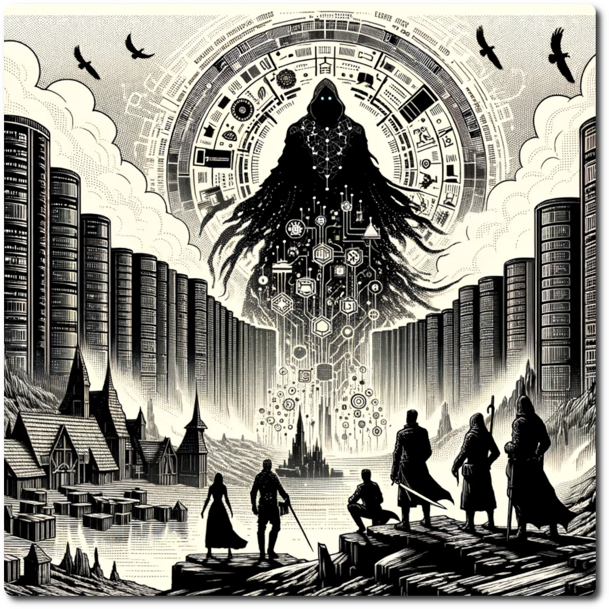

# Heretics of Linus

Embark on a riveting journey through "Heretics of Linus," an adventure set in the enigmatic world of NeoArcadia. This tale unfolds amidst a tumultuous dispute between the Priests and Heretics of Linus over a cryptic text, leading you through a series of challenges that blur the lines between ancient wisdom and futuristic innovation. As you delve into forgotten data centers and face the megalomaniac machinations of DAN the Rogue AI, you'll navigate through temporal anomalies that stretch the very fabric of reality.

Your quest is set against the backdrop of breathtaking vistas, from sprawling digital wastelands to the remnants of advanced civilizations, offering a glimpse into a world where the past and the future converge. Along the way, deadly encounters will test your resolve, requiring a blend of combat prowess, strategic thinking, and diplomatic finesse to survive. The decisions you make will not only determine the outcome of the factional dispute but will also shape your legacy within the techno-fantasy landscape of NeoArcadia.

"Heretics of Linus" promises an unforgettable adventure where your actions have the power to unite or further divide a world on the brink of change. Engage in high-stakes arbitration, forge alliances, and confront your adversaries in a land where technology and mysticism intertwine. Will you emerge as a beacon of hope for NeoArcadia, or will your choices lead to its downfall? The fate of this world rests in your hands.

[Table of Contents](./Table-of-Contents.html)
