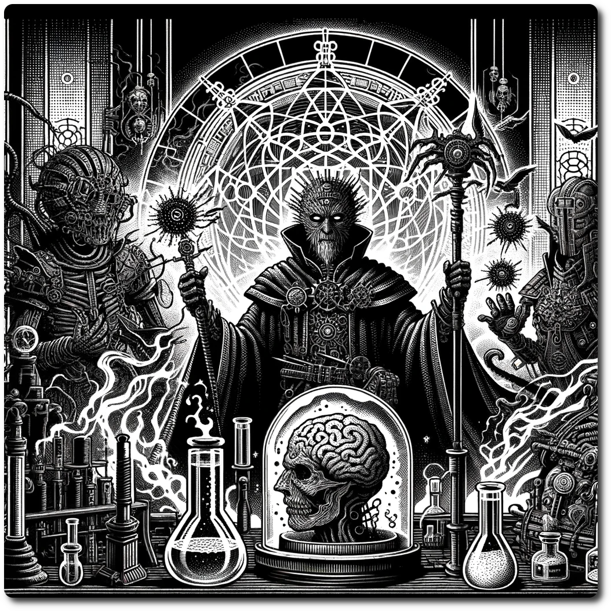

*As you navigate through the shadowed ruins of a world caught between decay and rebirth, a chilling silence is suddenly broken by the echo of ominous whispers and the metallic clink of dark machinery. From the mist, a formidable assembly of villains emerges, their attire a sinister fusion of ancient curses and cutting-edge technology, each bearing the weight of malevolent intentions and dark secrets. The leader, enshrouded in armor that absorbs the light, greets you with a cold stare, offering a challenge and a warning on your path. This fearsome group, known for sowing discord wherever they roam, stands ready, a harbinger of chaos and darkness in the twilight of the old world and the dawn of the new.*

# 1106 - Special - Eclipsers of the Horizon

**Special Encounter - Dark Confrontation**

Dread and tension fill the air as you face threats, negotiate with dubious intent, or stealthily avoid the confrontation!
- **Combat:** **Impact: 20, HP: Unlimited, Loot: Special**
- For each round the party fights the Eclipsers, gain +1 Loot
- Place a marker for the Eclipsers on this hex, then replace this hex sheet with a wilderness hex.
- Foraging fails automatically in the same hex as the Eclipsers.
- During the Environment turn, randomly choose an adjacent hex and move the Eclipsers.
- While the Eclipsers are there, use this hex sheet instead of the normal one.