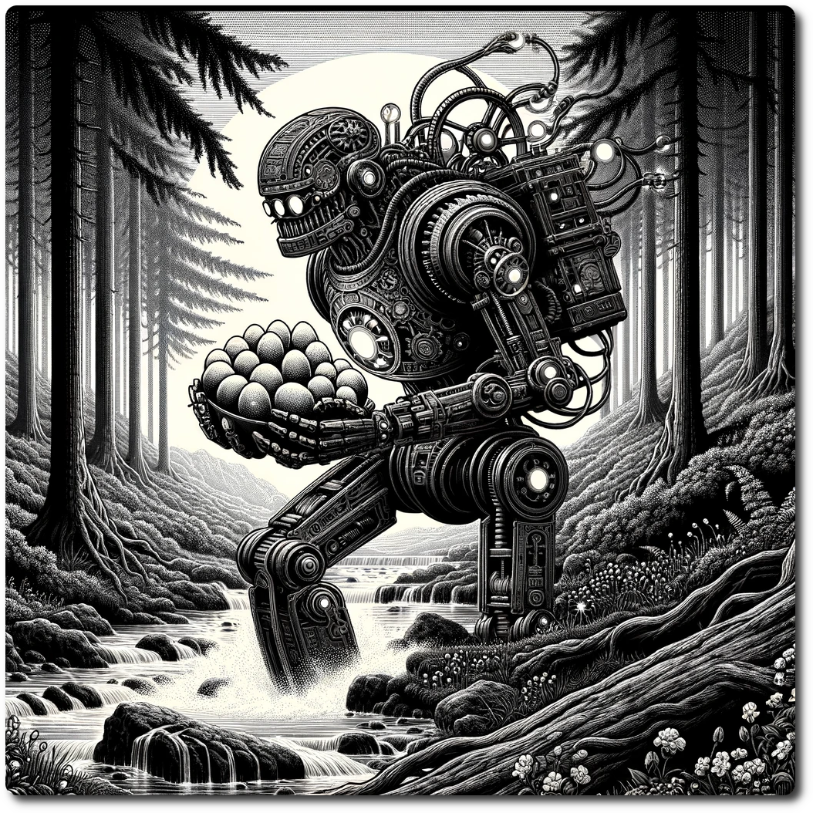

*A lost automaton traverses the wild, overgrown landscapes of a world long forgotten by its creators. Clutched in its metallic grasp are a handful of eggs, their shells infused with a soft, bioluminescent glow, harboring the seeds of life for a new, mysterious species. This automaton, a fusion of ancient technology and organic resilience, follows the call of an ancient programming, guiding it through dense forests and across rushing rivers, on a quest to find a hidden enclave where these precious charges can safely hatch. Amidst the wilderness, this solitary guardian moves with a single-minded purpose, protecting the fragile hope of renewal.*  

# 1304 - Wilderness - Lost Automaton

Forage: 7    
Scout: 8    

| Roll | Encounter Type | Description                                                                                                                                                                                                      |
| ---- | -------------- | ---------------------------------------------------------------------------------------------------------------------------------------------------------------------------------------------------------------- |
| 1    | Navigation     | **Misdirection**: The party faces the threat of disorientation in unfamiliar territory. Spend 1 R of they find themselves Lost.                                                                                  |
| 2    | Hazard         | **Thorn Brush Encounter**: Venturing through dense vegetation leads to an unexpected encounter with a thorn brush. If not chosen by scouting modifier, the party suffers 1 damage from the sharp, hidden thorns. |
| 3    | Supernatural   | **Night Screams**: The eerie howling of rogue AI disrupts the night, a chilling reminder of technology gone awry. The haunting voices penetrate the psyche of each party member, resulting in the loss of 1 WP.  |
| 4    | Combat         | **Ambushed by Wolves**: The party is challenged by a pack of wolves, ferocious in their natural habitat. **Impact: 10 HP: 5 Loot: 0**                                                                            |
| 5    | Combat         | **Bandits**: An ambush by bandits tests the party's readiness and combat skills. **Impact: 10 HP: 15 Loot: +2, 50 Gold**                                                                                         |
| 6    | BUGS!          | Bugs get into your supplies. Expend one Ration.                                                                                                                                                                  |

**Special Encounter - Not Lost, but Seeking**
- The party may choose to follow the automaton.
- If they do, the party is Lost, however the automaton will act as a member of the party.
- If the party follows the automaton for 5 turns they will see the automaton finally place the eggs in a safe place. The automaton then becomes a permanent member of the party.

Lost Automaton CM: 2, HP: 2, SP: 2, WP: 0, LP:0 R:1

[Terrain Types](./Terrain-Types.html)    
    
[Table of Contents](./Table-of-Contents.html)