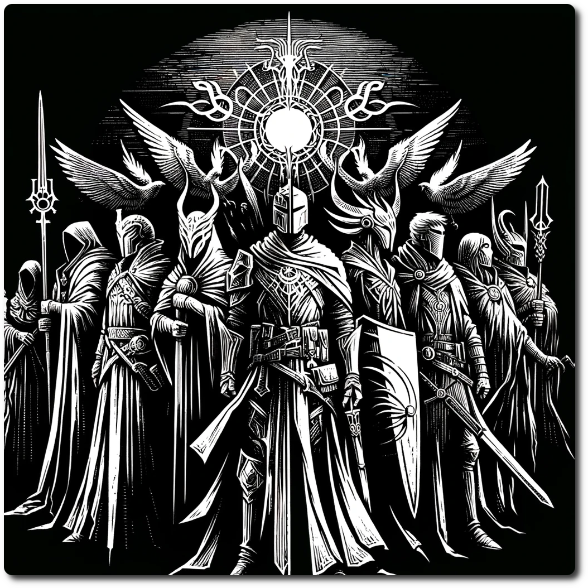

# 1506 - Special - Guardians of the Nexus

*As you traverse the ancient, overgrown ruins of reclaimed by the forest, a faint sound of laughter and clinking armor pierces the silence. Emerging from the dense fog, a motley crew of adventurers approaches, their gear a blend of archaic symbols and futuristic technology, each member exuding an aura of seasoned camaraderie and unspoken tales. The leader, a figure clad in armor that hums with a soft, ethereal light, greets you with a nod, offering assistance and companionship on your journey. This wandering party, known for aiding those they cross paths with, stands ready, a beacon of hope and strength in the uncertain wilderness of the ancient future.*

**Special Encounter - Good Company**

Joy and camaraderie abound as you swap supplies, stories and ale with fellow adventures!
- Parties entering this hex restore all stats except Luck
- Place a marker for the Guardians on this hex, then replace this hex sheet with a regular forest hex.
- Foraging succeeds automatically in the same hex as the Guardians.
- During the Environment turn, randomly choose and adjacent hex and move the Guardians.
- While the guardians are there, use this hex sheet instead of the normal one.
