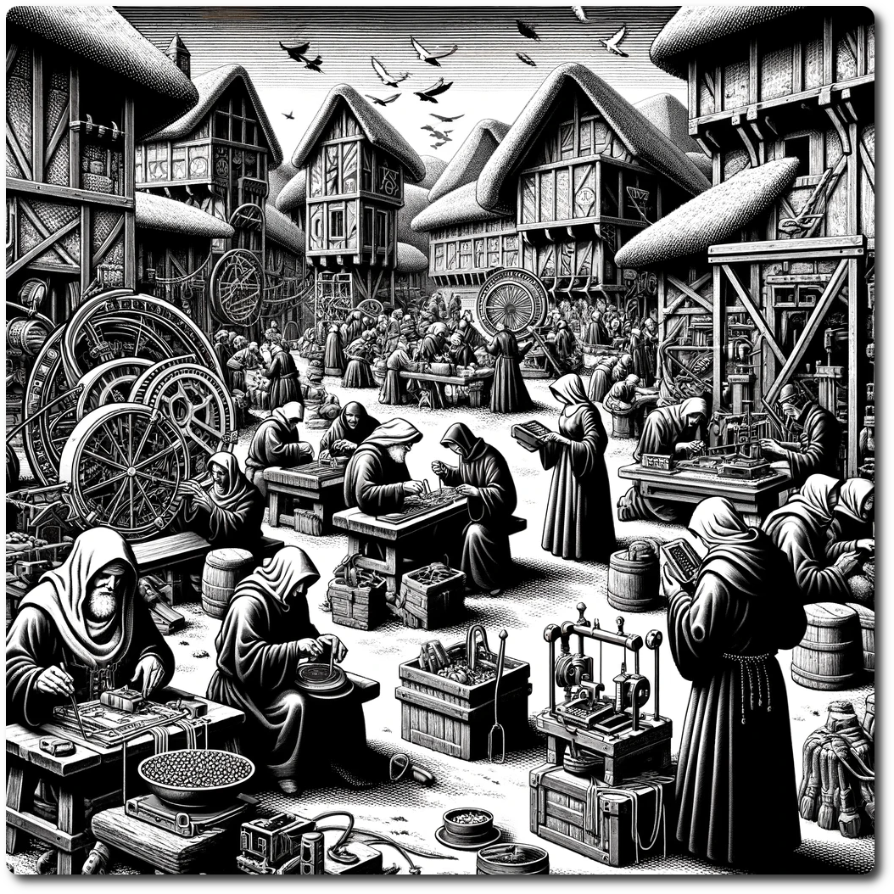

*The small settlement buzzes with construction sounds. Groups of the Heretics of Linus huddle together, scrutinizing ancient designs, while techstitchers interweave cables and circuits into tools. Nearby, communal buffets provide sustenance to the hungry.*

# 1608 - Wilderness - Linusopolis

**Forage:** 3    
**Scout:** -   

**Optional Special Encounter - [A Theoretical Disagreement](/adventures/Heretics-of-Linus/A-Theoretical-Disagreement.html)**

**Special Encounter - Fair Linusopolis, Oh boy we have a way to go.**
- Parties may expend trade good to upgrade Linusopolis.

| Building              | Level | Description                                                   | Required Trade Goods                           | Effect                                                                                                                                                          |
| --------------------- | ----- | ------------------------------------------------------------- | ---------------------------------------------- | --------------------------------------------------------------------------------------------------------------------------------------------------------------- |
| Arcane Forge          | 1     | Workshop for basic fabrication of items.                      | 10 Iron Ore, 5 Gems, 3 Programmable Matter     | AI-anvil adapts basic enchanting patterns. Party can recover HP equal to their fighters' HP.                                                                 |
|                       | 2     | Advanced fabrication with rare materials.                     | 20 Iron Ore, 10 Gems, 6 Programmable Matter    | AI-anvil now predicts wielder's needs, enhancing items unpredictably. Party can buy an [Auto-Boat](/adventures/Heretics-of-Linus/Auto-Boat.html) for 1500 Gold |
| Crystal Greenhouse    | 1     | Grows common magical plants.                                  | 8 Glass, 10 Timber, 5 Radiant Seeds            | Basic bioluminescent optimization. Party can buy a [Lumstick](../Lumstick.md#) for 2 Gold.                                               |
|                       | 2     | Cultivates rare and exotic plants.                            | 16 Glass, 20 Timber, 10 Radiant Seeds          | Enhanced growth conditions with sentient plant care. Party can buy Medicinal Herbs for 50 Gold                                                                  |
| Mystic Library        | 1     | Holds a modest collection of knowledge.                       | 15 Parchment, 10 Ink, 2 Quantum Crystals       | Basic holographic books with limited interaction. Party can recover R equal to their scouts' R                                                                  |
|                       | 2     | Vast archive of the arcane and future tech.                   | 30 Memory Crystals, 20 Ink, 4 Quantum Crystals | Advanced 3D projections with interactive learning programs. Party can buy [Cog-Stims](/adventures/Heretics-of-Linus/Cog-Stims.html) for 35 Gold                   |
| Elemental Power Plant | 1     | Powers small sections of the settlement.                      | 5 Elemental Stones, 10 Circuitry, 2 Etherium   | Basic elemental power capture and distribution. Party can buy powerpacks for 25 Gold                                                                            |
| Automaton Workshops   | 1     | Produces simple robotic aides.                                | 10 Iron Ore, 5 Circuitry, 3 Memory Crystals    | Basic automaton models with limited functions. Parties can buy Third Arm for 750 Gold                                                                           |
|                       | 2     | Crafts advanced defenders and workers.                        | 20 Iron Ore, 10 Circuitry, 6 Memory Crystals   | Self-evolving robots with adaptive learning and autonomy. Party can buy  drones for 1000 Gold                                                                |
| Alchemical Lab        | 1     | Basic potion making and experimentation.                      | 10 Herbs, 5 Reagents, 2 Spices                 | Cauldron doubles simple liquid concoctions. Party can buy Ale.                                                                                                  |
|                       | 2     | Advanced alchemical research and creation.                    | 20 spices,  10 Reagents, 4 Radiant Seeds       | Cauldron now capable of creating complex potions with variable effects. Party can now buy FlameQuick for 40 Gold                                                |
| Ether Network Center  | 1     | Basic communication and data transfer.                        | 5 Etherium, 10 Gold, 5 Programmable Matter     | Basic thought and emotion transmission network. Party can Restore 1 WP                                                                                          |
|                       | 2     | Complex network for advanced information and sensory sharing. | 10 Etherium, 20 Gold, 10 Quantum Crystals      | Advanced network supporting complex emotional and experiential sharing. Party can Restore all WP                                                                |

### Trade Goods Market

| Trade Good Offered  | Quantity | Trade Good Requested | Quantity | Notes                                                         |
| ------------------- | -------- | -------------------- | -------- | ------------------------------------------------------------- |
| Programmable Matter | 1        |                      | 500      | Essential for upgrading Arcane Forges and Alchemical Labs.    |
| Quantum Crystals    | 1        | Etherium             | 3        | Used in Mystic Libraries and Teleportation Hubs. High demand. |
| Radiant Seeds       | 1        | Timber               | 40       | Key for Crystal Greenhouses. Scarce and in high demand.       |
| Elemental Stones    | 1        | Glass                | 200      | Power source for Elemental Power Plants. Rarely found.        |
| Memory Crystals     | 1        | Iron Ore             | 30       | Crucial for Automaton Workshops. Technologically advanced.    |
| Etherium            | 1        | Programmable Matter  | 25       | Fuels Ether Network Centers. Interdimensional commodity.      |

