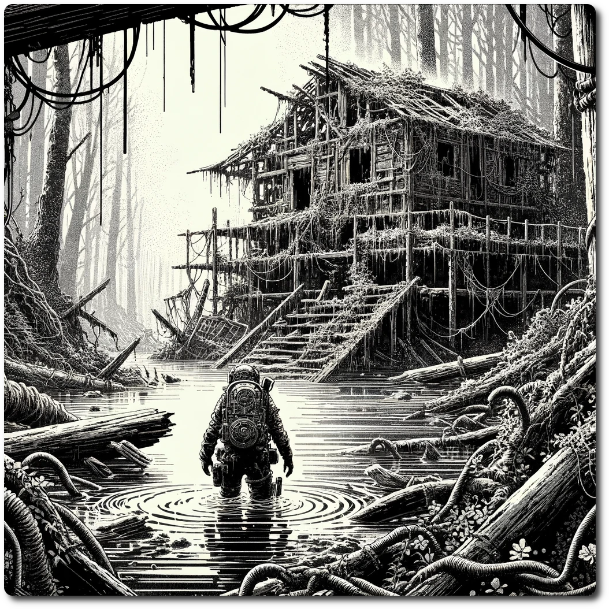

*As you wade through the dense, murky swamps, your boots finally catch on something solid. Regaining your footing, you gaze forward to discover the remnants of a village, partially engulfed by the swamp. The wooden structures, spared from complete decay by moisture and rot, suggest they have only recently succumbed.*

# 1801 - Swamp - The Sunken Village

Forage: 7    
Scout: 8    

| Roll | Encounter Type | Description                                                                                                                                                                                                                         |
| ---- | -------------- | ----------------------------------------------------------------------------------------------------------------------------------------------------------------------------------------------------------------------------------- |
| 1    | Trap           | **Sunken Spirits Snare**: An innocuous stretch of mud disguises a spectral trap, as the vengeful spirits of the village ensnare intruders. Expend 1 SP for a cautious passage, or suffer 2 damage from the spirits' chilling grasp. |
| 2    | Hazard         | **Miasmic Mist**: The ruins emit a poisonous mist, a remnant of alchemical experiments gone awry. Unless chosen by scouting modifier, the party inhales the mist, losing 1 SP.                                                      |
| 3    | Resources      | **Lost Villager's Cache**: If chosen by scouting modifier uncover a hidden stash, likely left by a villager before the tragedy, containing 4 medicinal herbs and 1d6 gems                                                           |
| 4    | Combat         | **Marshland Predators**: Lurking in the waterlogged ruins, Marshland Predators, descendants of the villagers' guardian beasts, emerge to confront the party. **Impact: 12 HP: 12 Loot: +2, 50 Gold**                                |
| 5    | Combat         | **Spectral Defenders Encounter**: Ghostly apparitions of the village's former defenders rise to challenge intruders. **Impact: 11 HP: 14 Loot: +2, 50 Gold**                                                                        |
| 6    | Discovery      | **Echoes of the Past**: The party stumbles upon a well-preserved section of the village, finding inscriptions that hint at the location of a powerful artifact. Gain +2 on your next scouting roll.                                 |

**Special Encounter - Down in the Muck**
- Spend 2 RP or 1 SP to make a Scouting Roll against a 9. If you succeed uncover the entrance to the library. You may repeat this roll as many times as you can pay.
- Parties that find the entrance may move to SV0001 - Ruins - Library of Linus