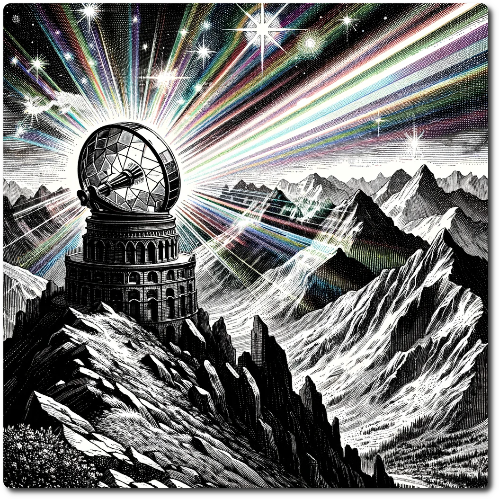

*Atop the towering peaks, the shattered remains of the ancient observatory stand as a silent sentinel, its fractured glass cylinder catching the sun's rays and casting a kaleidoscope of vibrant rainbow beams across the land. This breathtaking spectacle paints the rugged terrain in a tapestry of prismatic shades, turning the mountain's summit into a dazzling display of light and color.*

# 1804 - Mountain - Abandoned Observatory
    
Forage: 9  
Scout: 8    

| Roll | Encounter Type | Description |
| ---- | ---- | ---- |
| 1 | Hazard | **Cybernetic Storm Surge**: A sudden surge of electromagnetic energy from ancient, buried tech engulfs the party, disrupting gear and dealing 4 damage. The party also loses 1 stamina as they navigate through the tech-laden debris. |
| 2 | Condition | **Nano-Mist Disorientation**: An encounter with a cloud of rogue nano-particles causes sensory overload. If not chosen by scouting modifier, the party suffers disorientation and is Lost |
| 3 | Resources | **Ancient Cache Unearthed**: If chosen by scouting modifier uncover an ancient cache left by a civilization long gone. Make a Loot Roll +2. |
| 4 | Combat | **Mechanized Guardian Encounter**: The party stumbles upon a dormant mechanized guardian that activates upon their approach. **Impact: 9 HP: 20 Loot: +2, Ancient Tech** |
| 5 | Combat | **Raiders of the Lost Tech**: A gang of tech raiders, armed with scavenged cybernetic enhancements, ambushes the party in search of loot. **Impact: 11 HP: 18 Loot: +3, 75 Gold** |
| 6 | Anomaly | **Temporal Flux Zone**: The party enters a zone of fluctuating time, caused by a malfunctioning ancient time device. Effects vary from speeding up recovery processes to causing unexpected temporal shifts in the environment. (see below) |

#### Temporal Flux Zone - Let's Do the Time Warp Again.
- Roll 1d6, re-roll 5s and 6s then the turn phase changes to the result
 1. [Prepare Phase](/Prepare-Phase.html)
2. [Embark Phase](/Embark-Phase.html)
3. [Encounter Phase](/Encounter-Phase.html)
4. [Recover Phase](/Recover-Phase.html)

**Special Encounter - Ghosts of Time**

In the ruins of the abandoned observatory swallowed by time, the party encounters the Ghosts of Time, spectral remnants of past inhabitants trapped in a loop of their final moments. These ethereal figures are neither hostile nor entirely benign, caught in the twilight between digital echoes and mystical energies.

1. **Communication Challenge**: Attempt a Persuasion Roll (Difficulty 8) to communicate with the ghosts. Understanding their eternal repetitions allows skipping to 3.
2. **Temporal Anomaly**: The area is plagued by unstable time. Spend 1 RP to avoid temporal entrapment. Lack of RP leads to a catastrophic end, Party Death.
3. **Luck Intervention**: Risk any amount of LP, then roll 1d6. Rolling above your bet increases your LP by the wagered amount and progresses the encounter to 4. Failing reduces your LP by the same amount, risking a return to 1. or party demise if LP is depleted.
4. **Resolution**: Successfully disrupting the temporal loop dissipates the ghosts, revealing the laboratory's secrets. Exploration yields a data slate with Information: The Apocrypha of Binary Prophecies, 2 Ancient Tech, and +5 Loot.
