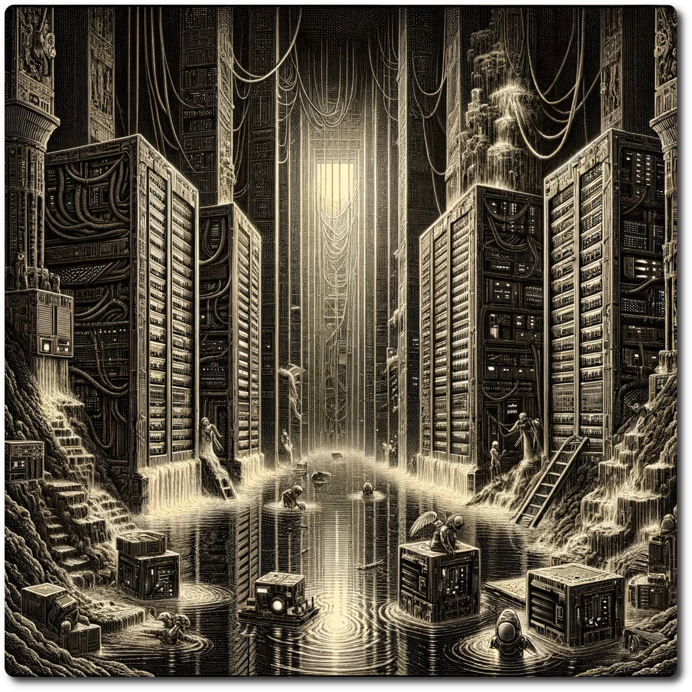

# SV0001 - Ruin - Library of Linus

*Plunging down the slick, mud-caked shaft into the bowels of the library, your descent is arrested by a pool of brackish, murky water that greedily infiltrates every crevice of your gear. At the shaft's nadir lies a grotesquely waterlogged server farm, an aberrant fusion of technology and decay. Beige monoliths, half-drowned in this technological mire, sporadically spark to life in a desperate gasp for electricity before succumbing to the filth, their circuits frying in a symphony of destruction. Amidst this chaos, a cadre of repair bots, their forms a bizarre melding of machine and organic matter, scuttle with frenetic urgency. These cybernetic scavengers engage in a macabre ballet, extracting the pulsing power supplies and enigmatically refurbishing them, as if performing arcane rituals to resurrect the electronic carcasses that litter this surreal catacomb. The air is electric with the scent of ozone and decay.*

**Encounter Table**

| Roll | Encounter Type | Description                                                                                                                                                                                                                    |
| ---- | -------------- | ------------------------------------------------------------------------------------------------------------------------------------------------------------------------------------------------------------------------------ |
| 1    | Resource       | **Ancient Tech Cache**: Amidst the debris, the party discovers a cache of ancient, but highly advanced technology. **Gain**: 1 Ancient Tech                                                                                    |
| 2    | Combat         | **Rogue Repair Drones**: A swarm of malfunctioning repair drones, mistaking the party for intruders, attack **Impact: 10, HP: 8, Loot: 2d6 plastic, 1d6 circuitry.**                                                           |
| 3    | Combat         | **Cybernetic Guardians**: Protectors of the server farm, these cybernetic guardians emerge from the water to engage. **Impact: 8, HP: 15; Loot: +3, 2d6 circuitry**                                                            |
| 4    | Hazard         | **Electrified Waters**: The party must navigate through sections of electrified water, risking shocks and damage to their equipment. **Challenge**: Find a way to safely cross or disable the hazard. Spend 1 RP or lose 2 SP. |
| 5    | Resource       | **Data Vaults**: The party finds access to partially corrupted data vaults containing valuable information. Spell: Force March                                                                                                 |
| 6    | Combat         | **Mutated Vermin**: Exposure to toxic substances and technology has mutated the local vermin into aggressive predators. **Impact: 14, HP: 10; Loot: +4, 2d6 reagents**                                                         |

#### Spell: Force March
- During Planning Phase expend one LP, Gain one free move. Skip your recover phase.
- Requires Spellware Interface to use.

**Special Encounter - Binary Reality**

*The ancient holography librarian, Archivus, materializes with a soft digital hum, his form flickering between the realms of the ancient noosphere and the moist library. As he presents the magic square to unlock the Teachings of Linus, his glowing lenses pierce through the dimly lit chamber, assuming the party to be priests, revered for their sacred union of flesh and circuitry. "Solve this ancient puzzle, o disciples of Linus," Archivus intones, his voice echoing with a blend of reverence and a challenge, "and unlock wisdom that bridges the divine digital and the mystical realms." The air vibrates with the potential of knowledge yet to be revealed, as the party stands on the precipice of ancient truths.

| 1   | 23  | 16  | 4   | 21  |
| --- | --- | --- | --- | --- |
| 15  | 14  | 7   | 18  | 11  |
| 24  | 17  |     | 9   | 2   |
| 20  | 8   | 19  | 12  | 6   |
| 5   | 3   | 10  | 22  | 25  |

When you have your answer, click [here](/adventures/Heretics-of-Linus/Binary-Reality.html) to check if you are correct.

If you are correct, gain Information: True Teachings of Linus.
If you are wrong, gain Information: False Teachings of Linus.
