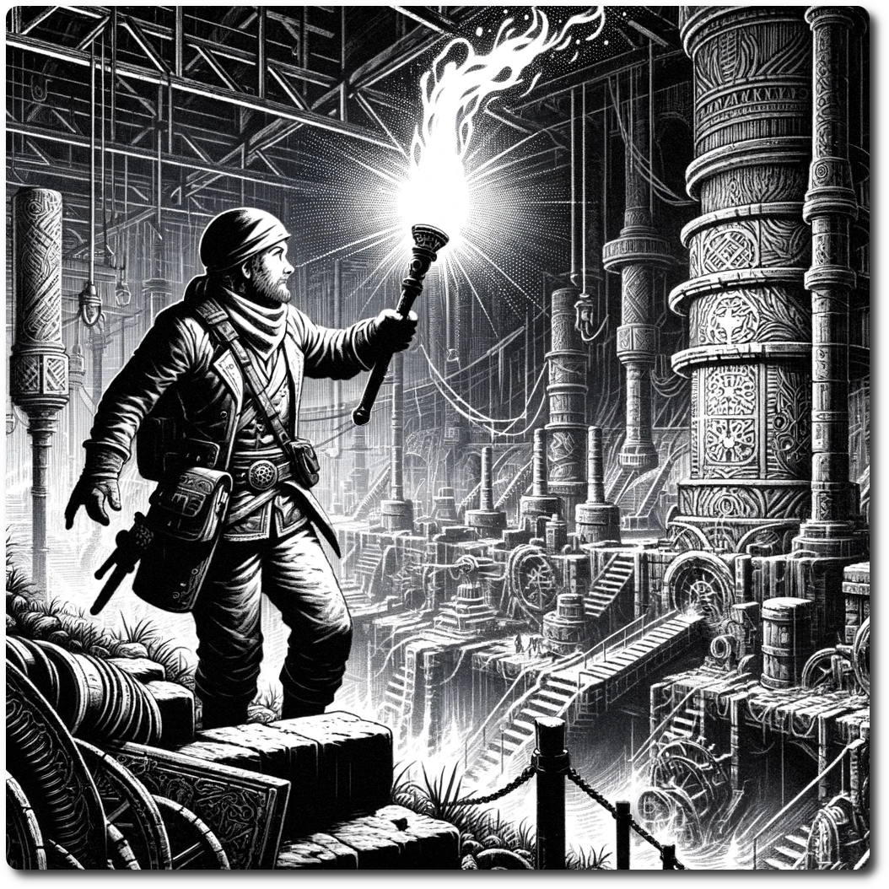

*The Lumstick is a unique, eco-friendly light source, harnessing the power of bio-luminescence to illuminate the darkest corners of the Ancient Future. Crafted from specially cultivated organisms, these handheld torches emit a soft, glowing light, making them indispensable for adventurers exploring the mysterious ruins and shadowy landscapes.*

# Lumstick
- Counteracts the effects of Darkness
- Lasts for 3 turns

