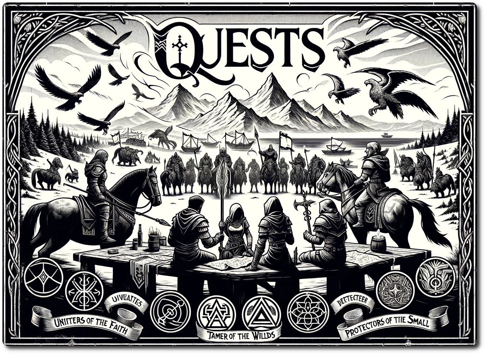

# Quests  
  
Earn the respect of not only the citizens of NeoArcadia, but also your fellow adventures. Quests are reward that add to your party's reputation and give your heroes a legacy to write tales about.  
  
## Unifies of the Faith + 1  
  
The Priest and Heretics are at odd over scriptural matters. Both sides are normally pacifists, but the war of words is escalating. Claims of hacking on both sides is stressing thing even further. Whoever can bring these twos side back to peace will make a name for themselves.

## Tamer of the Wilds +3

Rebuilding in the Ancient Future is not just a practical act, but is a symbolic one. Proving stability and safety makes you a hero to most, but it can make you enemies as well . . .

## Protectors of the Small +1

Who would have thought such a simple act would have gained you so much notice.