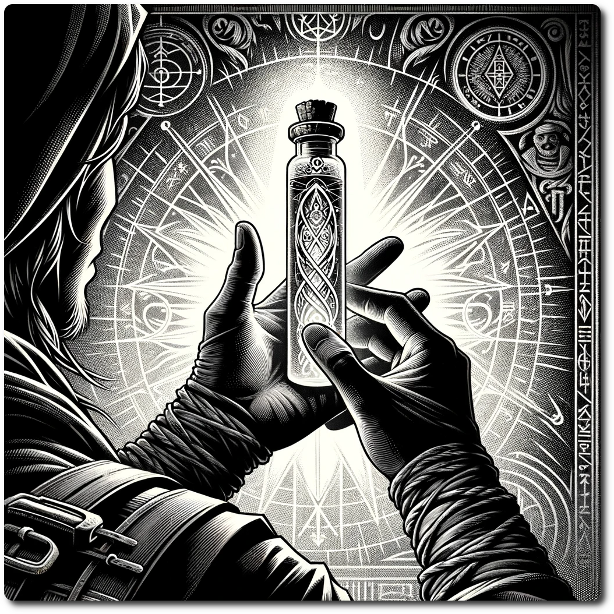

*The Reason Vial is a curious artifact, a testament to the arcane alchemists' mastery over fate itself. Crafted from crystal-clear glass that seems to shimmer with an inner light, this slender vial is capped with a meticulously engraved silver stopper, embodying the essence of precision and possibility.*

#  Reason Vial
- Reason Vial starts with 0
- After you roll dice, you may swap the value of one of the die with the value in the Reason Vial