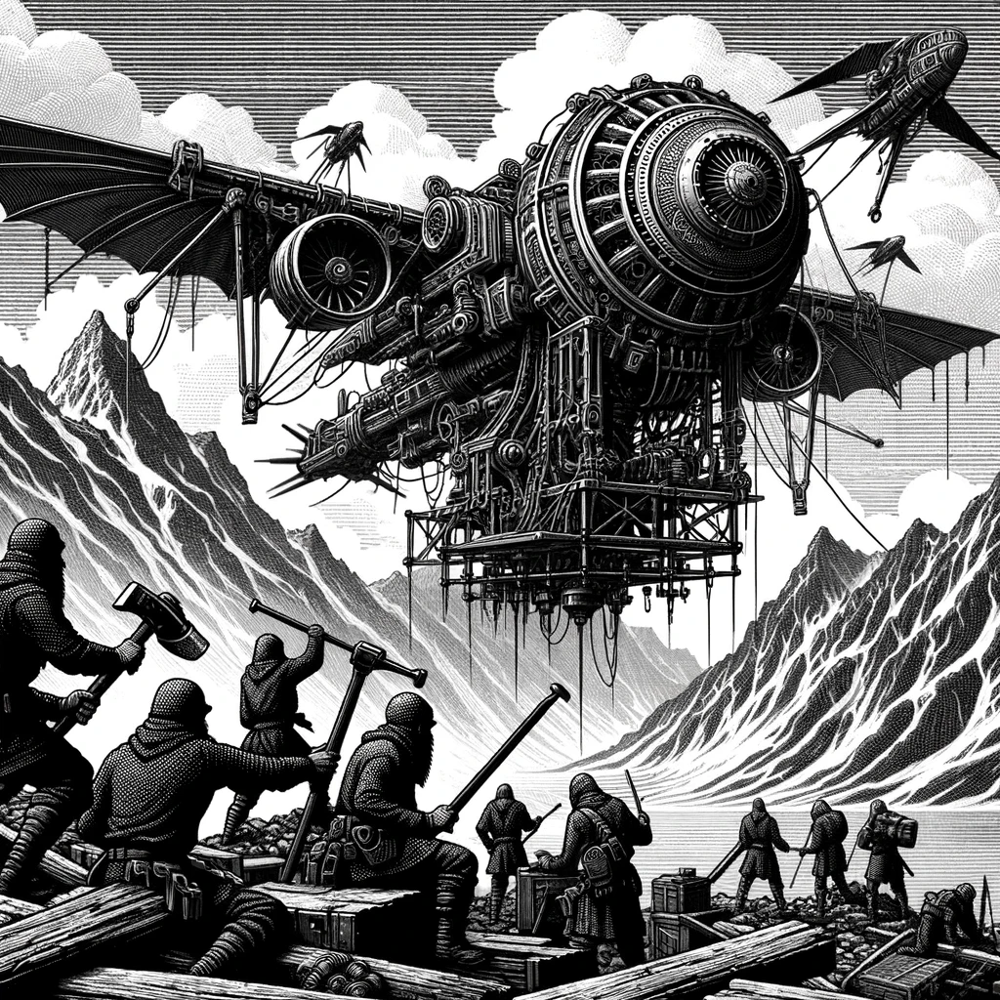

---  
share: "true"  
---  
  
  
  
  
# 0404- Special - Base of the Techno Bandits  
  
The Techno Bandits are a flurry of activity, harnessing the power of a pre-cataclysm weapon that grants them mastery over machinery. Amidst the high-altitude chill, they industriously assemble a daunting flying machine, its metallic wings gleaming against the stark mountain backdrop, poised to conquer the skies with newfound, fearsome capability.  
  
**Forage:** 4  
**Scout:** 9  
  
**Encounter Table**  
  
| Roll | Encounter Type | Description |  
| ---- | ---- | ---- |  
| 1 | Combat | Techno Bandit Ambush Impact: 11 HP: 15 Loot: +1, 50 Gold |  
| 2 | Combat | Techno Bandit Impact: 11 HP: 15 Loot: +1, 50 Gold |  
| 3 | Combat | Techno Bandit Ambush Impact: 13 HP: 15 Loot: +2, 75 Gold |  
| 4 | Combat | Techno Bandit Impact: 13 HP: 15 Loot: +2, 75 Gold |  
| 5 | Combat | Techno Bandit Ambush Impact: 15 HP: 15 Loot: +3, 100 Gold |  
| 6 | Combat | Techno Bandit Impact: 15 HP: 15 Loot: +3, 100 Gold |  
  
**Special Encounter - Invade the Base!**  
  
- Make a Scouting Roll, you may add that to the Party Impact  
- If you have Ancient Data Slates add +5 to the Party Impact  
- If you have the information "My Secret Plans, Do Not Share" add +3 to the Party Impact  
- Combat: Techno Bandit Warlord Impact: 20 HP: 30 Loot: Special  
  
If the party defeats the Techno Bandit Warlord they receive   
  
- The Party Completes Quest: Stop the Techno Bandits  
- Vehicle: Wind Racer - When party plans to move from a Mountain Hex, they may make one Free Move if they move to a non Mountain Hex. Looks like this device is not complete yet, it could do more . . .  
