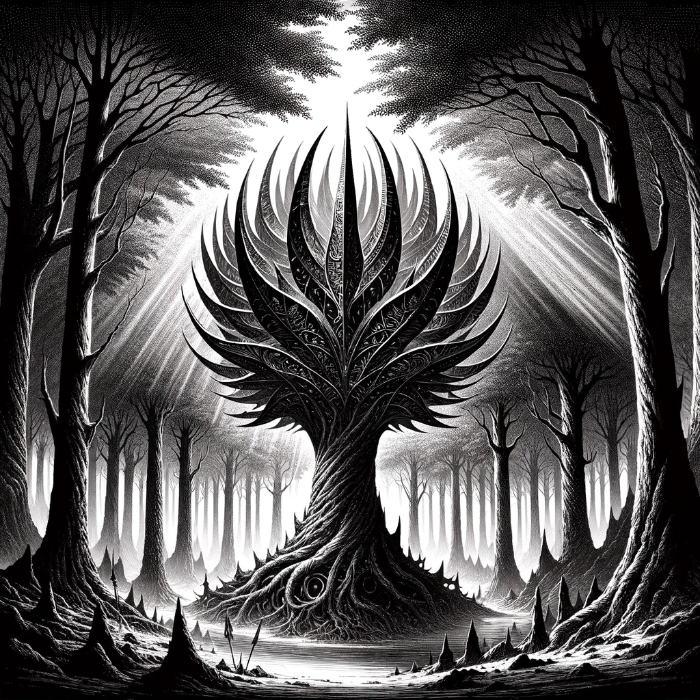

---  
share: "true"  
---  
  
  
  
  
# 1004 - Forest - Heart of the Iron Wood  
  
In the Ironwood Forest, the trees are not only alive but lethally sharp, their metallic leaves glinting like blades in the dappled sunlight, ready to slice through flesh and bone with a mere touch. As adventurers approach the forest's ancient heart, the largest tree, pulsing with biomechanical energy, unexpectedly poses a deep, resonant question about the nature of existence and the essence of free will.  
  
Forage: 8  
Scout: 9  
  
| Roll | Encounter Type | Description |  
| ---- | ---- | ---- |  
| 1 | Phenomenon | Eerie quiet, party loses 1 will power each |  
| 2 | Razor Leaves | If not chosen by scouting modifier, party members takes 2 damage. |  
| 3 | Resources | If chosen by scouting modifier find 1 gem, 6 ale, and 2 Herbs |  
| 4 | Combat | Cyber Monkey Ambush - Impact: 15  HP: 1 Loot: +1, 25 Gold |  
| 5 | Bandit Ambush | Bandits Ambush - Impact: 10 HP: 15 Loot: +2, 50 Gold |  
| 6 | Resources | 1d6 Medicinal Herb |  
  
**Special Encounter - When Sentience Blooms**  
  
Persuasion Difficulty 8  
  
If the party succeeds the Ancient Tree will trade 3 Medicinal Herbs for 2 Ale once per visit.  
That party no longer needs to complete either encounter when returning.  
  
If the party fails, the tree falls into a deep depression and will not talk again until the hex is entered again. The party loses 1 will power.  
  
  
