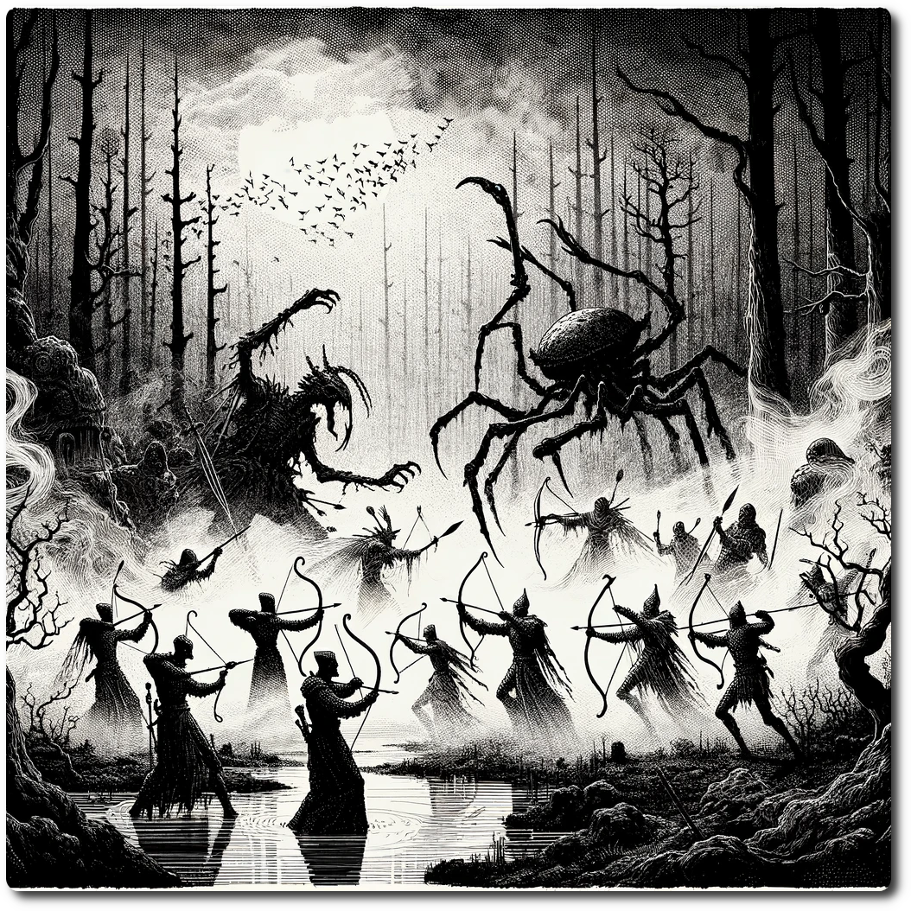

  
  
# 0107 - Swamp - Ruins of Echofall  
  
*In this vast swamp, the air is filled with a symphony of life — the chorus of frogs, the buzz of insects, and the distant calls of hidden creatures — all resonating above the subtle, dissonant gurgles and echoes from the decaying waste processing plants. These sounds mingle eerily, creating a haunting acoustic tapestry that tells a story of nature's resilience overshadowed by the remnants of a once-polluting past.*
  
Forage: 8  
Scout: 7  

| Roll | Encounter Type | Description |
| ---- | ---- | ---- |
| 1 | Trap | **Quickslime Trap**: A deceptively deadly trap, hidden beneath the surface. As party members step unknowingly, they must act swiftly, spending 1 RP to evade or suffer 2 damage from the ensnaring slime. |
| 2 | Hazard | **Toxic Fumes**: Emanating from unseen vents in the ground, these noxious gases catch the unwary by surprise. If not chosen by scouting modifier, the party loses 1 SP, struggling to breathe. |
| 3 | Resources | **Bountiful Find**: In the midst of peril, a glimmer of hope. If chosen by scouting modifier, find 1d6 medicinal herbs to heal wounds or 1d6 gems to fund further adventures. |
| 4 | Combat | **Giant Swamp Bugs**: Lurking within the mire, these colossal insects attack with surprising force. Engage in battle against these formidable foes. **Impact: 12, HP: 10, Loot: +1, 25 Gold** |
| 5 | Combat | **Rogue Drones**: Stray from their original commands, these mechanized adversaries present an unexpected challenge. **Impact: 14, HP: 12, Loot: +1, 50 Gold** |
| 6 | BUGS! | Bugs get into your supplies. Expend one Ration. |

**Special Encounter - Ancient Grudges Never Die**  
  
The event only triggers if the current Calendar is a Full Moon  
  
*In the haunted mists of an age-old swamp, spectral Scouts clash with colossal ancient swamp bugs, their ethereal arrows whistling through the air as they desperately avoid their many-legged foes. This eerie battle, a dance of ghostly figures and monstrous insects, unfolds with a surreal grace, echoing with the sounds of a long-forgotten war and the Scouts' unnerved whispers.*  
  
The party may join in the struggle aiding the Ghostly Scouts who's arrows are having no effect on the bugs.  
  
Ancient Giant Beetles - Impact: 20 HP: 15 Loot: Special  
  
Special Loot  
  
Party Completes the Quest: Neutralize the Phantom Signal  
  
Party also gains 4 corpses, clearly the bodies of long fallen scouts.  
  
One of the corpses is draped over a half functioning transmitter, the party gains 2 Ancient tech.  
  
  
  
  
  
  
  
