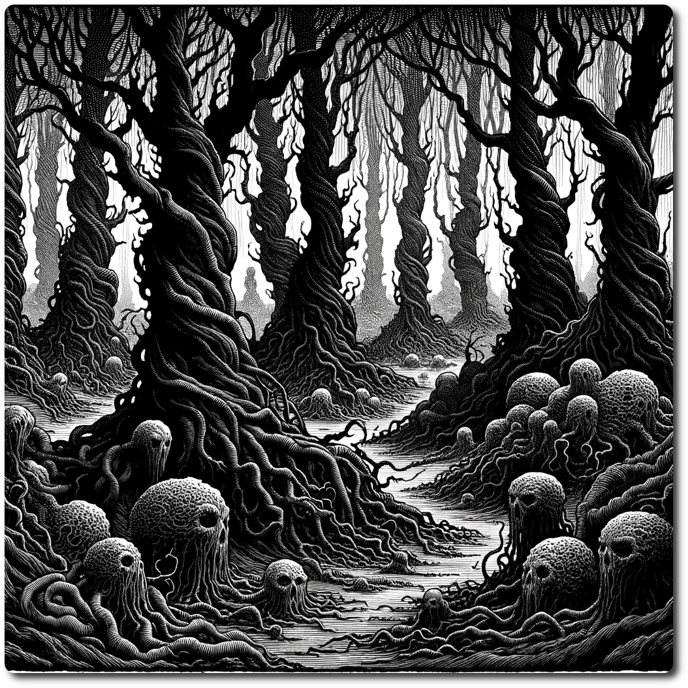

  
# 0201 - Forest - The Shrouded Grove  
  
In the Shrouded Grove, not only do shadows move with eerie autonomy, but it's also the final resting place for piles of bizarrely mutated creatures, their forms twisted and grotesque.  
  
Forage: 8  
Scout: 9  
  
| Roll | Encounter Type | Description |  
| ---- | ---- | ---- |  
| 1 | Resources | Patch of Medicinal Herb - 1d6  |  
| 2 | Poison Plant Pollen | If not chosen by scouting modifier, party takes 2 damage. |  
| 3 | Resources | If chosen by scouting modifier find 1 gem, 6 ale, and 2 Herbs |  
| 4 | Combat | Cyber Monkey Ambush - Impact: 15  HP: 1 Loot: +1, 50 Gold |  
| 5 | Combat | Bandits Ambush - Impact: 10 HP: 15 Loot: +2, 50 Gold |  
| 6 | Phenomenon | Eerie quiet, party loses 1 will power each |  
  
**Special Encounter - Attack of the Mutant Lurking Shadows  
  
Respawn: 10  
  
Shadows - Impact: 7 HP: 40 Loot: +5