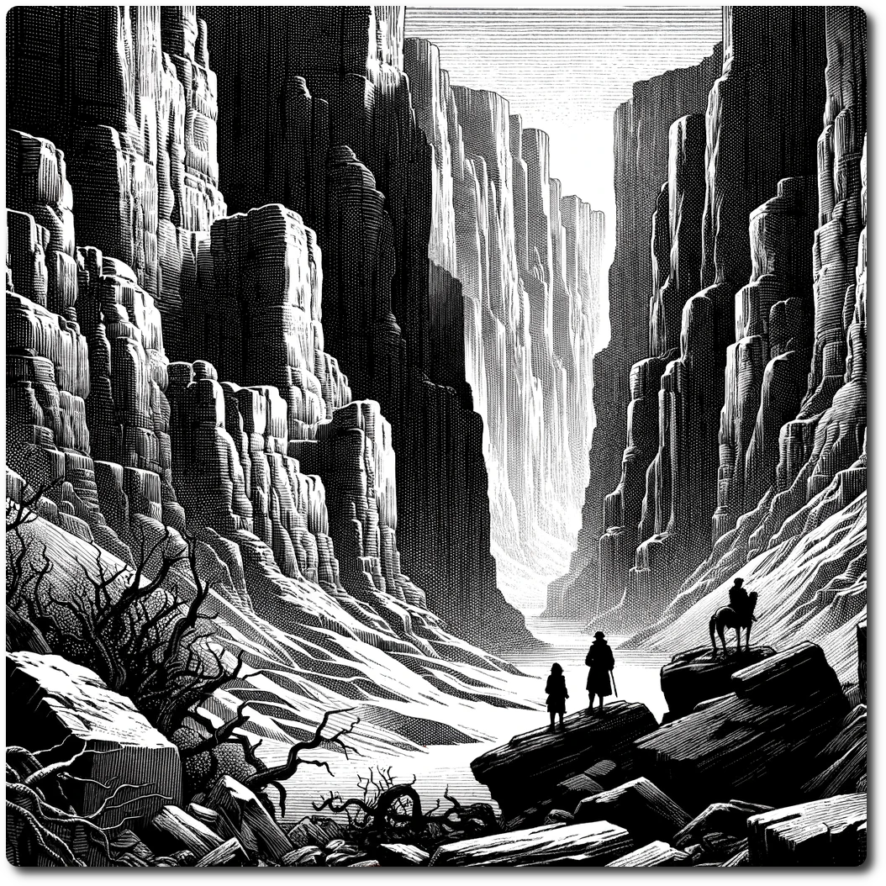

---  
share: "true"  
---  
  
  
  
  
# 0403 - Forest - The Whispering Canyons  
  
Upon reaching the Whispering Canyons, explorers find only silence, the promised ghostly melodies mere fabrications of hopeful imaginations, with no hidden cave or luminescent crystals in sight. The canyons, though grand in their natural beauty, hold a disappointing emptiness, devoid of the mystical allure that the rumors had so vividly painted.  
  
Forage: 8  
Scout: 9  
  
| Roll | Encounter Type | Description |  
| ---- | ---- | ---- |  
| 1 | Resources | Gain Information: Learn the Art of the Con  |  
| 2 | Poison Plant Pollen | If not chosen by scouting modifier, party members takes 2 damage. |  
| 3 | Resources | If chosen by scouting modifier find 1 gem, 6 ale, and 2 Herbs |  
| 4 | Combat | Cyber Monkey Ambush - Impact: 15  HP: 1 Loot: +1, 50 Gold |  
| 5 | Combat | Bandits Ambush - Impact: 10 HP: 15 Loot: +2, 50 Gold |  
| 6 | Phenomenon | Eerie quiet, party loses 1 will power each |  
  
**Special Encounter - False Rumors**  
  
The rumor was false, who started this rumor anyway?  
