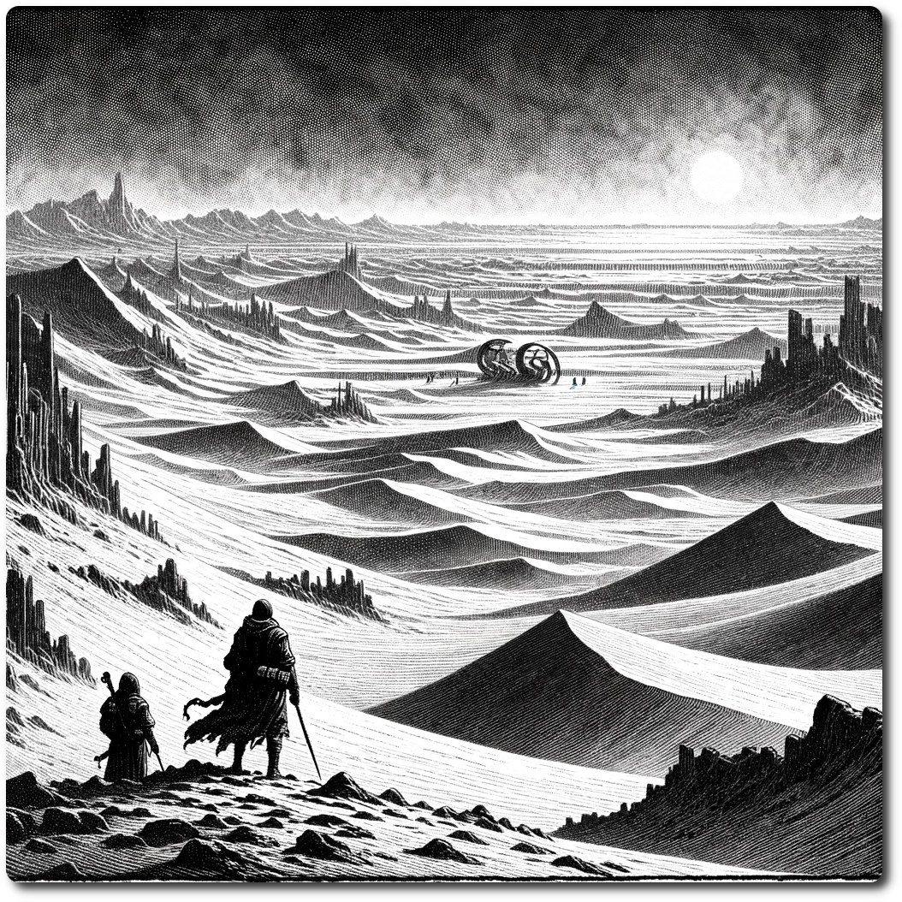

  
  
# 0707 - Wilderness - The Crimson Wastes  
  
*In the desolate expanse of the Crimson Wastes, the rumored colossal war machine is nowhere to be found, its existence merely a mirage created by the relentless, shimmering heat waves. Instead of mysterious, glowing runes and dormant metal, explorers are met with nothing but the endless, barren sands, their hopes of discovery buried as deep as the fabled machine itself.*
  
Forage: 9  
Scout: 8  

| Roll | Encounter Type | Description |
| ---- | ---- | ---- |
| 1 | Resources | **Gain Information**: Learn the Art of the Con |
| 2 | Hazard | **Thorn Brush Encounter**: A seemingly innocuous path leads the party into a thicket of razor-sharp thorns. If not chosen by scouting modifier, each member suffers 2 damage, a painful reminder of nature's hidden defenses. |
| 3 | Resources | **Scout's Prize**: Diligent scouting reveals a small hoard of essentials for the journey. If chosen by scouting modifier gain 6 ale, 1 gem. |
| 4 | Combat | **Wolf Pack Attack**: The silent whisper of the wild turns into a howl as a pack of wolves descends upon the party. **Impact: 16 HP: 5 Loot: 0** |
| 5 | Combat | **Bandits' Snare**: The tranquility of the path is shattered by the cunning ambush of bandits. **Impact: 15 HP: 15 Loot: +2, 50 Gold** |
| 6 | BUGS! | Bugs get into your supplies. Expend one Ration |

**Special Encounter - False Rumors**  
  
The rumor was false, who started this rumor anyway?  