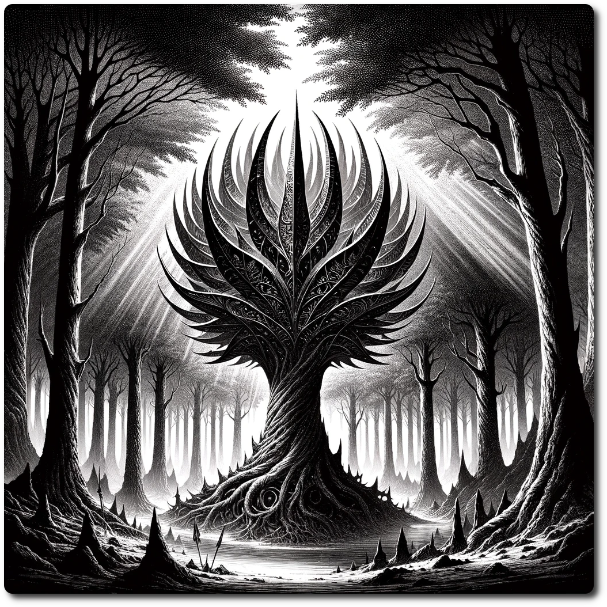

  
  
# 1004 - Forest - Heart of the Iron Wood  
  
*In the Ironwood Forest, the trees are not only alive but lethally sharp, their metallic leaves glinting like blades in the dappled sunlight, ready to slice through flesh and bone with a mere touch. As adventurers approach the forest's ancient heart, the largest tree, pulsing with biomechanical energy, unexpectedly poses a deep, resonant question about the nature of existence and the essence of free will.*
  
Forage: 8  
Scout: 9  

| Roll | Encounter Type | Description |
| ---- | ---- | ---- |
| 1 | Phenomenon | **Unsettling Silence**: A pervasive, eerie quiet engulfs the party, sapping their resolve. Party loses 1 WP, a psychological toll that tests their fortitude amidst the unknown. |
| 2 | Hazard | **Razor Leaves Hazard**: The party blunders into an area where the foliage hides a deadly secret - razor-sharp leaves. If not chosen by scouting modifier, party members takes 2 damage from these concealed blades, a painful reminder of nature's hidden dangers. |
| 3 | Resources | **Scout's Reward**: If chosen by scouting modifier find hidden treasures: 1 gem, 6 ale, and 2 medicinal herbs. This find is a boon for any adventurer's journey. |
| 4 | Combat | **Cyber Monkey Ambush**: The party is taken by surprise when cybernetically enhanced monkeys attack. **Impact: 15  HP: 1 Loot: +1, 25 Gold** |
| 5 | Combat | **Bandit Ambush**: A sudden and vicious ambush by bandits puts the party to the test. **Impact: 10 HP: 15 Loot: +2, 50 Gold** |
| 6 | Resources | **Herbal Discovery**: The adventurers find a patch of medicinal herbs, a critical resource for any journey. Gathering 1d6 of these herbs can make the difference between life and death, offering healing and hope amidst adversity. |  

**Special Encounter - When Sentience Blooms**  
  
Persuasion Difficulty 8  
  
If the party succeeds the Ancient Tree will trade 3 Medicinal Herbs for 2 Ale once per visit.  
That party no longer needs to complete either encounter when returning.  
  
If the party fails, the tree falls into a deep depression and will not talk again until the hex is entered again. The party loses 1 will power.  
  
  
