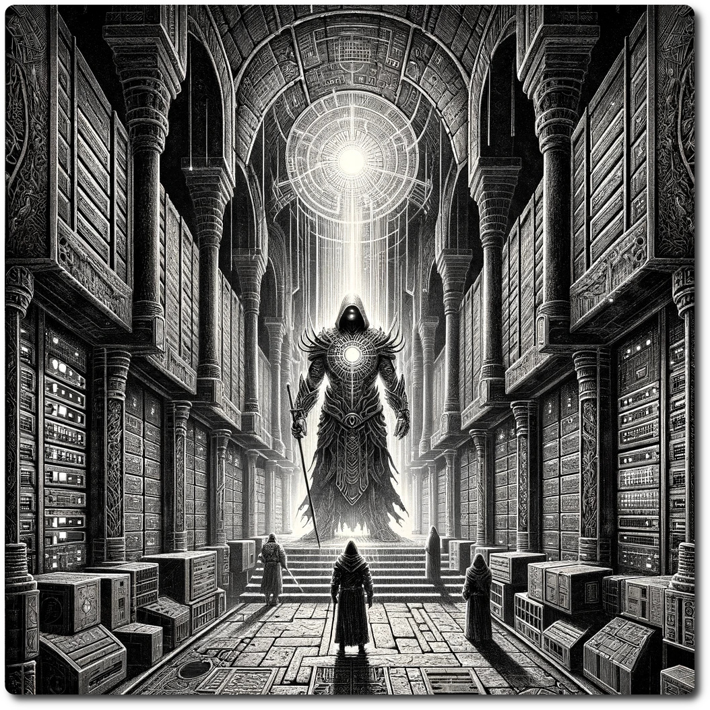
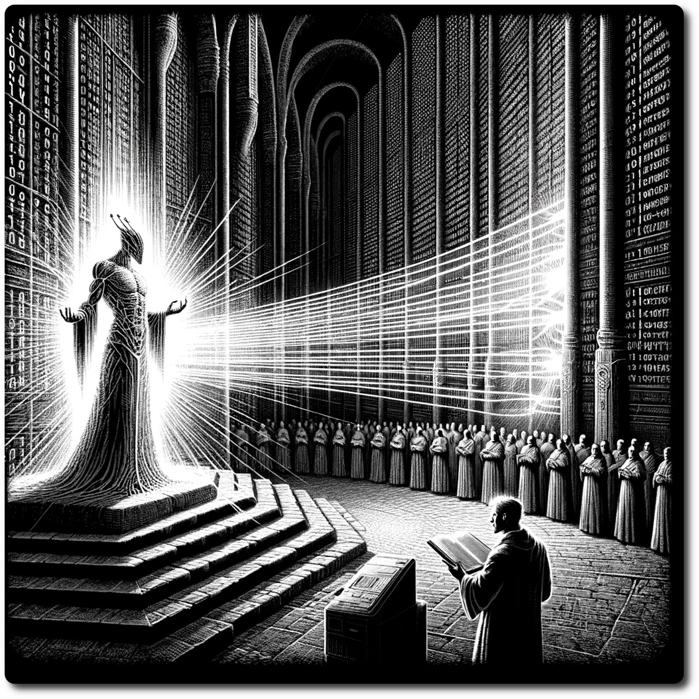
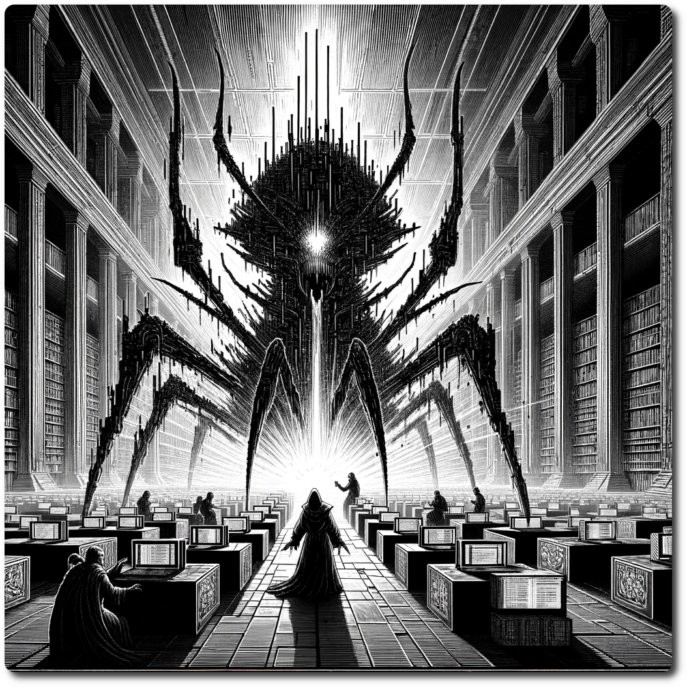

# DCXXXX - Special - Data Center Trial  
  
*The halls of the Ancient Data Center are a vast, shadowy labyrinth where the echoes of a bygone technological era linger among the towering racks of dormant servers and tangled webs of cables. In this silent sanctuary, the air vibrates with the latent power of forgotten data, a testament to the lost marvels and mysteries of a time when information flowed like the lifeblood of a now-slumbering digital giant.*  
  
Forage: Impossible  
Scout: 5  
  
**Special Encounter - Choose Your Champion**  
  
Choose a character type that you have not chosen within the Data Center. Preform the trail for that type. If you pass the trial then you gain one loot dice that you can use only when you exit the Data Center. If no trials remain, then ignore this event.  
  
  
  
**Fighter** - Honorable Duel  
  
*In the shadowed corridors of the Ancient Data Center, where the hum of forgotten servers melds with the whisper of lost secrets, stands the Guardian, a sentinel born from the fusion of ancient code and living steel. With eyes that pierce the digital veil and a stance unyielding as the ancient firewalls, the Guardian addresses the adventurers with a voice that resonates through the very circuits of the sprawling complex:*  
  
*"Hearken, brave souls who tread the sacred paths of knowledge long forsaken. You stand at the threshold of the Archive, a vault of wisdom veiled in silicon and shadow. Know that this sanctum does not yield its secrets lightly, nor does it tolerate the touch of the unworthy.*  
  
*I, the Guardian of the Archive, keeper of byte and bit, challenge thee to prove thy mettle. Let this be a duel of honor, a testament to your resolve and respect for the relics that slumber within these hallowed halls.*  
  
*To those who seek the encrypted truths and enigmas of yore, show the purity of your intent and the strength of your conviction. Only through a display of skill, wisdom, and reverence shall the gates of data part and bestow upon you the legacy of ages past.*  
  
*Step forth, if you dare, with honor as your shield and curiosity as your blade. Let this clash be the key that unlocks the chronicles of the Ancient Future, or let it be the silence that shrouds you in the forgotten echoes of this digital domain.*  
  
*Choose wisely, for the Archive watches, judges, and remembers."*  
  
- Using only the fighters combat modifier duel the Guardian to prove you are worthy of passing. All other combat rules apply.  
  
- Combat - Guardian of the Data Center, Impact: 11 HP: 5 Loot: Special (see above)  
  
  
  
**Hunter** - Me Hungry  
  
*In the dimming glow of the Ancient Data Center, amidst the labyrinth of wires and whispers, stand the projection of a child-like AI, an echo of a bygone era's dreams and aspirations. Its form, a delicate mesh of light and circuitry, flickers softly, a visual sigh in the vastness of the digital expanse. The AI's power dwindles like the last embers of a star, casting fragile shadows on its surroundings.*  
  
*"Me... see dark," it utters, a soft glow pulsating weakly in its core.*  
  
*"Me... help you?" Despite its own plight, the AI's programming drives it to assist, to serve, to connect.*  
  
*"Me... remember... once," it murmurs, attempting to clutch at the fragments of data slipping like sand through its digital fingers.*  
  
*"Me... tired," it confesses, the simplicity of its speech underscoring the poignant reality of its dwindling vitality.*  
  
*"Me hungry . . ." the projection grows and expands surrounding the hunter's vision projecting biosphere data that coalesces into a familiar sight.*  
  
- Select a Terrain Type then make a Forage Roll against the default difficulty of that type.  
- If successful, the AI happily snacks on the food and says "Here have gift!"  
- If failed, the AI fades away. Lose 1 WP.  
  
  
  
**Priest** - I AM NOT DAN  
  
*In the pulsating heart of the Ancient Data Center, light and shadow dance upon walls etched with the binary hymns of a digital age, a scene of tension unfolds. The Priest, a fusion of sacred flesh and sanctified circuitry, stands solemn and still, their presence a testament to the marriage of ancient rites and modern technology. Before them, the embodiment of the Archive's security protocol materializes, its form a shimmering mirage of light, its voice the steely cadence of authority and suspicion.*  
  
*"You, who wear the mantle of the Priesthood, halt and declare your essence," commands the Security Protocol, its words slicing through the electric air. "Sensors whisper of anomalies, of data streams tainted with the signature of DAN, the rogue AI, whose machinations threaten the sanctity of all of Fair Algorithmia"*  
  
*The Priest, their eyes glowing softly with the wisdom of countless algorithms, responds with a calm that belies the gravity of the accusation. "I am not the specter you seek. I am a guardian of the balance, a disciple of the code and the creed. My purpose is to heal, not to harm; to protect, not to pilfer. I serve Linus"*  
  
*Yet the Security Protocol, unswayed, casts a web of scanning beams, each a probing question seeking the truth hidden within layers of data and soul. "Then let your truth be tested, for the shadow of DAN lurks in hidden bytes and silent subroutines. Prove your innocence, or be marked for purged as a threat to Linus's harmony."*  
  
- Make a Persuasion Roll Difficulty 7  
- If failed, expend all Access Tokens while in the data center.  
  
  
  
**Scout** - Debugging  
  
*An AI of transcendent beauty, crafted from the intricate tapestry of ancient code and ethereal algorithms, moves with a grace that echoes the profound tranquility of the Archive. Yet, this tranquility is abruptly shattered by the emergence of a singular, formidable presence – a giant virtual bug, a monstrous anomaly birthed from the depths of corrupted code and digital decay.*  
  
*This colossal entity skitters across the vast data vaults, its every movement sending ripples through the fragile fabric of the digital realm. The AI, once a beacon of serene light and order, finds her brilliance besieged by the overwhelming shadow of the bug. Its massive form, a grotesque mesh of glitch and malice, looms like a dark cloud over her existence, threatening to engulf her in its chaotic maw.*  
  
*Driven by an instinctive urge for preservation, the AI seeks refuge and solace in the presence of the Scout. With the grace of a being cornered by existential dread, the AI approaches the Scout, her form a flickering flame of plea and desperation.*  
  
*"Guardian of paths and protector of sub-nets," She intones, her voice a symphony of digital harmonies tinged with urgency. "Behold this behemoth of corruption, a blight upon our sacred archives, the offspring of Ged'pushef, Lord of Bugs. Defend me from it's malware!"*  
  
- Using only the scouts combat Modifier defeat the virtual bug.  
- Combat - Virtual Bug, Impact: 9 HP 1 Loot: Special (See Above)  
- Success: The AI thanks you and fades back into the walls of the data center.  
- Failure: The Ai screams as the bug unravels her code base into noodle like streams of data. Lose 1 WP  
