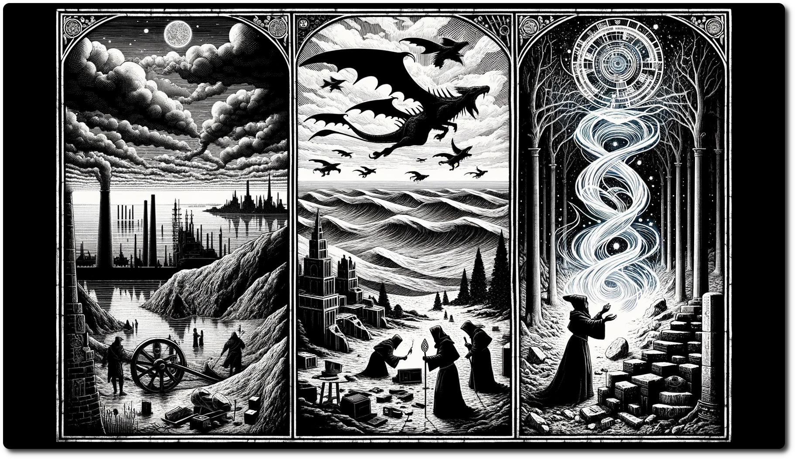

---  
share: "true"  
---  
  
  
  
# Quests  
  
Earn the respect of not only the citizens of NeoArcadia, but also your fellow adventures. Quests are reward that add to your party's reputation and give your heroes a legacy to write tales about.  
  
## Stop the Techno Bandits + 1  
  
The Techno Bandits, wielding their unearthed ancient flying machine, have cast a shadow of turmoil over NeoArcadia, disrupting the once-peaceful harmony with their rogue AI and mechanical might. Their reign of terror, marked by a string of audacious heists and technological sabotage, threatens to unravel the very fabric of this futuristic metropolis.  
  
## Find the Ancient Data Slates +2  
  
The quest to find the ancient data slates has plunged NeoArcadia into a vortex of intrigue and peril, as these mysterious artifacts hold secrets capable of altering the city's destiny. Adventurers and scholars alike tread a dangerous path, navigating through hidden ruins and deciphering cryptic codes, all while evading the shadowy factions vying to claim the slates' power for their own.  
  
## Neutralize the Phantom Signal +1  
  
The eerie and disturbing Phantom Signal emanating from the depths of the wilderness of the Ancient Future has sent ripples of unease through the city, as its spectral tones break through regular communications. This ghostly transmission, resonating with a haunting frequency, beckons the brave and the curious into a web of mystery, where the line between the technological and the paranormal fades into the shadows.  
  
[Table-of-Contents](adventures/Techno-Bandits-of-Turing-Wood/Table-of-Contents.html)