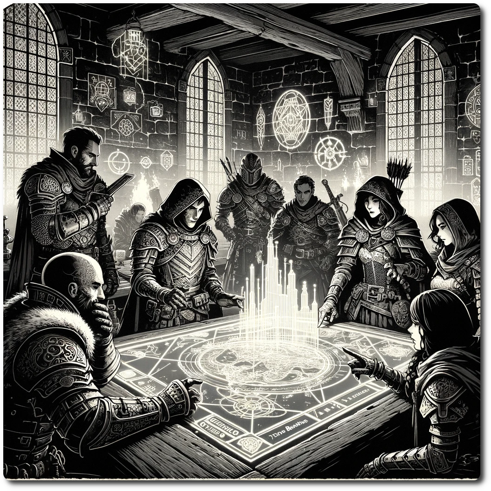

  
# Rumors  
  
0107. "The Ruins of Echofall are home to spectral figures that reenact a great battle every full moon, hiding untold treasures amidst their ghostly war."  
  
0201. "Travelers avoid the Shrouded Grove, where shadows move of their own accord, guarding an ancient, magical artifact lost to time."  
  
0207. "Beneath the Mirror Lake, a submerged city of glass and steel holds the remnants of a civilization advanced beyond our understanding."  
  
0304. "The Techno Bandits are rumored to have unearthed a pre-cataclysm weapon in the Sunken Ruins, granting them terrifying power over machinery."  
  
0403. "In the Whispering Canyons, echoes of a ghostly melody lure explorers towards a hidden cave filled with luminescent crystals."  
  
0601. "Some say the Phantom Signal emanating from the Ghostly Metropolis is not a malfunction, but a distress call from an entity trapped in a bygone era."  
  
0707. "The Crimson Wastes are said to house a colossal, dormant war machine, its surface etched with mysterious, glowing runes."  
  
0903. "Whispers circulate about ancient data slates hidden in the Desert of Mirrors, containing secrets that could change the balance of power in the realm."  
  
1004. "At the heart of the Ironwood Forest, an ancient tree with metallic leaves is believed to be the core of a living, breathing biomechanical ecosystem."  
  
1008. "In the Skyward Peaks, a floating island drifts lazily, rumored to be reachable only by those who harness the wind's ancient secrets."  

[Printable Cards](./Printable-Cards.html)

[Table-of-Contents](adventures/Techno-Bandits-of-Turing-Wood/Table-of-Contents.html)