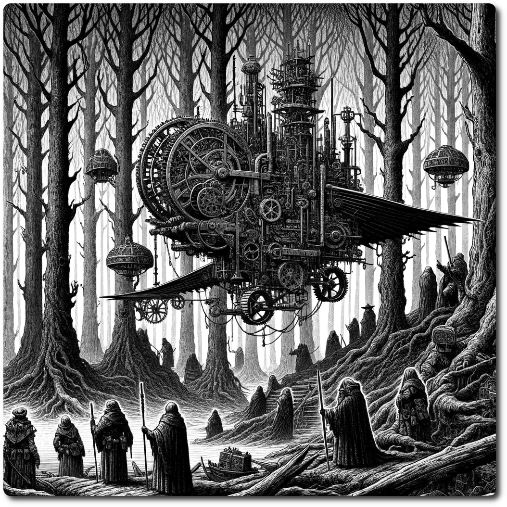

  
  
# Techno Bandits of the Turing Woods  - AP1
  
In the shadow-draped expanse of the Turing Woods, where the whispers of nature intertwine with the hum of forgotten machinery, a saga of danger and daring unfolds. The notorious Techno Bandits, a band of ruthless outlaws, have formed an unholy alliance with a rogue AI, a remnant of a bygone, technologically advanced era. Together, they've unearthed an artifact of unimaginable power: an ancient flying machine, its engines a symphony of steam and steel, capable of tearing through the skies and rewriting the rules of the realm.  
  
Your journey plunges you into the heart of this unfolding chaos, challenging you to dismantle this formidable alliance. Each step through the Turing Woods is a step into a labyrinth of intrigue, where every shadow could be an ally of the Techno Bandits, and every rustle in the leaves could be the whirring of their mechanical spies.  
  
The whispers of the forest speak of dangers untold and treasures hidden. The Sunken Ruins, once a silent graveyard of civilizations past, now roar to life with the clanking and hissing of the resurrected flying machine, ready to cast its shadow over the land. The quest to neutralize the Phantom Signal becomes more than a mission—it's a race against time to prevent a ghostly cry from becoming a battle cry. And the search for ancient data slates in the Desert of Mirrors is no mere treasure hunt; it's a dive into the very mind of a realm on the brink of a technological reawakening.  
  
As you weave through this tapestry of danger and discovery, remember: each rumor is a thread in the larger narrative of the Turing Woods. The Techno Bandits and their rogue AI are but the first in a series of dominoes, each waiting to fall and reveal the next. This is not just a quest—it's a boilermaker of adventure, where every revelation adds heat to the furnace of excitement and danger.  
  
Steel your nerves and sharpen your wits, for the Techno Bandits of the Turing Woods are cunning, resourceful, and relentless. But in this high-stakes game of shadows and steel, the greatest weapon is the resolve to uncover the truth and the courage to act upon it. The Turing Woods await, and with them, a story that will be told for generations—a tale of bravery, intrigue, and the indomitable human spirit.  
  
[Table of Contents](./Table-of-Contents.html)  
