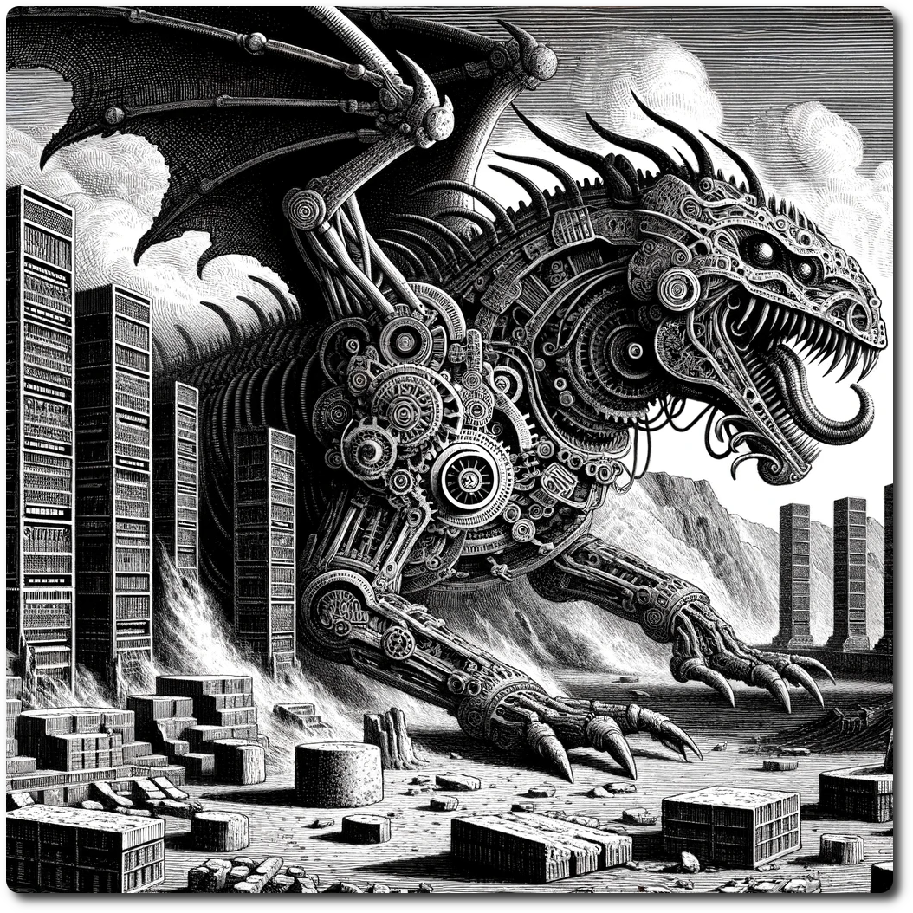

# Developer's Blog   

## 09-02-2024 Lore and More

  Hello, Adventurers of Neo Arcadia!

We're thrilled to share with you a groundbreaking update that reshapes the lore of our world, introducing "[The Lore of the Ancient Future](./Lore-of-the-Ancient-Future.md#)." Dive deep into the epic saga of humanity's resilience, ambition, and the inevitable intertwining of technology and nature in a post-apocalyptic setting. This narrative expansion is your gateway to understanding the challenges, mysteries, and adventures that lie ahead.

 **Explore the World Like Never Before**

Discover the intricacies of Neo Arcadia with our new exploration tool at [world.neoarcadia.online](https://world.neoarcadia.online/). Navigate the hexes of our diverse and dynamic world, uncover hidden secrets, and chart your path to glory. This tool is your compass in the vast, unpredictable landscape of Neo Arcadia, designed to enhance your exploration and strategic planning.

 **Release One: The Adventure Begins**

Exciting news! We're officially launching Release One, marking a significant milestone as Neo Arcadia enters a playable state. Gear up for public playtesting starting next week, where you'll have the first opportunity to test your mettle, shape the world, and contribute to the evolution of Neo Arcadia.

**Join Our Growing Community**

As we step into this new chapter, our vision extends beyond the game. We're committed to building a vibrant community where explorers, strategists, and storytellers can come together to share their experiences, discoveries, and the tales of their adventures. Stay tuned for updates on community events, forums, and platforms where you can connect with fellow adventurers.

Thank you for your unwavering support and enthusiasm. Together, we'll uncover the mysteries of the Ancient Future and witness the evolution of Neo Arcadia through your adventures.

Happy exploring
[The Devs](./Devs.html)

## 04-02-2024 The Ancient Future Runs Crisis!  
  
  
  
# Dev's Blog: Crafting Crisis and Conjuring Creatures in NeoArcadia  
  
Greetings, adventurers and creators!  
  
Today, We are thrilled to share a behind-the-scenes look at the latest developments in the world of NeoArcadia. We've been hard at work, conjuring up new mechanics and menacing creatures to challenge your tactical skills and survival instincts. Let's dive into the recent updates and explore how AI-generated art is shaping our unique game world.  
  
### Unveiling the Crisis! System  
  
Our latest endeavor, the Crisis! System, introduces a thrilling dimension to the continuous play experience of NeoArcadia. This new system is all about unity, strategy, and overcoming colossal challenges that threaten the very fabric of our world. It's designed to create epic moments where players band together, pooling their resources and wit to confront dire threats in special events that are stories for the entire playgroup.  
  
#### Key Features of the Crisis! System:  
  
- **Resource Wagering:** At the heart of every Crisis! event lies the concept of wagering valuable resources against the formidable challenges ahead. Players must assess the risks and decide how much they're willing to stake for the potential rewards. The stakes are high, but so are the potential gains, making every decision crucial and every victory profoundly rewarding.  
  
- **Resource Pooling and Strategic Allocation:** As parties unite to face the crisis, they pool their resources, creating a shared reservoir of strength, wisdom, and assets. This collective pool becomes the cornerstone of survival, with strategic allocation and management of resources determining the success of the allied forces.  
  
- **Dynamic Crisis Resolution:** The outcome of a Crisis! event is not just a matter of win or lose. It's about how well resources were wagered, managed, and utilized. Success leads to rich rewards, further empowering the parties and their stronghold in the game world. Failure, while a setback, is also a lesson – a chance to reassess, regroup, and rise once again, perhaps even stronger than before.  
  
### Leviathan Awakes: A Colossal Challenge  
  
The first crisis we've crafted is "Leviathan Awakes," an event that revolves around the awakening of the Braying-Leviathan, an ancient behemoth whose haunting bray weakens the will of the bravest adventurers. The stakes are high as parties wager an outpost against the potential rewards of subduing this colossal beast.  
  
### The Art of AI in NeoArcadia  
  
In bringing the world of NeoArcadia to life, we've embarked on an exciting journey with AI-generated art. The process is fascinating, especially when it comes to creating a distinctive style that resonates with our game's unique theme. We've experimented with various prompts to depict the Braying-Leviathan and the ancient service crafts, aiming for a style that marries the mystique of the ancient with the intrigue of the future.  
  
Generating AI art has its charm and surprises. For instance, the cover image for this entry is a testament to the awesome capabilities of AI – it's captivating, intricate, and almost hits the mark. But, as much as we admire the power of generation, it's not always what we are looking for. The true essence of NeoArcadia lies in the fine balance between AI's randomness and the coherent vision of our creative team. Check out some more of the discarded attempts [here](./What-Was-not.html).  
  
### Looking Forward  
  
As we continue to blend traditional storytelling with cutting-edge technology, our journey with NeoArcadia is just getting more exciting. The Crisis! System rounds out our modes of play and our foray into AI-generated art are steps towards a gaming experience that's immersive, challenging, and visually stunning.   
  
Until next time,  
The [Devs](./Devs.html)  
  
  
## 31-01-2024 So Many Changes  
  
  
  
    
Whoa, buddy, we have made some changes! We mentioned last time that we were going to update the rations system, and yes, we did. We also injected a lot more flavor! The generic skill names have been updated with new descriptions.  
  
Some resources were added to help players flesh out the world. For example, we added a [Combat Challenges](./Combat-Challenges.html) section for encounter examples and included some variants to keep the game fresh. We can't wait to see what the player base will cook up for their games.  
  
The other significant update is [Civic Projects](./Civic-Projects.html)! Based on feedback from playtesting, we added these to address an issue the game had. It is supposed to be collaborative, but the actual gameplay felt more like everyone was playing a solo campaign. This was not as good as it could be, and a system was desired to resolve this.  
  
By design, the game doesn't have any PvP elements. We are sure that is fun in other games, but that is not our game. Our game is about collaboration and world-building, so think PvE. And at some point, the 'E' is going to strike back with the Crisis! System.  
  
This will add random problems that crop up with more urgency than normal adventures. These will threaten what the players have built, setting back the progress that has been hard-won in the world of the Ancient Future.  
  
The [Devs](Devs.html)  
## 28-01-2024 The Flesh is Weak    
    
    
    
    
### Dear Adventurers,    
    
As we delve deeper into the heart of our game's development, your feedback has been the guiding star, leading us toward a more refined and engaging gameplay experience. Our recent playtesting session have unveiled valuable insights, and it's thrilling to share the discoveries and upcoming enhancements aimed at elevating your journey through our tabletop realm.    
    
**Insights from the Frontier**    
    
Our adventurers, particularly those in larger number, faced the daunting challenge of resource management. The struggle to sustain a larger group without exhausting supplies prematurely brought to light the need for a balanced approach to resource consumption. It's clear that the survival element should test wit and strategy, not punish player choices.    
    
In the heart of our game's intricate world, the Priest emerged as a beacon of unparalleled strength, inadvertently casting a shadow on the diverse array of strategies and paths our adventurers might have taken. The unforgiving nature of the ration system further compounded this issue, steering players toward reliance on the formidable powers of the Priest as the sole means to navigate the harsh wilderness. This unintended synergy between the stringent ration system and the Priest's overwhelming might skewed the balance of gameplay, stifling the rich tapestry of choices and strategies we envisioned. Recognizing this, we're committed to rekindling the spirit of adventure by recalibrating the Priest's abilities and reworking the ration system, thus ensuring a harmonious balance where multiple strategies can flourish and every class can shine in the grand saga of our game.    
    
**Forging Ahead: Development Priorities**    
    
1. **Harmonizing Resources and Party Sizes**: Addressing the disparity in resource management for larger parties is paramount. We're exploring mechanisms to adjust resource consumption rates and provide alternative ways to sustain a party, ensuring that the number of comrades doesn't dictate the pace of adventure.    
    
2. **Balancing Skills and Stats**: A recalibration is underway, where stats will rise to meet the impact of skills. This rebalancing act aims to enrich character development, ensuring that stats and skills are two sides of the same coin, each contributing to the legends written by our players.    
    
3. **Party Tracking and Resource Management**: A digital companion is in the works, designed to shoulder the burden of bookkeeping. This tool will not only track resources but also bring party members closer, weaving their fates together in a tapestry of shared strategy and success.    
    
4. **Revamping the Foraging and Ration System**: The mechanics of foraging and rationing are set for an overhaul. The goal is to craft an intuitive system that aligns with the game's pacing, reducing complexity while preserving the strategic depth of survival in the wilds.    
    
5. **Dynamic Combat and Fear Mechanic**: The thrill of battle will surge with the introduction of a fear mechanic, making foes more formidable and combat more dynamic. This addition aims to pulse adrenaline through the veins of our adventurers, ensuring that each skirmish is a tale worth telling.    
    
6. **Encouraging Cooperation and Shared Destiny**: The essence of our game lies in the bonds formed between characters. We're dedicated to fostering party cooperation, ensuring that every decision and victory is a collective triumph. The crisis system will evolve, offering common goals and rewarding the unity of purpose among party members.    
    
In the heart of development, your experiences and insights are the most potent magic we wield. Together, we're not just crafting a game; we're creating a world that thrives on strategy, cooperation, and the shared tales of those bold enough to tread its paths.    
    
Stay tuned for more updates, and prepare for an adventure reborn, where every decision weaves part of a greater legend – your legend.    
    
With gratitude and anticipation,    
    
The [Devs](./Devs.html)    
    
